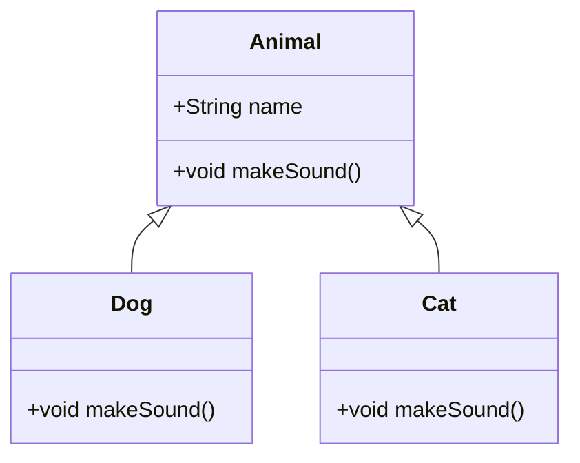
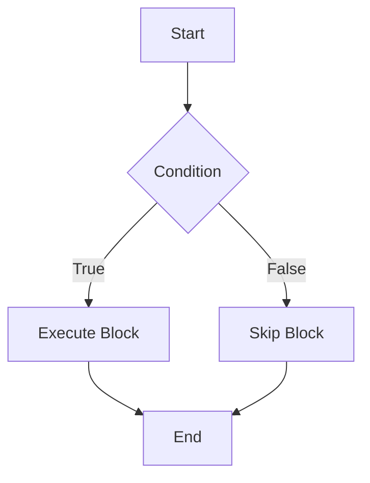

# Java Fundamentals

## Overview

Java Fundamentals encompass the core concepts and building blocks of the Java programming language, including syntax, data types, operators, control structures, object-oriented principles, and essential language features. These fundamentals provide the foundation for writing robust, portable, and efficient Java applications that run on the Java Virtual Machine (JVM).

## Detailed Explanation

### Object-Oriented Programming Concepts

Java is fundamentally an object-oriented language. Key concepts include:

- **Classes and Objects**: Classes are blueprints for objects, encapsulating data (fields) and behavior (methods).
- **Inheritance**: Allows a class to inherit properties and methods from another class.
- **Polymorphism**: Enables objects to be treated as instances of their parent class, with method overriding.
- **Encapsulation**: Hides internal state and requires interaction through defined interfaces.
- **Abstraction**: Focuses on essential features while hiding implementation details.



### Language Basics

#### Variables and Data Types

Variables store data values. Java has primitive types for basic values and reference types for objects.

**Primitive Data Types:**

| Type    | Size    | Default Value | Range                                      |
|---------|---------|---------------|--------------------------------------------|
| byte    | 1 byte  | 0             | -128 to 127                                |
| short   | 2 bytes | 0             | -32,768 to 32,767                         |
| int     | 4 bytes | 0             | -2,147,483,648 to 2,147,483,647           |
| long    | 8 bytes | 0L            | -9.2e18 to 9.2e18                          |
| float   | 4 bytes | 0.0f          | ±3.4e38 (approx.)                         |
| double  | 8 bytes | 0.0d          | ±1.8e308 (approx.)                        |
| char    | 2 bytes | '\u0000'      | 0 to 65,535 (Unicode)                     |
| boolean | 1 bit   | false         | true or false                             |

**Reference Types:** Include classes, interfaces, arrays, and strings.

#### Operators

Operators perform operations on variables and values.

| Category          | Operators          | Description                  | Example     |
|-------------------|--------------------|------------------------------|-------------|
| Arithmetic        | +, -, *, /, %      | Basic math operations        | a + b       |
| Relational        | ==, !=, <, >, <=, >= | Comparison operations       | a > b       |
| Logical           | &&, ||, !          | Boolean logic                | a && b      |
| Assignment        | =, +=, -=, *=, /=  | Assign values                | a += b      |
| Increment/Decrement | ++, --           | Increase/decrease by 1       | a++         |
| Bitwise           | &, |, ^, ~, <<, >>, >>> | Bit-level operations       | a & b       |

#### Control Flow Statements

Control structures direct program execution flow.

- **Conditional Statements:** if-else, switch
- **Loops:** for, while, do-while
- **Branching:** break, continue, return



#### Arrays

Arrays store multiple values of the same type.

#### Packages

Packages organize classes and interfaces, preventing naming conflicts.

### Classes and Objects

Classes define object blueprints. Objects are instances of classes.

### Interfaces and Inheritance

Interfaces define contracts. Inheritance allows class extension.

### Generics

Generics enable type-safe collections and methods.

### Annotations

Annotations provide metadata for code.

## Real-world Examples & Use Cases

- **Web Applications:** Java Servlets and JSP for server-side development.
- **Mobile Apps:** Android SDK uses Java for app logic.
- **Enterprise Systems:** Spring Framework for dependency injection and MVC.
- **Big Data:** Hadoop MapReduce jobs written in Java.
- **Financial Services:** High-performance trading systems leveraging Java's speed and reliability.
- **IoT Devices:** Embedded Java for constrained environments.

## Code Examples

### Hello World

```java
public class HelloWorld {
    public static void main(String[] args) {
        System.out.println("Hello, World!");
    }
}
```

### Variables and Data Types

```java
public class DataTypesExample {
    public static void main(String[] args) {
        // Primitive types
        int age = 30;
        double height = 5.9;
        boolean isStudent = true;
        char grade = 'A';
        
        // Reference type
        String name = "Alice";
        
        System.out.println("Name: " + name + ", Age: " + age);
    }
}
```

### Operators and Expressions

```java
public class OperatorsExample {
    public static void main(String[] args) {
        int a = 10, b = 5;
        
        // Arithmetic
        int sum = a + b;
        int diff = a - b;
        
        // Relational
        boolean isEqual = (a == b);
        
        // Logical
        boolean result = (a > b) && (b > 0);
        
        System.out.println("Sum: " + sum + ", Equal: " + isEqual + ", Result: " + result);
    }
}
```

### Control Flow

```java
public class ControlFlowExample {
    public static void main(String[] args) {
        int score = 85;
        
        // if-else
        if (score >= 90) {
            System.out.println("Grade: A");
        } else if (score >= 80) {
            System.out.println("Grade: B");
        } else {
            System.out.println("Grade: C");
        }
        
        // for loop
        for (int i = 1; i <= 5; i++) {
            System.out.println("Count: " + i);
        }
        
        // while loop
        int j = 1;
        while (j <= 3) {
            System.out.println("While count: " + j);
            j++;
        }
    }
}
```

### Classes and Objects

```java
public class Car {
    private String model;
    private int year;
    
    public Car(String model, int year) {
        this.model = model;
        this.year = year;
    }
    
    public void displayInfo() {
        System.out.println("Model: " + model + ", Year: " + year);
    }
    
    public static void main(String[] args) {
        Car myCar = new Car("Toyota Camry", 2020);
        myCar.displayInfo();
    }
}
```

### Arrays

```java
public class ArrayExample {
    public static void main(String[] args) {
        // Declare and initialize array
        int[] numbers = {1, 2, 3, 4, 5};
        
        // Access elements
        System.out.println("First element: " + numbers[0]);
        
        // Loop through array
        for (int num : numbers) {
            System.out.println(num);
        }
    }
}
```

### Generics (Basic Introduction)

```java
import java.util.ArrayList;
import java.util.List;

public class GenericsExample {
    public static void main(String[] args) {
        List<String> names = new ArrayList<>();
        names.add("Alice");
        names.add("Bob");
        
        for (String name : names) {
            System.out.println(name);
        }
    }
}
```

## References

- [Oracle Java Tutorials: Learning the Java Language](https://docs.oracle.com/javase/tutorial/java/index.html)
- [Oracle Java Language Specification](https://docs.oracle.com/javase/specs/jls/se21/html/index.html)
- [Java SE Documentation](https://docs.oracle.com/en/java/javase/)
- [Dev.java: Learn Java](https://dev.java/learn/)

## Github-README Links & Related Topics

- [Java Design Patterns](../java-design-patterns/README.md)
- [Java Collections Deep Dive](../java-collections-deep-dive/README.md)
- [Java Exception Handling](../java-exception-handling/README.md)
- [Java Generics](../java-generics/README.md)
- [Java OOP Principles](../java-oop/README.md)
- [JVM Internals and Class Loading](../jvm-internals-and-class-loading/README.md)