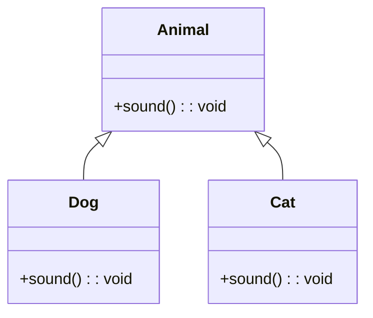

# Java Fundamentals

## Overview

Java is a high-level, object-oriented programming language developed by Sun Microsystems (now Oracle) in 1995. It is designed to be platform-independent, meaning Java programs can run on any device that has a Java Virtual Machine (JVM) installed. Java emphasizes simplicity, robustness, security, and portability, making it one of the most popular programming languages for building enterprise applications, web services, mobile apps, and more.

## Detailed Explanation

### Key Concepts

Java programs are organized into classes and objects. The language supports object-oriented programming (OOP) principles, which include encapsulation, inheritance, polymorphism, and abstraction. Java code is compiled into bytecode, which is then interpreted or JIT-compiled by the JVM for execution.

### Language Basics

- **Variables**: Used to store data. Java has primitive types and reference types (objects, arrays).

| Primitive Type | Size | Range | Default Value |
|----------------|------|-------|---------------|
| byte | 8 bits | -128 to 127 | 0 |
| short | 16 bits | -32,768 to 32,767 | 0 |
| int | 32 bits | -2^31 to 2^31-1 | 0 |
| long | 64 bits | -2^63 to 2^63-1 | 0L |
| float | 32 bits | ~1.4e-45 to 3.4e38 | 0.0f |
| double | 64 bits | ~4.9e-324 to 1.8e308 | 0.0d |
| char | 16 bits | '\u0000' to '\uffff' | '\u0000' |
| boolean | 1 bit | true or false | false |
- **Operators**: Arithmetic (+, -, *, /), relational (==, !=, <, >), logical (&&, ||, !), and assignment (=, +=, etc.).
- **Control Flow**: Conditional statements (if-else, switch) and loops (for, while, do-while).
- **Arrays**: Fixed-size collections of elements of the same type.

### Object-Oriented Programming

Java supports four main OOP principles:

- **Encapsulation**: Bundling data and methods into classes, with access control via modifiers (public, private, protected).
- **Inheritance**: Allows a class to inherit properties from another class using the `extends` keyword.
- **Polymorphism**: Ability of objects to take on many forms, achieved through method overriding and overloading.
- **Abstraction**: Hiding complex implementation details, often using abstract classes and interfaces.

Key concepts:
- **Classes**: Blueprints for objects, defining state (fields) and behavior (methods).
- **Objects**: Instances of classes, created using the `new` keyword.
- **Interfaces**: Contracts that classes can implement, defining methods that must be provided.
- **Packages**: Namespaces for organizing classes and avoiding naming conflicts.



### Platform Independence

Java achieves platform independence through:
- Compilation to bytecode (.class files)
- JVM interprets bytecode on any platform
- Write Once, Run Anywhere (WORA) principle

```mermaid
graph TD;
    A[Java Source Code (.java)] --> B[Java Compiler (javac)] --> C[Bytecode (.class)] --> D[JVM] --> E[Machine Code for Target Platform]
```

## Real-world Examples & Use Cases

- **Web Applications**: Frameworks like Spring Boot for building RESTful APIs and microservices.
- **Mobile Applications**: Android apps are primarily developed in Java (though Kotlin is also supported).
- **Enterprise Software**: Banking systems, e-commerce platforms, and large-scale data processing.
- **Big Data**: Tools like Apache Hadoop and Spark use Java for distributed computing.
- **Embedded Systems**: Java ME for resource-constrained devices.

## Code Examples

### Hello World Program

```java
public class HelloWorld {
    public static void main(String[] args) {
        System.out.println("Hello, World!");
    }
}
```

### Variables and Data Types

```java
public class VariablesExample {
    public static void main(String[] args) {
        // Primitive types
        int age = 25;
        double salary = 50000.50;
        boolean isEmployed = true;
        char grade = 'A';
        
        // Reference type
        String name = "John Doe";
        
        System.out.println("Name: " + name + ", Age: " + age + ", Salary: " + salary);
    }
}
```

### Control Structures

```java
public class ControlFlowExample {
    public static void main(String[] args) {
        int number = 10;
        
        // If-else
        if (number > 0) {
            System.out.println("Positive number");
        } else if (number < 0) {
            System.out.println("Negative number");
        } else {
            System.out.println("Zero");
        }
        
        // For loop
        for (int i = 1; i <= 5; i++) {
            System.out.println("Count: " + i);
        }
        
        // While loop
        int j = 1;
        while (j <= 3) {
            System.out.println("While count: " + j);
            j++;
        }
    }
}
```

### Simple Class and Object

```java
public class Person {
    // Fields (state)
    private String name;
    private int age;
    
    // Constructor
    public Person(String name, int age) {
        this.name = name;
        this.age = age;
    }
    
    // Method (behavior)
    public void introduce() {
        System.out.println("Hi, I'm " + name + " and I'm " + age + " years old.");
    }
    
    public static void main(String[] args) {
        Person person = new Person("Alice", 30);
        person.introduce();
    }
}
```

### OOP Example with Inheritance and Polymorphism

```java
class Animal {
    void sound() {
        System.out.println("Animal sound");
    }
}

class Dog extends Animal {
    void sound() {
        System.out.println("Bark");
    }
}

class Cat extends Animal {
    void sound() {
        System.out.println("Meow");
    }
}

public class Main {
    public static void main(String[] args) {
        Animal a1 = new Dog();
        Animal a2 = new Cat();
        a1.sound(); // Bark
        a2.sound(); // Meow
    }
}
```

### Collections Example

```java
import java.util.*;

public class CollectionsExample {
    public static void main(String[] args) {
        List<String> list = new ArrayList<>();
        list.add("Java");
        list.add("Fundamentals");

        Set<String> set = new HashSet<>();
        set.add("Unique");
        set.add("Values");

        Map<String, Integer> map = new HashMap<>();
        map.put("One", 1);
        map.put("Two", 2);

        for (String s : list) {
            System.out.println(s);
        }
    }
}
```

### Exception Handling Example

```java
public class ExceptionExample {
    public static void main(String[] args) {
        try {
            int result = divide(10, 0);
            System.out.println("Result: " + result);
        } catch (ArithmeticException e) {
            System.out.println("Error: " + e.getMessage());
        } finally {
            System.out.println("Execution completed.");
        }
    }

    public static int divide(int a, int b) {
        return a / b;
    }
}
```

## Common Pitfalls & Edge Cases

- **Null Pointer Exceptions**: Always check for null before accessing object methods or fields.
- **Memory Leaks**: Avoid holding references to objects longer than necessary, especially in long-running applications.
- **Type Casting**: Use instanceof to check before casting to avoid ClassCastException.
- **Integer Overflow**: Be aware of limits for primitive types; use BigInteger for large numbers.
- **String Immutability**: Strings are immutable; use StringBuilder for frequent modifications.

## Tools & Libraries

- **JDK**: Oracle JDK or OpenJDK for development and runtime.
- **IDEs**: IntelliJ IDEA, Eclipse, NetBeans for coding assistance.
- **Build Tools**: Maven, Gradle for project management and dependency resolution.
- **Testing**: JUnit for unit testing.

## References

- [Oracle Java Tutorials - Learning the Java Language](https://docs.oracle.com/javase/tutorial/java/index.html)
- [Oracle Java Tutorials - Object-Oriented Programming Concepts](https://docs.oracle.com/javase/tutorial/java/concepts/index.html)
- [Oracle Java Tutorials - Language Basics](https://docs.oracle.com/javase/tutorial/java/nutsandbolts/index.html)
- [Oracle Java Tutorials - Classes and Objects](https://docs.oracle.com/javase/tutorial/java/javaOO/index.html)
- [Java Language Specification](https://docs.oracle.com/javase/specs/jls/se21/html/index.html)

## Github-README Links & Related Topics

- [OOP Principles in Java](../java-oop-principles/README.md)
- [Java Collections](../java-collections/README.md)
- [Multithreading & Concurrency in Java](../java-multithreading-and-concurrency/README.md)
- [Collections & Data Structures](../collections-data-structures/README.md)
- [Java Generics](../java-generics/README.md)
- [Exception Handling in Java](../java-exception-handling/README.md)
