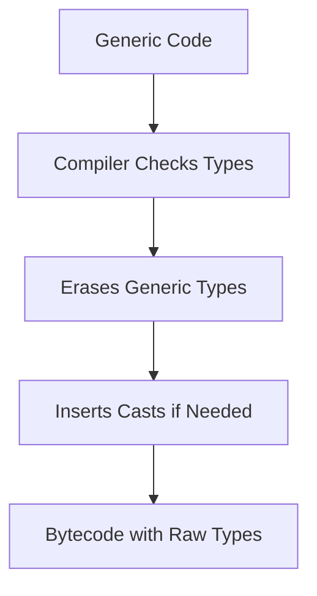

# Java Generics Deep Dive

## Overview

Java Generics provide a way to create classes, interfaces, and methods that operate on types specified by the user at compile time. They enable type safety, eliminate the need for explicit casting, and allow for reusable code without compromising type checking.

## Detailed Explanation

Generics were introduced in Java 5 to address the limitations of raw types and casting. The core concept is parameterization of types, allowing collections and other data structures to be type-safe.

### Key Concepts

- **Type Parameters**: Represented by `<T>`, where T is a placeholder for a type.
- **Type Erasure**: At runtime, generic types are erased to their raw types to maintain backward compatibility.
- **Bounded Types**: `<T extends Number>` restricts T to subclasses of Number.
- **Wildcards**: `?` for unknown types, `? extends T` for upper bounds, `? super T` for lower bounds.

### Type Erasure Process



## Real-world Examples & Use Cases

1. **Collections Framework**: `List<String>` ensures only strings are added.
2. **API Design**: Generic methods in utility classes like `Collections.sort()`.
3. **Custom Data Structures**: Implementing generic stacks, queues, or trees.

## Code Examples

### Basic Generic Class

```java
public class Box<T> {
    private T value;

    public void set(T value) {
        this.value = value;
    }

    public T get() {
        return value;
    }
}

// Usage
Box<String> stringBox = new Box<>();
stringBox.set("Hello Generics");
String value = stringBox.get();
```

### Bounded Type Parameters

```java
public class NumberBox<T extends Number> {
    private T number;

    public void set(T number) {
        this.number = number;
    }

    public double getDoubleValue() {
        return number.doubleValue();
    }
}
```

### Wildcards

```java
public void printList(List<?> list) {
    for (Object elem : list) {
        System.out.println(elem);
    }
}

public void addNumbers(List<? super Integer> list) {
    list.add(1);
    list.add(2);
}
```

## Common Pitfalls & Edge Cases

- **Type Erasure Issues**: Cannot use `instanceof` with generics directly.
- **Heap Pollution**: Mixing raw and generic types can lead to `ClassCastException`.
- **Overloading**: Generic methods cannot be overloaded by type parameters alone.

## References

- [Oracle Java Tutorials: Generics](https://docs.oracle.com/javase/tutorial/java/generics/)
- [Effective Java by Joshua Bloch: Chapter on Generics](https://www.amazon.com/Effective-Java-Joshua-Bloch/dp/0134685997)

## Github-README Links & Related Topics

- [java-generics](https://github.com/topics/java-generics)
- Related: [Java Collections Deep Dive](../java-collections-deep-dive/README.md)
- Related: [Java OOP Principles](../java-oop-principles/README.md)
