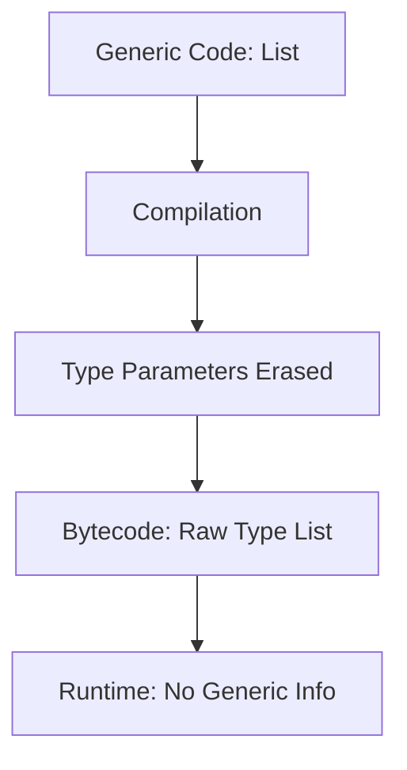

## Overview

Java Generics provide compile-time type safety by allowing classes, interfaces, and methods to operate on parameterized types. Introduced in Java 5, generics eliminate the need for explicit casting and prevent ClassCastException at runtime, enabling reusable and type-safe code for collections and algorithms.

## Detailed Explanation

### Type Parameters

Generics use type parameters (e.g., `<T>`, `<K, V>`) to define placeholders for actual types.

- **Generic Classes**: `class Box<T> { private T item; }`
- **Generic Interfaces**: `interface List<E> { void add(E element); }`
- **Generic Methods**: `public <T> T getFirst(List<T> list) { return list.get(0); }`

### Bounded Type Parameters

Restrict type parameters to subtypes or supertypes.

- **Upper Bounded**: `<T extends Number>` - T must be Number or subclass.
- **Lower Bounded**: `<T super Integer>` - T must be Integer or superclass.
- **Multiple Bounds**: `<T extends Comparable<T> & Serializable>`

### Wildcards

Wildcards (`?`) represent unknown types, useful for flexibility.

- **Unbounded Wildcard**: `List<?>` - any type.
- **Upper Bounded**: `List<? extends Number>` - Number or subclasses.
- **Lower Bounded**: `List<? super Integer>` - Integer or superclasses.

### Type Erasure

At runtime, generics are erased to raw types for backward compatibility. Type information is not available at runtime, which is why `List<String>` becomes `List` in bytecode.



### Raw Types

Using generics without type parameters (e.g., `List` instead of `List<String>`) is allowed for legacy code but unsafe and generates warnings.

## Real-world Examples & Use Cases

| Use Case | Example | Description |
|----------|---------|-------------|
| Collections | `ArrayList<String>` | Type-safe string lists without casting. |
| Custom Containers | `Pair<K, V>` | Key-value pairs in maps or tuples. |
| Algorithms | `sort(List<T extends Comparable>)` | Generic sorting for comparable types. |
| Frameworks | Spring's `ResponseEntity<T>` | Typed HTTP responses. |
| Utilities | Apache Commons' generic utilities | Reusable components like `Pair`. |

Generics are essential in APIs like Java Collections Framework, ensuring type safety in enterprise applications.

## Code Examples

### Generic Class

```java
public class Box<T> {
    private T item;

    public void set(T item) { this.item = item; }
    public T get() { return item; }

    public static void main(String[] args) {
        Box<String> stringBox = new Box<>();
        stringBox.set("Hello Generics");
        String value = stringBox.get(); // No cast needed
    }
}
```

### Generic Method

```java
public class Utils {
    public static <T> T getFirst(List<T> list) {
        if (list.isEmpty()) throw new IllegalArgumentException("List is empty");
        return list.get(0);
    }

    public static void main(String[] args) {
        List<Integer> numbers = Arrays.asList(1, 2, 3);
        Integer first = Utils.<Integer>getFirst(numbers); // Explicit type
        Integer first2 = Utils.getFirst(numbers); // Type inferred
    }
}
```

### Wildcards in Methods

```java
public class WildcardExample {
    public static void printList(List<?> list) {
        for (Object elem : list) {
            System.out.println(elem);
        }
    }

    public static void addNumbers(List<? super Integer> list) {
        list.add(42); // Can add Integer or subclasses
    }

    public static double sum(List<? extends Number> list) {
        double sum = 0.0;
        for (Number n : list) {
            sum += n.doubleValue();
        }
        return sum;
    }
}
```

### Bounded Types

```java
public class BoundedExample {
    public static <T extends Comparable<T>> T max(T a, T b) {
        return a.compareTo(b) > 0 ? a : b;
    }

    public static void main(String[] args) {
        System.out.println(max(1, 2)); // Works with Integer
        System.out.println(max("apple", "banana")); // Works with String
    }
}
```

## Common Pitfalls & Edge Cases

- **Erasure Limitations**: Cannot create generic arrays `new T[10]`; use `ArrayList<T>` instead.
- **Overloading**: Methods `void method(List<String>)` and `void method(List<Integer>)` are identical after erasure.
- **Instanceof**: Cannot use `instanceof` with parameterized types; check raw type first.
- **Static Members**: Static fields/methods cannot use class type parameters.
- **Inheritance**: `List<String>` is not a subtype of `List<Object>`; use wildcards for covariance.

## Tools & Libraries

- **Java Collections Framework**: Built-in generics in `List`, `Map`, etc.
- **Guava**: Google's utilities with advanced generics like `Multimap`.
- **Lombok**: Code generation with generic support.
- **Jackson**: JSON serialization with generics for type-safe parsing.

## Github-README Links & Related Topics

- [Collections Framework](java/collections-framework/README.md)
- [Advanced Java Concepts](java/advanced-java-concepts/README.md)
- [Java Language Basics](java/java-language-basics/README.md)
- [Reflection and Annotations](java/reflection-and-annotations/README.md)

## References

- [Oracle Java Generics Tutorial](https://docs.oracle.com/javase/tutorial/java/generics/)
- [Java Language Specification: Generics](https://docs.oracle.com/javase/specs/jls/se21/html/jls-8.html)
- [Effective Java: Item 26-29 on Generics](https://www.amazon.com/Effective-Java-Joshua-Bloch/dp/0134685997)
- [Type Erasure in Java](https://www.baeldung.com/java-generics-type-erasure)</content>
</xai:function_call ><xai:function_call name="write">
<parameter name="filePath">java-lambda-expressions/README.md