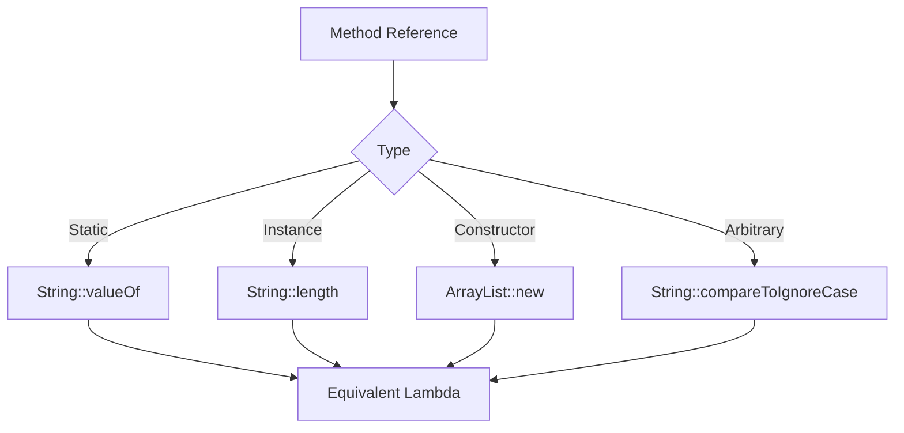

## Overview

Lambda expressions, introduced in Java 8, enable functional programming by treating functions as first-class citizens. They provide concise syntax for implementing functional interfaces, enabling cleaner code for collections processing, event handling, and asynchronous operations.

## Detailed Explanation

### Functional Interfaces

Lambdas implement single abstract method (SAM) interfaces.

- **Built-in**: `Predicate<T>`, `Function<T,R>`, `Consumer<T>`, `Supplier<T>`.
- **Custom**: Interfaces with one abstract method.

### Lambda Syntax

`(parameters) -> expression` or `(parameters) -> { statements; }`

- **No Parameters**: `() -> System.out.println("Hello")`
- **Single Parameter**: `x -> x * 2` (parentheses optional)
- **Multiple Parameters**: `(x, y) -> x + y`
- **Block Body**: `x -> { return x.toUpperCase(); }`

### Method References

Shorthand for lambdas calling existing methods.

- **Static**: `String::valueOf` ≡ `x -> String.valueOf(x)`
- **Instance**: `String::length` ≡ `s -> s.length()`
- **Constructor**: `ArrayList::new` ≡ `() -> new ArrayList()`
- **Arbitrary Instance**: `String::compareToIgnoreCase` ≡ `(s1, s2) -> s1.compareToIgnoreCase(s2)`



### Variable Capture

Lambdas capture variables from enclosing scope.

- **Effectively Final**: Variables must be final or effectively final (not reassigned).
- **Instance Variables**: Accessible without restrictions.
- **Local Variables**: Must be effectively final.

### Type Inference

Compiler infers parameter and return types from context.

## Real-world Examples & Use Cases

| Use Case | Example | Description |
|----------|---------|-------------|
| Collections | `list.stream().filter(s -> s.length() > 3)` | Filtering data streams. |
| Event Handling | `button.setOnAction(e -> System.out.println("Clicked"))` | GUI event listeners. |
| Asynchronous | `CompletableFuture.supplyAsync(() -> compute())` | Non-blocking computations. |
| Sorting | `list.sort((a,b) -> a.compareTo(b))` | Custom comparators. |
| Testing | `assertTrue(list.stream().anyMatch(s -> s.contains("test")))` | Assertions in tests. |

Lambdas simplify code in frameworks like Spring for bean processing and JavaFX for UI events.

## Code Examples

### Basic Lambda

```java
import java.util.function.Predicate;

public class LambdaBasics {
    public static void main(String[] args) {
        Predicate<String> isLong = s -> s.length() > 5;
        System.out.println(isLong.test("Hello")); // false
        System.out.println(isLong.test("Hello World")); // true
    }
}
```

### Stream Operations

```java
import java.util.Arrays;
import java.util.List;
import java.util.stream.Collectors;

public class StreamExample {
    public static void main(String[] args) {
        List<String> words = Arrays.asList("Java", "Lambda", "Expressions");

        // Filter and map
        List<String> result = words.stream()
            .filter(s -> s.length() > 4)
            .map(String::toUpperCase)
            .collect(Collectors.toList());

        System.out.println(result); // [LAMBDA, EXPRESSIONS]
    }
}
```

### Method References

```java
import java.util.Arrays;
import java.util.List;
import java.util.function.Function;

public class MethodRefs {
    public static void main(String[] args) {
        List<String> words = Arrays.asList("a", "bb", "ccc");

        // Lambda
        words.forEach(s -> System.out.println(s));

        // Method reference
        words.forEach(System.out::println);

        // Constructor reference
        Function<String, StringBuilder> toBuilder = StringBuilder::new;
        StringBuilder sb = toBuilder.apply("Hello");
    }
}
```

### Variable Capture

```java
import java.util.function.Supplier;

public class CaptureExample {
    private String instanceVar = "Instance";

    public Supplier<String> createSupplier() {
        String localVar = "Local"; // Effectively final
        return () -> instanceVar + " " + localVar;
    }

    public static void main(String[] args) {
        CaptureExample ex = new CaptureExample();
        Supplier<String> supplier = ex.createSupplier();
        System.out.println(supplier.get()); // Instance Local
    }
}
```

### Custom Functional Interface

```java
@FunctionalInterface
interface Calculator {
    int operate(int a, int b);
}

public class CustomFunctional {
    public static void main(String[] args) {
        Calculator add = (a, b) -> a + b;
        Calculator multiply = (a, b) -> a * b;

        System.out.println(add.operate(2, 3)); // 5
        System.out.println(multiply.operate(2, 3)); // 6
    }
}
```

## Common Pitfalls & Edge Cases

- **Effectively Final Rule**: Attempting to modify captured variables causes compile errors.
- **Ambiguity**: Multiple SAM interfaces may require explicit casting.
- **Performance**: Lambdas create objects; avoid in tight loops.
- **Serialization**: Lambdas are not serializable by default; use method references.
- **Exception Handling**: Checked exceptions in lambdas must be handled or declared.

## Tools & Libraries

- **Java Streams API**: Core for functional operations.
- **RxJava**: Reactive programming with lambdas.
- **JUnit 5**: Lambda-based assertions and extensions.
- **Spring Framework**: Functional bean registration.

## Github-README Links & Related Topics

- [Streams and Functional Java](java/streams-functional-java/README.md)
- [Advanced Java Streams](java/java-streams-advanced/README.md)
- [Java Language Basics](java/java-language-basics/README.md)
- [Collections Framework](java/collections-framework/README.md)

## References

- [Oracle Lambda Expressions Tutorial](https://docs.oracle.com/javase/tutorial/java/javaOO/lambdaexpressions.html)
- [Java Language Specification: Lambdas](https://docs.oracle.com/javase/specs/jls/se21/html/jls-15.html)
- [Functional Programming in Java](https://www.baeldung.com/java-functional-programming)
- [Method References](https://docs.oracle.com/javase/tutorial/java/javaOO/methodreferences.html)</content>
</xai:function_call ><xai:function_call name="write">
<parameter name="filePath">java-modules/README.md