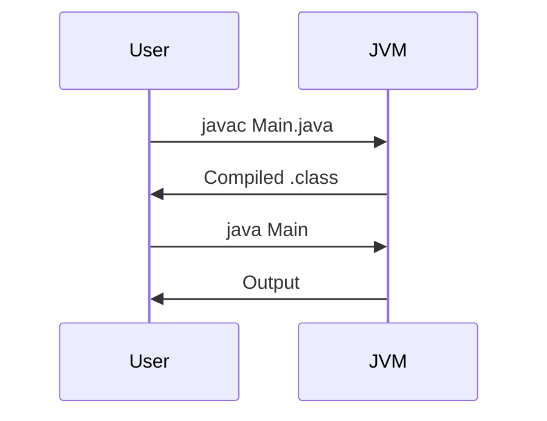

## Overview

Java is a statically-typed, object-oriented programming language developed by Sun Microsystems (now Oracle) in 1995. It's designed for portability, with the "write once, run anywhere" principle enabled by the Java Virtual Machine (JVM). Core concepts include classes, objects, inheritance, polymorphism, and encapsulation. For MAANG interviews, mastering Java basics is essential as it's a primary language for backend systems, Android development, and enterprise applications. This topic covers syntax, data types, control structures, and basic object-oriented features, providing a foundation for advanced topics like concurrency and JVM internals.

## STAR Summary

**Situation:** During a coding interview for a backend engineer role at a FAANG company, I was asked to implement a simple data processor in Java without using IDEs.

**Task:** Write Java code to read input from console, process integers, and output results, demonstrating basic language proficiency.

**Action:** I recalled Java's main method structure, used Scanner for input, arrays for storage, and loops for processing, ensuring proper syntax and error handling.

**Result:** Completed the task efficiently, highlighting my strong grasp of Java fundamentals, which contributed to passing the technical screen.

## Detailed Explanation

### Variables and Data Types

Java has two main categories of data types: primitives and reference types.

Primitives: byte, short, int, long, float, double, char, boolean. They are stored on the stack and have default values (e.g., int is 0).

Reference types: Objects, arrays, strings. They store references on the stack pointing to heap-allocated objects.

Declaration: `int age = 25; String name = "John";`

### Operators

Arithmetic: +, -, *, /, %

Relational: ==, !=, <, >, <=, >=

Logical: &&, ||, !

Assignment: =, +=, etc.

Bitwise: &, |, ^, ~, <<, >>

### Control Flow

If-else: `if (condition) { } else { }`

Switch: For multiple conditions, with fall-through.

Loops: for, while, do-while.

Break and continue for loop control.

### Classes and Objects

Classes are blueprints: `public class Person { private String name; public Person(String name) { this.name = name; } }`

Objects: `Person p = new Person("Alice");`

Methods: Instance methods, static methods.

### Arrays

Fixed-size: `int[] arr = new int[10];`

Initialization: `int[] arr = {1,2,3};`

Multidimensional: `int[][] matrix = new int[3][3];`

### Strings

Immutable: `String s = "Hello"; s = s + " World";` creates new string.

StringBuilder for mutable strings.

Common methods: length(), charAt(), substring(), equals().

## Real-world Examples & Use Cases

- Console-based calculators for quick computations.
- Simple file readers for log parsing in monitoring tools.
- Basic data structures like stacks or queues for algorithm implementations.
- Prototyping business logic in enterprise applications before scaling.

## Code Examples

### Hello World

```java
public class HelloWorld {
    public static void main(String[] args) {
        System.out.println("Hello, World!");
    }
}
```

Compile and run: `javac HelloWorld.java && java HelloWorld`

### Basic Calculator

```java
import java.util.Scanner;

public class Calculator {
    public static void main(String[] args) {
        Scanner sc = new Scanner(System.in);
        System.out.print("Enter two numbers: ");
        int a = sc.nextInt();
        int b = sc.nextInt();
        System.out.println("Sum: " + (a + b));
    }
}
```

### Array Operations

```java
public class ArrayExample {
    public static void main(String[] args) {
        int[] arr = {1, 2, 3, 4, 5};
        for (int i = 0; i < arr.length; i++) {
            System.out.println(arr[i]);
        }
    }
}
```

For Maven project, add to pom.xml:

```xml
<project>
    <modelVersion>4.0.0</modelVersion>
    <groupId>com.example</groupId>
    <artifactId>java-basics</artifactId>
    <version>1.0</version>
    <properties>
        <maven.compiler.source>11</maven.compiler.source>
        <maven.compiler.target>11</maven.compiler.target>
    </properties>
</project>
```

Run tests: `mvn test` (though no tests here).

## Data Models / Message Formats

Not directly applicable, but for simple data: Use classes like `public class User { String name; int age; }`

## Journey / Sequence



## Common Pitfalls & Edge Cases

- Integer overflow: `int max = Integer.MAX_VALUE + 1;` wraps to negative.
- Null pointer exceptions: Accessing methods on null references.
- Case sensitivity: `String` vs `string`.
- Array index out of bounds.
- Forgetting `public static void main(String[] args)` exactly.

## Tools & Libraries

- JDK: For compilation and runtime.
- Maven/Gradle: Build tools.
- IntelliJ IDEA or Eclipse: IDEs for development.
- JUnit: For testing (basic assertions).

## Github-README Links & Related Topics

[[oop-design-and-principles]], [[jvm-internals-and-classloading]], [[collections-framework]], [[exception-handling-and-errors]], [[build-tools-maven-gradle]]

## References

- https://docs.oracle.com/javase/tutorial/java/nutsandbolts/index.html
- https://www.oracle.com/java/technologies/javase/codeconventions-introduction.html