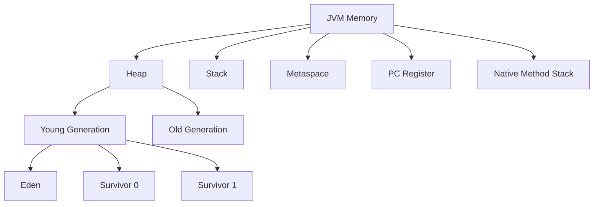

## Overview

Java Memory Management refers to how the Java Virtual Machine (JVM) handles memory allocation, deallocation, and garbage collection for Java applications. It involves dividing memory into areas like Heap, Stack, Metaspace, and managing object lifecycles to prevent memory leaks and optimize performance.

## Detailed Explanation

The JVM divides memory into several regions:

- **Heap**: Stores objects and arrays. Divided into Young Generation (Eden, Survivor spaces) and Old Generation.
- **Stack**: Stores method calls, local variables, and references. Each thread has its own stack.
- **Metaspace**: Stores class metadata, replacing PermGen in Java 8+.
- **Program Counter (PC) Register**: Holds the address of the current instruction.
- **Native Method Stack**: For native code execution.

Garbage Collection (GC) automatically reclaims memory from unreachable objects. Common algorithms include Serial, Parallel, CMS, G1, and ZGC.

### Memory Model Diagram



## Real-world Examples & Use Cases

- **Web Applications**: Managing session data in heap to avoid OOM errors.
- **Big Data Processing**: Efficient GC in Spark jobs to handle large datasets.
- **Microservices**: Tuning heap sizes for containerized apps in Kubernetes.

## Code Examples

### Basic Memory Allocation

```java
public class MemoryExample {
    public static void main(String[] args) {
        // Stack allocation for primitives
        int x = 10;
        
        // Heap allocation for objects
        String str = new String("Hello");
        
        // Array on heap
        int[] arr = new int[1000];
    }
}
```

### Detecting Memory Leaks

```java
import java.util.ArrayList;
import java.util.List;

public class MemoryLeakExample {
    private static List<Object> list = new ArrayList<>();
    
    public void addObject() {
        list.add(new Object()); // Potential leak if not cleared
    }
    
    // To fix: implement proper cleanup
}
```

## References

- [Oracle JVM Memory Management](https://docs.oracle.com/javase/8/docs/technotes/guides/vm/gctuning/)
- [Java Memory Model](https://www.oracle.com/java/technologies/javase/memorymanagement-whitepaper.pdf)

## Github-README Links & Related Topics

- [garbage-collection-algorithms](../garbage-collection-algorithms/README.md)
- [jvm-internals-and-class-loading](../jvm-internals-and-class-loading/README.md)
- [java](../java/README.md)