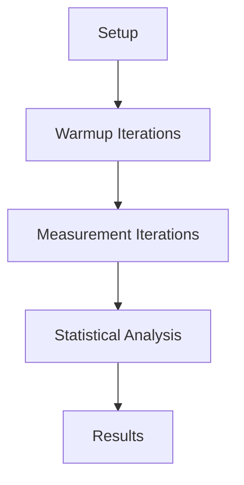

# Java Microbenchmarking

## Overview

Java Microbenchmarking involves measuring the performance of small code units. JMH (Java Microbenchmark Harness) is the standard tool for this, providing accurate and reliable benchmarks.

## Detailed Explanation

Microbenchmarking measures execution time of code snippets. JMH handles JVM warmup, dead code elimination, and statistical analysis to ensure accurate results.

Key concepts:
- Warmup iterations
- Measurement iterations
- Benchmark modes (Throughput, AverageTime, etc.)
- Forks for isolation
- Blackhole to prevent optimizations

### Benchmark Lifecycle



## Real-world Examples & Use Cases

- Comparing algorithm implementations
- Measuring library performance
- Identifying bottlenecks
- Validating optimizations
- Regression testing

## Code Examples

### Basic JMH Benchmark

```java
import org.openjdk.jmh.annotations.*;
import java.util.concurrent.TimeUnit;

@BenchmarkMode(Mode.AverageTime)
@OutputTimeUnit(TimeUnit.MICROSECONDS)
@State(Scope.Thread)
public class StringBenchmark {
    
    @Benchmark
    public String stringConcat() {
        return "Hello" + " " + "World";
    }
    
    @Benchmark
    public String stringBuilder() {
        return new StringBuilder().append("Hello").append(" ").append("World").toString();
    }
}
```

### Running Benchmarks

```bash
# Compile and run
mvn clean install
java -jar target/benchmarks.jar
```

### Advanced Benchmark

```java
@BenchmarkMode({Mode.Throughput, Mode.AverageTime})
@Warmup(iterations = 5, time = 1, timeUnit = TimeUnit.SECONDS)
@Measurement(iterations = 5, time = 1, timeUnit = TimeUnit.SECONDS)
@Fork(1)
@State(Scope.Benchmark)
public class CollectionBenchmark {
    
    private List<Integer> arrayList;
    private List<Integer> linkedList;
    
    @Setup
    public void setup() {
        arrayList = new ArrayList<>();
        linkedList = new LinkedList<>();
        for (int i = 0; i < 10000; i++) {
            arrayList.add(i);
            linkedList.add(i);
        }
    }
    
    @Benchmark
    public int arrayListGet() {
        return arrayList.get(5000);
    }
    
    @Benchmark
    public int linkedListGet() {
        return linkedList.get(5000);
    }
}
```

## References

- [JMH Official Site](https://openjdk.org/projects/code-tools/jmh/)
- [JMH Samples](https://hg.openjdk.org/code-tools/jmh/file/tip/jmh-samples/src/main/java/org/openjdk/jmh/samples/)

## Github-README Links & Related Topics

- [Performance Optimization Techniques](../performance-optimization-techniques/README.md)
- [Profiling Tools](../profiling-tools/README.md)
- [JVM Performance Tuning](../java/advanced-java-concepts/jvm-performance-tuning/README.md)