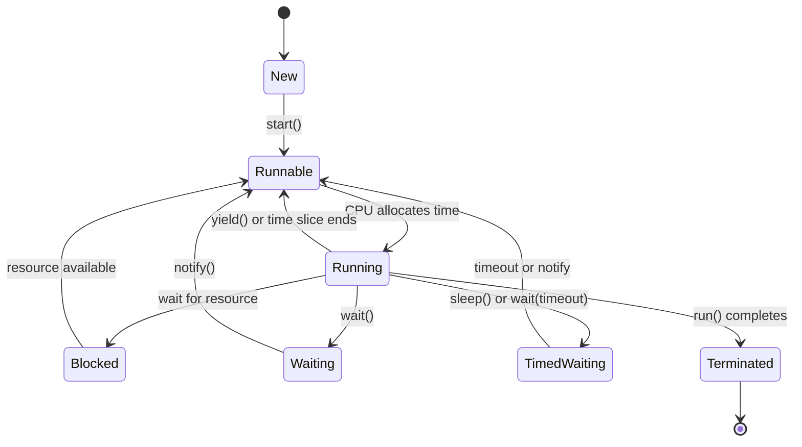
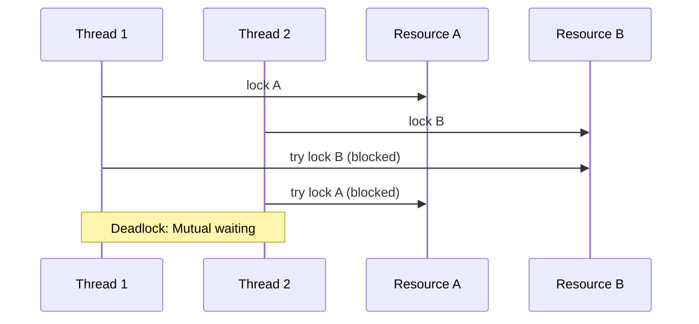

# Overview

Multithreading and concurrency in Java enable programs to perform multiple tasks simultaneously, improving performance and responsiveness. Java provides built-in support for threads, synchronization mechanisms, and high-level concurrency utilities in the `java.util.concurrent` package. With Java 21, virtual threads (Project Loom) offer lightweight concurrency for scalable applications. Key concepts include thread creation, synchronization to avoid race conditions, memory visibility, and managing thread pools for efficient resource utilization.

This topic covers the fundamentals of concurrent programming in Java, from basic thread operations to advanced patterns like producer-consumer, deadlock prevention, and modern features like virtual threads.

# Detailed Explanation

## Thread Lifecycle

Threads in Java follow a lifecycle managed by the JVM. The states include:

- **New**: Thread created but not started.
- **Runnable**: Ready to run, waiting for CPU time.
- **Running**: Executing code.
- **Blocked**: Waiting for a resource (e.g., I/O).
- **Waiting/Timed Waiting**: Paused indefinitely or for a timeout.
- **Terminated**: Execution completed.



## Thread Creation

Threads can be created by extending `Thread` or implementing `Runnable`. The latter is preferred for better flexibility.

## Synchronization

Synchronization prevents race conditions by ensuring only one thread accesses shared resources at a time. Methods include:

- **Synchronized blocks/methods**: Use intrinsic locks.
- **Locks**: Explicit locks like `ReentrantLock` for more control.
- **Atomic variables**: Classes like `AtomicInteger` for lock-free operations.

| Mechanism | Description | Use Case |
|-----------|-------------|----------|
| `synchronized` | Intrinsic lock on object | Simple mutual exclusion |
| `ReentrantLock` | Explicit lock with features like fairness | Complex locking scenarios |
| `AtomicInteger` | Lock-free atomic operations | Counters, flags |

## Concurrency Utilities

The `java.util.concurrent` package provides high-level tools:

- **Executors**: Manage thread pools.
- **Futures**: Represent asynchronous computations.
- **Concurrent Collections**: Thread-safe data structures like `ConcurrentHashMap`.
- **Synchronization Aids**: `CountDownLatch`, `CyclicBarrier`, `Semaphore`.

## Common Patterns

- **Producer-Consumer**: Threads produce and consume data via shared buffers.
- **Fork-Join**: Divide tasks into subtasks for parallel execution.

## Memory Model

Java's memory model defines how threads interact with memory, ensuring visibility and ordering through "happens-before" relationships established by synchronization, volatile variables, and thread start/join operations.

## Volatile Keyword

The `volatile` keyword guarantees that changes to a variable are immediately visible to all threads. It does not provide atomicity for compound operations.

## Atomic Operations

Classes like `AtomicInteger` provide lock-free, thread-safe operations using compare-and-swap (CAS) instructions.

## Virtual Threads (Java 21+)

Virtual threads are user-mode threads managed by the JVM, enabling efficient concurrency for I/O-bound tasks without the overhead of platform threads.

# Real-world Examples & Use Cases

- **Web Servers**: Handle multiple client requests concurrently (e.g., Tomcat uses thread pools).
- **GUI Applications**: Keep UI responsive while performing background tasks (e.g., Swing event dispatch thread).
- **Data Processing**: Parallelize computations in big data pipelines (e.g., Apache Spark).
- **Gaming**: Simulate multiple entities or handle network I/O without blocking.
- **Financial Systems**: Process transactions concurrently while maintaining consistency.

# Common Pitfalls & Edge Cases

- **Deadlock**: Threads hold resources and wait for others in a cycle, leading to indefinite blocking.
- **Race Conditions**: Concurrent access to shared data without synchronization causes unpredictable results.
- **Starvation**: A thread is perpetually denied resources due to scheduling policies.
- **Livelock**: Threads change state in response to each other but make no progress.
- **Memory Visibility Issues**: Changes by one thread are not visible to others without proper synchronization.
- **Atomicity Violations**: Operations like `i++` are not atomic, leading to lost updates.



# Code Examples

## Basic Thread Creation

```java
// Extending Thread
public class MyThread extends Thread {
    @Override
    public void run() {
        System.out.println("Thread is running: " + Thread.currentThread().getName());
    }
}

// Usage
public class Main {
    public static void main(String[] args) {
        MyThread thread = new MyThread();
        thread.start(); // Starts the thread
    }
}
```

## Implementing Runnable

```java
public class MyRunnable implements Runnable {
    @Override
    public void run() {
        System.out.println("Runnable is executing: " + Thread.currentThread().getName());
    }
}

// Usage
public class Main {
    public static void main(String[] args) {
        Thread thread = new Thread(new MyRunnable());
        thread.start();
    }
}
```

## Synchronization with Synchronized

```java
public class Counter {
    private int count = 0;

    public synchronized void increment() {
        count++;
    }

    public synchronized int getCount() {
        return count;
    }
}

// Usage
public class Main {
    public static void main(String[] args) throws InterruptedException {
        Counter counter = new Counter();
        Thread t1 = new Thread(() -> {
            for (int i = 0; i < 1000; i++) counter.increment();
        });
        Thread t2 = new Thread(() -> {
            for (int i = 0; i < 1000; i++) counter.increment();
        });
        t1.start();
        t2.start();
        t1.join();
        t2.join();
        System.out.println("Final count: " + counter.getCount()); // Should be 2000
    }
}
```

## Using ExecutorService

```java
import java.util.concurrent.ExecutorService;
import java.util.concurrent.Executors;

public class Main {
    public static void main(String[] args) {
        ExecutorService executor = Executors.newFixedThreadPool(3);
        for (int i = 0; i < 5; i++) {
            executor.submit(() -> {
                System.out.println("Task executed by: " + Thread.currentThread().getName());
            });
        }
        executor.shutdown();
    }
}
```

## Producer-Consumer with BlockingQueue

```java
import java.util.concurrent.BlockingQueue;
import java.util.concurrent.LinkedBlockingQueue;

public class ProducerConsumer {
    private static final BlockingQueue<Integer> queue = new LinkedBlockingQueue<>(10);

    static class Producer implements Runnable {
        @Override
        public void run() {
            try {
                for (int i = 0; i < 10; i++) {
                    queue.put(i);
                    System.out.println("Produced: " + i);
                    Thread.sleep(100);
                }
            } catch (InterruptedException e) {
                Thread.currentThread().interrupt();
            }
        }
    }

    static class Consumer implements Runnable {
        @Override
        public void run() {
            try {
                for (int i = 0; i < 10; i++) {
                    int item = queue.take();
                    System.out.println("Consumed: " + item);
                    Thread.sleep(200);
                }
            } catch (InterruptedException e) {
                Thread.currentThread().interrupt();
            }
        }
    }

    public static void main(String[] args) {
        Thread producer = new Thread(new Producer());
        Thread consumer = new Thread(new Consumer());
        producer.start();
        consumer.start();
    }
}

```

## Using Volatile

```java
public class VolatileExample {
    private volatile boolean running = true;

    public void stop() {
        running = false;
    }

    public void run() {
        while (running) {
            // Perform work
        }
    }
}
```

## Using AtomicInteger

```java
import java.util.concurrent.atomic.AtomicInteger;

public class AtomicCounter {
    private AtomicInteger count = new AtomicInteger(0);

    public void increment() {
        count.incrementAndGet();
    }

    public int get() {
        return count.get();
    }
}
```

## Virtual Threads Example

```java
import java.util.concurrent.Executors;

public class VirtualThreadsDemo {
    public static void main(String[] args) {
        try (var executor = Executors.newVirtualThreadPerTaskExecutor()) {
            for (int i = 0; i < 100; i++) {
                executor.submit(() -> {
                    System.out.println("Task in virtual thread: " + Thread.currentThread().getName());
                });
            }
        }
    }
}
```

# Tools & Libraries

- **JMH (Java Microbenchmarking Harness)**: For accurate performance benchmarking of concurrent code.
- **VisualVM**: Tool for profiling and monitoring JVM, including thread dumps and CPU usage.
- **JConsole**: Built-in JVM monitoring tool for threads, memory, and performance.
- **Libraries**: 
  - **Guava**: Provides additional concurrency utilities like `ListenableFuture`.
  - **RxJava**: For reactive programming and asynchronous streams.
  - **Akka**: Actor-based concurrency framework for building concurrent applications.

# References
- [Oracle Java Concurrency Tutorial](https://docs.oracle.com/javase/tutorial/essential/concurrency/)
- [Java Util Concurrent Package](https://docs.oracle.com/javase/8/docs/api/java/util/concurrent/package-summary.html)
- [Baeldung Concurrency Guide](https://www.baeldung.com/java-concurrency)
- [Effective Java: Concurrency Chapter](https://www.amazon.com/Effective-Java-Joshua-Bloch/dp/0134685997) (Book reference)
- [Java Memory Model](https://docs.oracle.com/javase/specs/jls/se21/html/jls-17.html)
- [Project Loom: Virtual Threads](https://openjdk.org/jeps/444)
- [JMH (Java Microbenchmarking Harness)](https://openjdk.org/projects/code-tools/jmh/)

# STAR Summary

**Situation**: A web server handling thousands of concurrent requests experiences performance degradation and occasional crashes under high load.

**Task**: Optimize the server to handle concurrency efficiently without resource exhaustion.

**Action**: Implemented a thread pool using `ExecutorService`, applied synchronization for shared state, and used atomic variables for counters. Monitored with VisualVM to identify bottlenecks.

**Result**: Server throughput increased by 50%, response times reduced by 30%, and eliminated crashes, ensuring reliable operation under peak loads.

# Github-README Links & Related Topics

- [Java Executorservice](../java-executorservice/)
- [Java Completablefuture](../java-completablefuture/)
- [Java Concurrenthashmap](../java-concurrenthashmap/)
- [Java Atomic Variables](../java-atomic-variables/)
- [Java Synchronized Blocks](../java-synchronized-blocks/)
- [Java Readwritelock](../java-readwritelock/)
- [Java Semaphore](../java-semaphore/)
- [Java CountDownLatch](../java-countdownlatch/)
- [Java CyclicBarrier](../java-cyclicbarrier/)
- [Java Structured Concurrency](../java-structured-concurrency/)