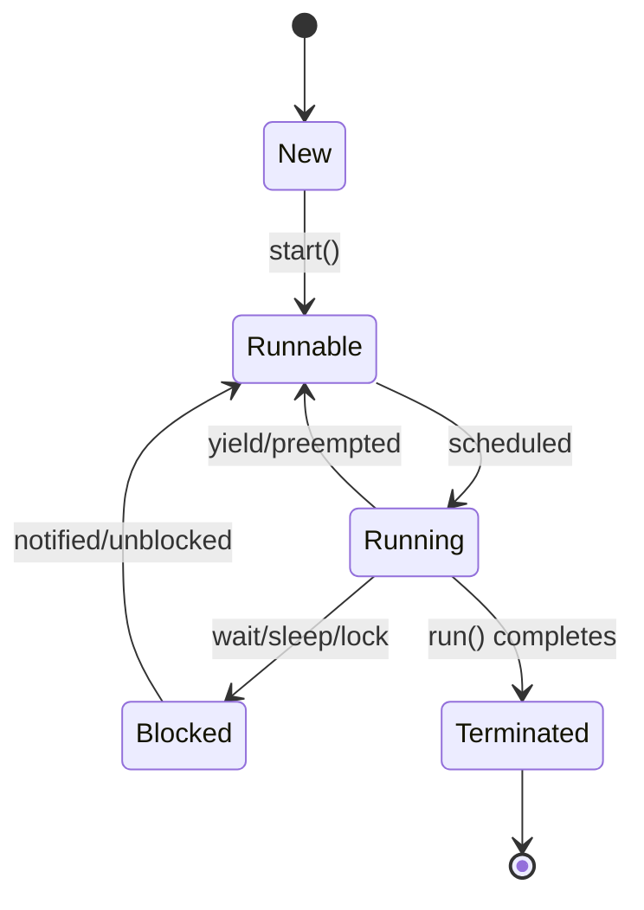
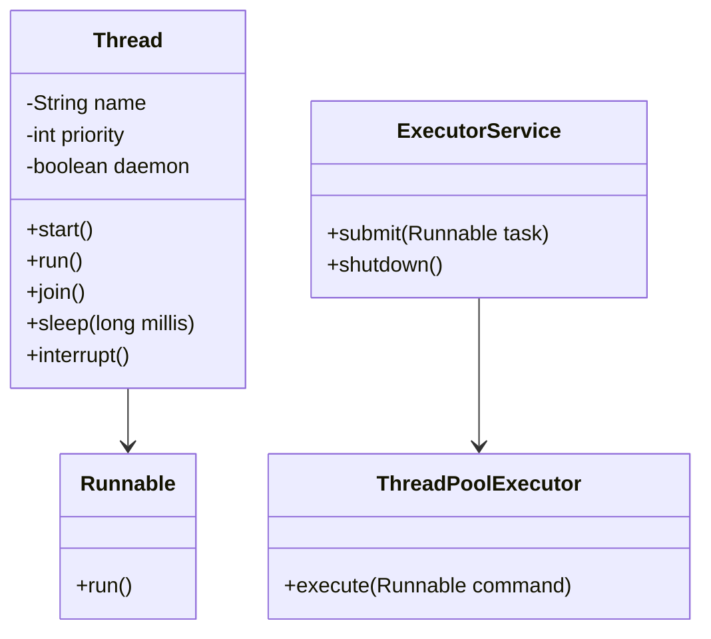
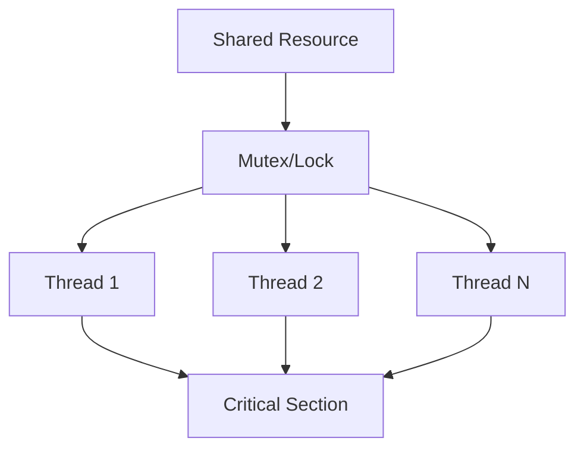
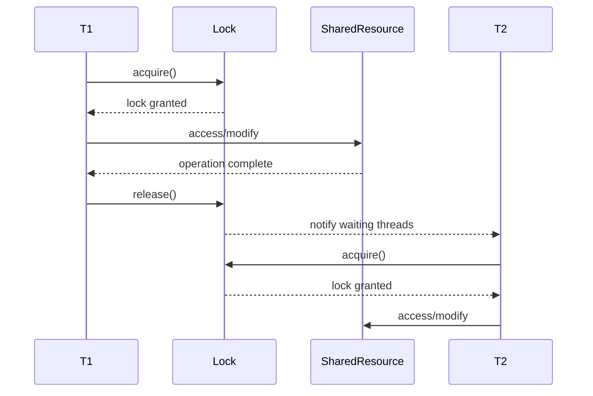

# Multithreading & Concurrency in Java

## Overview

Multithreading and concurrency in Java enable programs to execute multiple threads simultaneously, improving performance and responsiveness. Java provides robust support through the `java.lang.Thread` class, `java.util.concurrent` package, and synchronization mechanisms. Understanding these concepts is essential for building scalable, efficient applications that handle concurrent tasks without data corruption or deadlocks.

## Detailed Explanation

### Key Concepts

- **Thread**: A lightweight process within a program that executes independently.
- **Concurrency**: Multiple threads executing simultaneously, potentially on different cores.
- **Parallelism**: True simultaneous execution on multi-core systems.
- **Synchronization**: Coordinating access to shared resources to prevent race conditions.
- **Thread Safety**: Ensuring code behaves correctly when accessed by multiple threads.

### Thread Lifecycle

1. **New**: Thread created but not started.
2. **Runnable**: Thread ready to run, waiting for CPU time.
3. **Running**: Thread executing.
4. **Blocked**: Thread waiting for a resource (e.g., I/O, lock).
5. **Terminated**: Thread completed execution.



### Synchronization Mechanisms

- **Synchronized Blocks/Methods**: Use `synchronized` keyword to lock objects.
- **Locks**: `ReentrantLock` for more flexible locking.
- **Atomic Variables**: Classes like `AtomicInteger` for thread-safe operations.
- **Volatile**: Ensures visibility of changes across threads.
- **ThreadLocal**: Provides thread-specific variables.

### Executor Framework

The `java.util.concurrent` package provides:
- **ExecutorService**: Manages thread pools.
- **ThreadPoolExecutor**: Configurable thread pool.
- **ScheduledExecutorService**: For delayed/scheduled tasks.

### Common Concurrency Utilities

| Utility | Purpose | Example |
|---------|---------|---------|
| CountDownLatch | Wait for multiple threads to complete | Coordinating startup tasks |
| CyclicBarrier | Synchronize at a common point | Multi-phase algorithms |
| Semaphore | Control access to resources | Limiting concurrent connections |
| Exchanger | Exchange data between threads | Producer-consumer with data exchange |

## Real-world Examples & Use Cases

- **Web Servers**: Handle multiple client requests concurrently using thread pools.
- **Database Connections**: Pool connections to manage concurrent database access.
- **GUI Applications**: Keep UI responsive while performing background tasks.
- **Big Data Processing**: Parallel processing of large datasets using ForkJoinPool.
- **Game Development**: Separate threads for rendering, physics, and user input.

## Code Examples

### Creating and Starting Threads

```java
public class SimpleThread extends Thread {
    @Override
    public void run() {
        System.out.println("Thread running: " + Thread.currentThread().getName());
    }

    public static void main(String[] args) {
        SimpleThread thread = new SimpleThread();
        thread.start(); // Starts the thread
    }
}
```

### Using Runnable Interface

```java
public class RunnableExample implements Runnable {
    @Override
    public void run() {
        System.out.println("Runnable running: " + Thread.currentThread().getName());
    }

    public static void main(String[] args) {
        Thread thread = new Thread(new RunnableExample());
        thread.start();
    }
}
```

### Synchronization Example

```java
public class SynchronizedCounter {
    private int count = 0;

    public synchronized void increment() {
        count++;
    }

    public synchronized int getCount() {
        return count;
    }

    public static void main(String[] args) throws InterruptedException {
        SynchronizedCounter counter = new SynchronizedCounter();
        
        Thread t1 = new Thread(() -> {
            for (int i = 0; i < 1000; i++) {
                counter.increment();
            }
        });
        
        Thread t2 = new Thread(() -> {
            for (int i = 0; i < 1000; i++) {
                counter.increment();
            }
        });
        
        t1.start();
        t2.start();
        t1.join();
        t2.join();
        
        System.out.println("Final count: " + counter.getCount()); // Should be 2000
    }
}
```

### Using ExecutorService

```java
import java.util.concurrent.ExecutorService;
import java.util.concurrent.Executors;

public class ExecutorExample {
    public static void main(String[] args) {
        ExecutorService executor = Executors.newFixedThreadPool(3);
        
        for (int i = 0; i < 5; i++) {
            executor.submit(() -> {
                System.out.println("Task executed by: " + Thread.currentThread().getName());
                try {
                    Thread.sleep(1000);
                } catch (InterruptedException e) {
                    Thread.currentThread().interrupt();
                }
            });
        }
        
        executor.shutdown();
    }
}
```

### Atomic Variables

```java
import java.util.concurrent.atomic.AtomicInteger;

public class AtomicExample {
    private static AtomicInteger counter = new AtomicInteger(0);

    public static void main(String[] args) throws InterruptedException {
        Thread t1 = new Thread(() -> {
            for (int i = 0; i < 1000; i++) {
                counter.incrementAndGet();
            }
        });
        
        Thread t2 = new Thread(() -> {
            for (int i = 0; i < 1000; i++) {
                counter.incrementAndGet();
            }
        });
        
        t1.start();
        t2.start();
        t1.join();
        t2.join();
        
        System.out.println("Final counter: " + counter.get()); // Should be 2000
    }
}
```

### Producer-Consumer with BlockingQueue

```java
import java.util.concurrent.BlockingQueue;
import java.util.concurrent.LinkedBlockingQueue;

public class ProducerConsumer {
    private static BlockingQueue<Integer> queue = new LinkedBlockingQueue<>(10);

    public static void main(String[] args) {
        Thread producer = new Thread(() -> {
            try {
                for (int i = 0; i < 10; i++) {
                    queue.put(i);
                    System.out.println("Produced: " + i);
                    Thread.sleep(100);
                }
            } catch (InterruptedException e) {
                Thread.currentThread().interrupt();
            }
        });

        Thread consumer = new Thread(() -> {
            try {
                for (int i = 0; i < 10; i++) {
                    int item = queue.take();
                    System.out.println("Consumed: " + item);
                    Thread.sleep(200);
                }
            } catch (InterruptedException e) {
                Thread.currentThread().interrupt();
            }
        });

        producer.start();
        consumer.start();
    }
}
```

## Common Pitfalls & Edge Cases

- **Race Conditions**: Unprotected shared data access leading to inconsistent states.
- **Deadlocks**: Threads waiting indefinitely for resources held by each other.
- **Starvation**: A thread unable to gain access to required resources.
- **Memory Visibility**: Changes not visible across threads without proper synchronization.
- **Thread Leaks**: Threads not properly terminated, consuming resources.
- **Over-synchronization**: Excessive locking reducing performance.

## Data Models

### Thread Model Diagram



### Concurrency Pattern Diagram



## Journey / Sequence

#### Thread Synchronization Sequence



## STAR Summary

- **Situation**: Interview question about handling concurrent access in a multi-threaded Java application.
- **Task**: Explain thread safety, synchronization mechanisms, and demonstrate proper concurrent programming techniques.
- **Action**: Discussed synchronized blocks, volatile variables, atomic classes, and Executor framework; provided code examples for producer-consumer pattern and thread-safe counters.
- **Result**: Showed strong understanding of Java concurrency, leading to advanced questions about lock-free algorithms and performance optimization.

## Tools & Libraries

- **JVM Tools**:
  - `jstack`: Thread dump analysis.
  - `jconsole`: Monitor thread activity.
  - `VisualVM`: GUI for thread monitoring.
- **Libraries**:
  - **Guava**: Additional concurrency utilities.
  - **RxJava**: Reactive programming for concurrency.
  - **Akka**: Actor-based concurrency model.

## References

- [Oracle Java Concurrency Tutorial](https://docs.oracle.com/javase/tutorial/essential/concurrency/)
- [Java Concurrency in Practice by Brian Goetz](https://www.amazon.com/Java-Concurrency-Practice-Brian-Goetz/dp/0321349601)
- [java.util.concurrent Package Documentation](https://docs.oracle.com/en/java/javase/21/docs/api/java.base/java/util/concurrent/package-summary.html)

## Github-README Links & Related Topics

- [Java Fundamentals](../java-fundamentals/README.md)
- [JVM Internals & Class Loading](../jvm-internals-class-loading/README.md)
- [Collections & Data Structures](../collections-and-data-structures/README.md)
- [Java Memory Management](../java-memory-management/README.md)