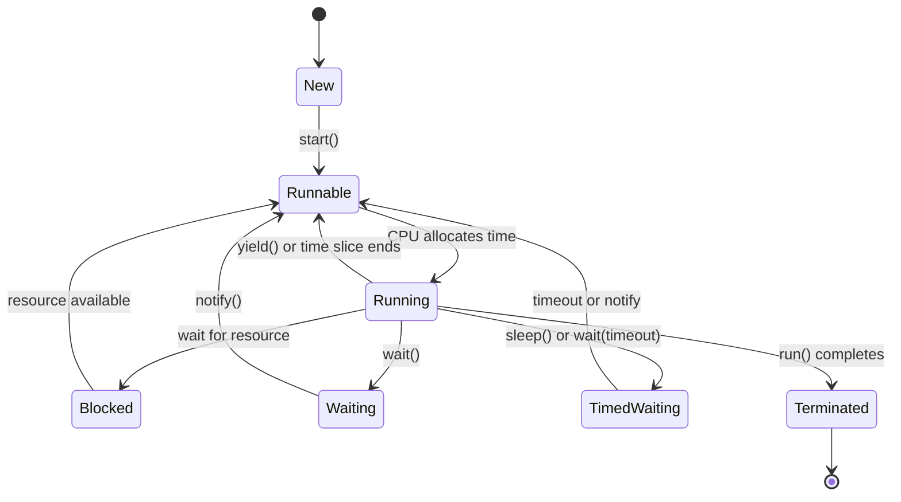
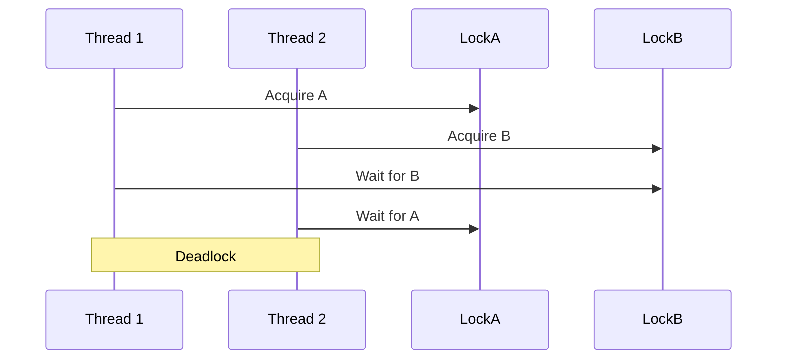

# Overview

Multithreading and concurrency in Java allow programs to execute multiple tasks simultaneously, enhancing performance, responsiveness, and resource utilization. Java provides robust support through the `java.lang.Thread` class, synchronization primitives, and the `java.util.concurrent` package. Key features include thread lifecycle management, synchronization to prevent race conditions, atomic operations, and modern additions like virtual threads in Java 21 for scalable I/O-bound applications.

This guide covers core concepts, best practices, and practical implementations essential for interview preparation and real-world development.

# Detailed Explanation

## Thread Lifecycle

Threads in Java transition through states managed by the JVM:

- **New**: Thread instantiated but not started.
- **Runnable**: Ready for execution, awaiting CPU allocation.
- **Running**: Actively executing code.
- **Blocked**: Paused due to resource contention (e.g., I/O operations).
- **Waiting/Timed Waiting**: Indefinitely or temporarily suspended (e.g., via `wait()` or `sleep()`).
- **Terminated**: Execution completed or interrupted.



## Thread Creation and Management

Threads can be created by extending `Thread` or implementing `Runnable`/`Callable`. `Runnable` is preferred for flexibility. The `Executor` framework manages thread pools efficiently.

## Synchronization Mechanisms

Synchronization ensures thread-safe access to shared resources:

| Mechanism | Description | Use Case |
|-----------|-------------|----------|
| `synchronized` | Intrinsic locks for mutual exclusion | Simple critical sections |
| `ReentrantLock` | Explicit locks with advanced features (e.g., fairness, timeouts) | Complex locking needs |
| `Atomic` classes | Lock-free operations using CAS | Counters, flags without locks |
| `volatile` | Ensures visibility of variable changes | Flags, single writes |

## Concurrency Utilities

The `java.util.concurrent` package offers high-level abstractions:

- **Executors**: Thread pool management (e.g., `ThreadPoolExecutor`).
- **Futures/CompletableFuture**: Asynchronous computation handling.
- **Concurrent Collections**: Thread-safe data structures (e.g., `ConcurrentHashMap`, `CopyOnWriteArrayList`).
- **Synchronization Aids**: `CountDownLatch`, `CyclicBarrier`, `Semaphore`, `Phaser`.

## Memory Model and Visibility

Java's memory model defines "happens-before" relationships for ordering and visibility. Synchronization, `volatile`, and thread operations establish these guarantees.

## Advanced Concepts

- **Fork-Join Framework**: For divide-and-conquer parallelism.
- **Virtual Threads (Java 21+)**: Lightweight threads for high-concurrency I/O tasks.
- **Reactive Streams**: For asynchronous data processing.

# Real-world Examples & Use Cases

- **Web Servers**: Concurrent request handling (e.g., Spring Boot with thread pools).
- **GUI Applications**: Background processing without freezing UI (e.g., JavaFX).
- **Data Processing**: Parallel computations in big data (e.g., Hadoop MapReduce).
- **Gaming**: Simultaneous entity simulations and network handling.
- **Financial Systems**: Transaction processing with consistency guarantees.
- **Microservices**: Asynchronous communication and load balancing.

# Code Examples

## Basic Thread Creation

```java
// Extending Thread
public class MyThread extends Thread {
    @Override
    public void run() {
        System.out.println("Thread running: " + Thread.currentThread().getName());
    }
}

// Implementing Runnable
public class MyRunnable implements Runnable {
    @Override
    public void run() {
        System.out.println("Runnable executing: " + Thread.currentThread().getName());
    }
}

// Usage
public class Main {
    public static void main(String[] args) {
        Thread t1 = new MyThread();
        Thread t2 = new Thread(new MyRunnable());
        t1.start();
        t2.start();
    }
}
```

## Synchronization Example

```java
public class SynchronizedCounter {
    private int count = 0;

    public synchronized void increment() {
        count++;
    }

    public synchronized int getCount() {
        return count;
    }
}

// Usage with race condition demonstration
public class Main {
    public static void main(String[] args) throws InterruptedException {
        SynchronizedCounter counter = new SynchronizedCounter();
        Runnable task = () -> {
            for (int i = 0; i < 1000; i++) counter.increment();
        };
        Thread t1 = new Thread(task);
        Thread t2 = new Thread(task);
        t1.start(); t2.start();
        t1.join(); t2.join();
        System.out.println("Count: " + counter.getCount()); // 2000
    }
}
```

## ExecutorService for Thread Pools

```java
import java.util.concurrent.ExecutorService;
import java.util.concurrent.Executors;

public class ExecutorExample {
    public static void main(String[] args) {
        ExecutorService executor = Executors.newFixedThreadPool(4);
        for (int i = 0; i < 10; i++) {
            executor.submit(() -> {
                System.out.println("Task by: " + Thread.currentThread().getName());
            });
        }
        executor.shutdown();
    }
}
```

## Producer-Consumer Pattern

```java
import java.util.concurrent.BlockingQueue;
import java.util.concurrent.LinkedBlockingQueue;

public class ProducerConsumer {
    private static BlockingQueue<Integer> queue = new LinkedBlockingQueue<>(5);

    static class Producer implements Runnable {
        public void run() {
            try {
                for (int i = 0; i < 10; i++) {
                    queue.put(i);
                    System.out.println("Produced: " + i);
                }
            } catch (InterruptedException e) {
                Thread.currentThread().interrupt();
            }
        }
    }

    static class Consumer implements Runnable {
        public void run() {
            try {
                for (int i = 0; i < 10; i++) {
                    int item = queue.take();
                    System.out.println("Consumed: " + item);
                }
            } catch (InterruptedException e) {
                Thread.currentThread().interrupt();
            }
        }
    }

    public static void main(String[] args) {
        new Thread(new Producer()).start();
        new Thread(new Consumer()).start();
    }
}
```

## Atomic Variables

```java
import java.util.concurrent.atomic.AtomicInteger;

public class AtomicCounter {
    private AtomicInteger count = new AtomicInteger(0);

    public void increment() {
        count.incrementAndGet();
    }

    public int get() {
        return count.get();
    }
}
```

## Virtual Threads (Java 21+)

```java
import java.util.concurrent.Executors;

public class VirtualThreadsExample {
    public static void main(String[] args) {
        try (var executor = Executors.newVirtualThreadPerTaskExecutor()) {
            for (int i = 0; i < 100; i++) {
                executor.submit(() -> {
                    System.out.println("Virtual thread: " + Thread.currentThread().getName());
                });
            }
        }
    }
}
```

# Common Pitfalls & Edge Cases

- **Deadlocks**: Circular resource dependencies; avoid by ordering locks or using timeouts.
- **Race Conditions**: Unprotected shared state access; mitigate with synchronization.
- **Starvation**: Threads denied resources; use fair locks.
- **Livelock**: Threads busy-waiting without progress; redesign logic.
- **Memory Inconsistencies**: Use `volatile` or synchronization for visibility.
- **InterruptedException Handling**: Properly propagate or handle interruptions.



# Tools & Libraries

- **JMH**: Microbenchmarking for performance testing.
- **VisualVM/JConsole**: JVM monitoring and profiling.
- **Libraries**:
  - **Guava**: Additional concurrency utilities.
  - **RxJava**: Reactive programming.
  - **Akka**: Actor model for concurrency.

# References

- [Oracle Java Concurrency Tutorial](https://docs.oracle.com/javase/tutorial/essential/concurrency/)
- [Java Util Concurrent API](https://docs.oracle.com/javase/8/docs/api/java/util/concurrent/package-summary.html)
- [Baeldung Java Concurrency](https://www.baeldung.com/java-concurrency)
- [Effective Java - Concurrency](https://www.amazon.com/Effective-Java-Joshua-Bloch/dp/0134685997)
- [Java Memory Model Specification](https://docs.oracle.com/javase/specs/jls/se21/html/jls-17.html)
- [Project Loom - Virtual Threads](https://openjdk.org/jeps/444)
- [JMH Documentation](https://openjdk.org/projects/code-tools/jmh/)

# Github-README Links & Related Topics

- [Java Executorservice](../java-executorservice/)
- [Java Completablefuture](../java-completablefuture/)
- [Java Concurrenthashmap](../java-concurrenthashmap/)
- [Java Atomic Variables](../java-atomic-variables/)
- [Java Readwritelock](../java-readwritelock/)
- [Java Semaphore](../java-semaphore/)
- [Java CountDownLatch](../java-countdownlatch/)
- [Java CyclicBarrier](../java-cyclicbarrier/)