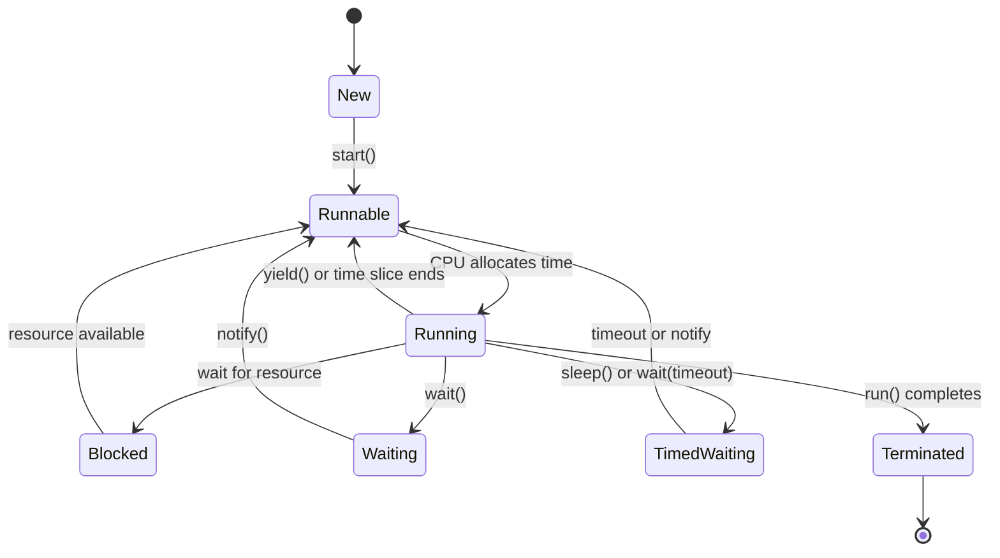

# Overview

Multithreading and concurrency in Java enable programs to perform multiple tasks simultaneously, improving performance and responsiveness. Java provides built-in support for threads, synchronization mechanisms, and high-level concurrency utilities in the `java.util.concurrent` package. Key concepts include thread creation, synchronization to avoid race conditions, and managing thread pools for efficient resource utilization.

This topic covers the fundamentals of concurrent programming in Java, from basic thread operations to advanced patterns like producer-consumer and deadlock prevention.

# Detailed Explanation

## Thread Lifecycle

Threads in Java follow a lifecycle managed by the JVM. The states include:

- **New**: Thread created but not started.
- **Runnable**: Ready to run, waiting for CPU time.
- **Running**: Executing code.
- **Blocked**: Waiting for a resource (e.g., I/O).
- **Waiting/Timed Waiting**: Paused indefinitely or for a timeout.
- **Terminated**: Execution completed.



## Thread Creation

Threads can be created by extending `Thread` or implementing `Runnable`. The latter is preferred for better flexibility.

## Synchronization

Synchronization prevents race conditions by ensuring only one thread accesses shared resources at a time. Methods include:

- **Synchronized blocks/methods**: Use intrinsic locks.
- **Locks**: Explicit locks like `ReentrantLock` for more control.
- **Atomic variables**: Classes like `AtomicInteger` for lock-free operations.

| Mechanism | Description | Use Case |
|-----------|-------------|----------|
| `synchronized` | Intrinsic lock on object | Simple mutual exclusion |
| `ReentrantLock` | Explicit lock with features like fairness | Complex locking scenarios |
| `AtomicInteger` | Lock-free atomic operations | Counters, flags |

## Concurrency Utilities

The `java.util.concurrent` package provides high-level tools:

- **Executors**: Manage thread pools.
- **Futures**: Represent asynchronous computations.
- **Concurrent Collections**: Thread-safe data structures like `ConcurrentHashMap`.
- **Synchronization Aids**: `CountDownLatch`, `CyclicBarrier`, `Semaphore`.

## Common Patterns

- **Producer-Consumer**: Threads produce and consume data via shared buffers.
- **Fork-Join**: Divide tasks into subtasks for parallel execution.

## Pitfalls

- **Deadlock**: Threads wait indefinitely for resources.
- **Race Conditions**: Unpredictable results from unsynchronized access.
- **Starvation**: A thread never gets CPU time.

# Real-world Examples & Use Cases

- **Web Servers**: Handle multiple client requests concurrently (e.g., Tomcat uses thread pools).
- **GUI Applications**: Keep UI responsive while performing background tasks (e.g., Swing event dispatch thread).
- **Data Processing**: Parallelize computations in big data pipelines (e.g., Apache Spark).
- **Gaming**: Simulate multiple entities or handle network I/O without blocking.
- **Financial Systems**: Process transactions concurrently while maintaining consistency.

# Code Examples

## Basic Thread Creation

```java
// Extending Thread
public class MyThread extends Thread {
    @Override
    public void run() {
        System.out.println("Thread is running: " + Thread.currentThread().getName());
    }
}

// Usage
public class Main {
    public static void main(String[] args) {
        MyThread thread = new MyThread();
        thread.start(); // Starts the thread
    }
}
```

## Implementing Runnable

```java
public class MyRunnable implements Runnable {
    @Override
    public void run() {
        System.out.println("Runnable is executing: " + Thread.currentThread().getName());
    }
}

// Usage
public class Main {
    public static void main(String[] args) {
        Thread thread = new Thread(new MyRunnable());
        thread.start();
    }
}
```

## Synchronization with Synchronized

```java
public class Counter {
    private int count = 0;

    public synchronized void increment() {
        count++;
    }

    public synchronized int getCount() {
        return count;
    }
}

// Usage
public class Main {
    public static void main(String[] args) throws InterruptedException {
        Counter counter = new Counter();
        Thread t1 = new Thread(() -> {
            for (int i = 0; i < 1000; i++) counter.increment();
        });
        Thread t2 = new Thread(() -> {
            for (int i = 0; i < 1000; i++) counter.increment();
        });
        t1.start();
        t2.start();
        t1.join();
        t2.join();
        System.out.println("Final count: " + counter.getCount()); // Should be 2000
    }
}
```

## Using ExecutorService

```java
import java.util.concurrent.ExecutorService;
import java.util.concurrent.Executors;

public class Main {
    public static void main(String[] args) {
        ExecutorService executor = Executors.newFixedThreadPool(3);
        for (int i = 0; i < 5; i++) {
            executor.submit(() -> {
                System.out.println("Task executed by: " + Thread.currentThread().getName());
            });
        }
        executor.shutdown();
    }
}
```

## Producer-Consumer with BlockingQueue

```java
import java.util.concurrent.BlockingQueue;
import java.util.concurrent.LinkedBlockingQueue;

public class ProducerConsumer {
    private static final BlockingQueue<Integer> queue = new LinkedBlockingQueue<>(10);

    static class Producer implements Runnable {
        @Override
        public void run() {
            try {
                for (int i = 0; i < 10; i++) {
                    queue.put(i);
                    System.out.println("Produced: " + i);
                    Thread.sleep(100);
                }
            } catch (InterruptedException e) {
                Thread.currentThread().interrupt();
            }
        }
    }

    static class Consumer implements Runnable {
        @Override
        public void run() {
            try {
                for (int i = 0; i < 10; i++) {
                    int item = queue.take();
                    System.out.println("Consumed: " + item);
                    Thread.sleep(200);
                }
            } catch (InterruptedException e) {
                Thread.currentThread().interrupt();
            }
        }
    }

    public static void main(String[] args) {
        Thread producer = new Thread(new Producer());
        Thread consumer = new Thread(new Consumer());
        producer.start();
        consumer.start();
    }
}
```

# References

- [Oracle Java Concurrency Tutorial](https://docs.oracle.com/javase/tutorial/essential/concurrency/)
- [Java Util Concurrent Package](https://docs.oracle.com/javase/8/docs/api/java/util/concurrent/package-summary.html)
- [Baeldung Concurrency Guide](https://www.baeldung.com/java-concurrency)
- [Effective Java: Concurrency Chapter](https://www.amazon.com/Effective-Java-Joshua-Bloch/dp/0134685997) (Book reference)

# Github-README Links & Related Topics

- [Java Executorservice](../java-executorservice/)
- [Java Completablefuture](../java-completablefuture/)
- [Java Concurrenthashmap](../java-concurrenthashmap/)
- [Java Atomic Variables](../java-atomic-variables/)
- [Java Synchronized Blocks](../java-synchronized-blocks/)
- [Java Readwritelock](../java-readwritelock/)
- [Java Semaphore](../java-semaphore/)
- [Java CountDownLatch](../java-countdownlatch/)
- [Java CyclicBarrier](../java-cyclicbarrier/)