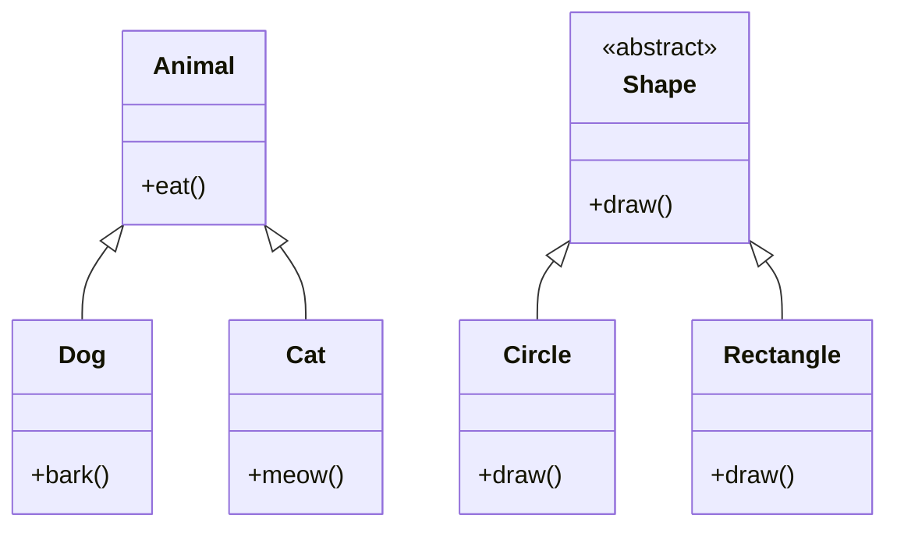

# OOP Principles in Java

## Overview

Object-Oriented Programming (OOP) is a fundamental paradigm in Java that organizes software design around objects, which encapsulate data and behavior. Java supports four core OOP principles: **Encapsulation**, **Inheritance**, **Polymorphism**, and **Abstraction**. These principles promote code reusability, maintainability, and scalability by modeling real-world entities and relationships.

## Detailed Explanation

### Encapsulation

Encapsulation bundles data (fields) and methods (functions) that operate on the data into a single unit called a class. It restricts direct access to some of an object's components, protecting the integrity of the data. In Java, this is achieved using access modifiers: `private`, `protected`, `public`, and package-private (default).

- **Benefits**: Data hiding, improved security, easier maintenance.
- **Implementation**: Use private fields with public getter/setter methods.

### Inheritance

Inheritance allows a class (subclass) to inherit properties and behaviors from another class (superclass). This promotes code reuse and establishes a hierarchical relationship. In Java, inheritance is implemented using the `extends` keyword for classes and `implements` for interfaces.

- **Types**: Single inheritance (one superclass), multiple inheritance via interfaces.
- **Benefits**: Reduces code duplication, supports polymorphism.

### Polymorphism

Polymorphism enables objects to be treated as instances of their parent class or interface, allowing methods to behave differently based on the object type. It includes compile-time (method overloading) and runtime (method overriding) polymorphism.

- **Method Overloading**: Same method name, different parameters.
- **Method Overriding**: Subclass provides specific implementation of a superclass method.
- **Benefits**: Flexibility, extensibility.

### Abstraction

Abstraction focuses on exposing essential features while hiding implementation details. It simplifies complex systems by providing a high-level view. In Java, abstraction is achieved through abstract classes (using `abstract` keyword) and interfaces.

- **Abstract Classes**: Can have abstract and concrete methods; cannot be instantiated.
- **Interfaces**: Define contracts with abstract methods; support multiple inheritance.
- **Benefits**: Modularity, reduced complexity.

| Principle      | Key Concept                  | Java Mechanism              | Example Use Case          |
|----------------|------------------------------|-----------------------------|---------------------------|
| Encapsulation | Data hiding                  | Access modifiers           | Secure data access       |
| Inheritance   | Code reuse                   | `extends`                   | Hierarchical modeling    |
| Polymorphism  | Multiple forms               | Overloading/Overriding     | Dynamic method dispatch  |
| Abstraction   | Hiding complexity           | Abstract classes/Interfaces| API design               |



## Real-world Examples & Use Cases

- **Encapsulation**: Banking applications use encapsulation to protect account balances and transaction details, exposing only necessary methods like `deposit()` and `withdraw()`.
- **Inheritance**: GUI frameworks like Swing use inheritance to create custom components from base classes like `JButton`.
- **Polymorphism**: Payment systems handle different payment methods (credit card, PayPal) through a common `PaymentProcessor` interface.
- **Abstraction**: Database drivers abstract underlying storage mechanisms, allowing applications to switch between SQL and NoSQL without code changes.

## Code Examples

### Encapsulation Example

```java
public class BankAccount {
    private double balance;
    private String accountNumber;

    public BankAccount(String accountNumber, double initialBalance) {
        this.accountNumber = accountNumber;
        this.balance = initialBalance;
    }

    public void deposit(double amount) {
        if (amount > 0) {
            balance += amount;
        }
    }

    public void withdraw(double amount) {
        if (amount > 0 && amount <= balance) {
            balance -= amount;
        }
    }

    public double getBalance() {
        return balance;
    }

    // No direct access to balance or accountNumber
}
```

### Inheritance Example

```java
public class Vehicle {
    protected String brand;
    protected int year;

    public Vehicle(String brand, int year) {
        this.brand = brand;
        this.year = year;
    }

    public void start() {
        System.out.println("Vehicle starting");
    }
}

public class Car extends Vehicle {
    private int doors;

    public Car(String brand, int year, int doors) {
        super(brand, year);
        this.doors = doors;
    }

    @Override
    public void start() {
        System.out.println("Car engine starting");
    }

    public void honk() {
        System.out.println("Honk honk!");
    }
}
```

### Polymorphism Example

```java
// Method Overloading
public class Calculator {
    public int add(int a, int b) {
        return a + b;
    }

    public double add(double a, double b) {
        return a + b;
    }
}

// Method Overriding
public abstract class Employee {
    public abstract double calculateSalary();
}

public class FullTimeEmployee extends Employee {
    private double monthlySalary;

    public FullTimeEmployee(double monthlySalary) {
        this.monthlySalary = monthlySalary;
    }

    @Override
    public double calculateSalary() {
        return monthlySalary;
    }
}

public class Contractor extends Employee {
    private double hourlyRate;
    private int hoursWorked;

    public Contractor(double hourlyRate, int hoursWorked) {
        this.hourlyRate = hourlyRate;
        this.hoursWorked = hoursWorked;
    }

    @Override
    public double calculateSalary() {
        return hourlyRate * hoursWorked;
    }
}
```

### Abstraction Example

```java
public interface PaymentProcessor {
    void processPayment(double amount);
    boolean validatePayment();
}

public abstract class DatabaseConnection {
    public abstract void connect();
    public abstract void disconnect();

    public void executeQuery(String query) {
        // Common implementation
        System.out.println("Executing query: " + query);
    }
}

public class MySQLConnection extends DatabaseConnection {
    @Override
    public void connect() {
        System.out.println("Connecting to MySQL database");
    }

    @Override
    public void disconnect() {
        System.out.println("Disconnecting from MySQL database");
    }
}
```

## References

- [Oracle Java Tutorials: Object-Oriented Programming Concepts](https://docs.oracle.com/javase/tutorial/java/concepts/)
- [GeeksforGeeks: OOPs Concepts in Java](https://www.geeksforgeeks.org/object-oriented-programming-oops-concept-in-java/)
- [Java OOP Principles - Baeldung](https://www.baeldung.com/java-oop)
- [Effective Java by Joshua Bloch](https://www.amazon.com/Effective-Java-Joshua-Bloch/dp/0134685997)

## Github-README Links & Related Topics

- [Java Fundamentals](../java-fundamentals/)
- [Encapsulation in Java](../encapsulation-in-java/)
- [Inheritance in Java](../inheritance-in-java/)
- [Abstraction in Java](../abstraction-in-java/)
- [Java Design Patterns](../java-design-patterns/)
- [Polymorphism in Java](../polymorphism-in-java/)
- [Java OOP Principles Deep Dive](../java-oop-principles-deep-dive/)