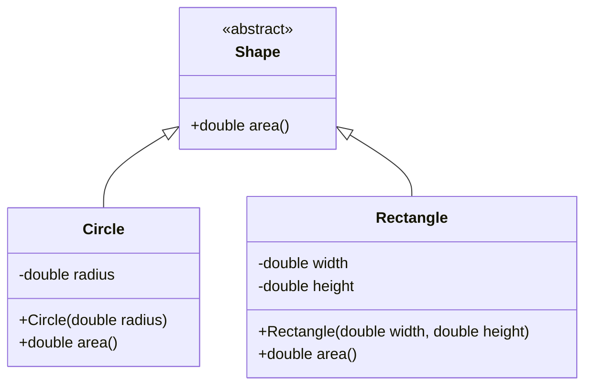

# OOP Principles in Java

## Overview

Object-Oriented Programming (OOP) is a programming paradigm that uses objects and classes to structure software. In Java, OOP revolves around four core principles: **Encapsulation**, **Abstraction**, **Inheritance**, and **Polymorphism**. These principles enable developers to create modular, reusable, and maintainable code by modeling real-world entities and their behaviors.

This guide provides an in-depth exploration of each principle, including explanations, examples, code snippets, and diagrams, tailored for both interview preparation and practical application.

## Detailed Explanation

### Encapsulation

Encapsulation bundles data (fields) and methods (operations on data) into a single unit called a class, restricting direct access to internal state. It promotes data hiding and controlled access through public methods.

- **Key Concepts**: Access modifiers (`private`, `protected`, `public`), getter/setter methods.
- **Benefits**: Enhances security, reduces coupling, simplifies maintenance.

### Abstraction

Abstraction focuses on exposing essential features while hiding implementation details. It allows dealing with complexity by providing a simplified interface.

- **Key Concepts**: Abstract classes (cannot be instantiated), interfaces (contracts for behavior), method signatures.
- **Benefits**: Reduces code complexity, improves reusability, supports loose coupling.

### Inheritance

Inheritance enables a subclass to acquire properties and behaviors from a superclass, establishing an "is-a" relationship. It facilitates code reuse and hierarchical organization.

- **Key Concepts**: `extends` keyword for class inheritance, `implements` for interfaces, method overriding, `super` reference.
- **Benefits**: Promotes code reuse, supports polymorphism, enables hierarchical classification.

### Polymorphism

Polymorphism allows objects to be treated as instances of their parent class, enabling dynamic behavior. It comes in two forms: compile-time (overloading) and runtime (overriding).

- **Key Concepts**: Method overloading (same name, different parameters), method overriding (same signature in subclass), dynamic dispatch.
- **Benefits**: Increases flexibility, supports extensibility, enables uniform interfaces.

| Principle       | Purpose                          | Java Mechanism                  | Example Use Case               |
|-----------------|----------------------------------|---------------------------------|-------------------------------|
| Encapsulation  | Data protection and hiding      | Access modifiers, getters/setters | Bank account balance management |
| Abstraction    | Simplifying complex systems     | Abstract classes, interfaces    | Vehicle control interface     |
| Inheritance    | Code reuse and hierarchy        | `extends`, `super`              | Employee type classifications |
| Polymorphism   | Flexible behavior               | Overloading, overriding         | Payment method processing     |



*Figure 1: Abstraction and Inheritance - Shape Hierarchy with Polymorphic area() Method*

```mermaid
graph TD
    A[Payment Interface] --> B[CreditCard.process()]
    A --> C[PayPal.process()]
    A --> D[BankTransfer.process()]
    B --> E[Uniform Processing]
    C --> E
    D --> E
```

*Figure 2: Polymorphism - Different Payment Types Implementing Common Interface*

## Real-world Examples & Use Cases

- **Encapsulation**: In e-commerce, a `ShoppingCart` class encapsulates item lists and totals, exposing only `addItem()` and `getTotal()` methods to prevent unauthorized modifications.
- **Abstraction**: GUI frameworks use abstract `Component` classes, allowing developers to focus on high-level interactions without worrying about rendering details.
- **Inheritance**: In a library management system, `Book`, `Magazine`, and `DVD` classes inherit from a `LibraryItem` superclass, sharing common attributes like `title` and `author`.
- **Polymorphism**: In logging systems, different loggers (FileLogger, ConsoleLogger) implement a common `Logger` interface, allowing interchangeable usage based on configuration.

In enterprise applications, these principles support design patterns like Factory and Strategy, enabling scalable architectures in frameworks such as Spring.

## Code Examples

### Encapsulation Example

```java
public class Employee {
    private String name;
    private double salary;

    public Employee(String name, double salary) {
        this.name = name;
        this.salary = salary;
    }

    public String getName() {
        return name;
    }

    public void setSalary(double salary) {
        if (salary > 0) {
            this.salary = salary;
        }
    }

    public double getSalary() {
        return salary;
    }
}
```

### Abstraction Example

```java
interface Drawable {
    void draw();
}

abstract class GraphicObject {
    int x, y;

    abstract void moveTo(int newX, int newY);
}

class Circle extends GraphicObject implements Drawable {
    int radius;

    @Override
    void moveTo(int newX, int newY) {
        x = newX;
        y = newY;
    }

    @Override
    public void draw() {
        System.out.println("Drawing circle at (" + x + "," + y + ") with radius " + radius);
    }
}
```

### Inheritance Example

```java
class Animal {
    protected String species;

    public Animal(String species) {
        this.species = species;
    }

    public void eat() {
        System.out.println(species + " is eating.");
    }
}

class Dog extends Animal {
    private String breed;

    public Dog(String breed) {
        super("Dog");
        this.breed = breed;
    }

    @Override
    public void eat() {
        System.out.println(breed + " dog is eating.");
    }

    public void bark() {
        System.out.println("Woof!");
    }
}
```

### Polymorphism Example

```java
interface Shape {
    double calculateArea();
}

class Triangle implements Shape {
    private double base, height;

    public Triangle(double base, double height) {
        this.base = base;
        this.height = height;
    }

    @Override
    public double calculateArea() {
        return 0.5 * base * height;
    }
}

class Square implements Shape {
    private double side;

    public Square(double side) {
        this.side = side;
    }

    @Override
    public double calculateArea() {
        return side * side;
    }
}

// Usage
Shape[] shapes = {new Triangle(10, 5), new Square(4)};
for (Shape shape : shapes) {
    System.out.println("Area: " + shape.calculateArea());
}
```

## STAR Summary

To articulate OOP principles effectively in technical interviews:

- **Situation**: Developing a complex application with multiple interacting components.
- **Task**: Organize code to ensure maintainability and scalability.
- **Action**: Applied encapsulation to secure data, abstraction to simplify interfaces, inheritance for code reuse, and polymorphism for flexible behaviors.
- **Result**: Delivered a robust system with reduced bugs, easier testing, and future extensibility.

## Journey / Sequence

A recommended approach for implementing OOP in Java projects:

1. **Model Entities**: Identify real-world objects and define classes.
2. **Define Abstractions**: Create interfaces or abstract classes for common behaviors.
3. **Encapsulate Data**: Use private fields and public accessors.
4. **Establish Hierarchies**: Apply inheritance where "is-a" relationships exist.
5. **Enable Polymorphism**: Implement method overriding and overloading for dynamic behavior.
6. **Refactor Iteratively**: Review and adjust based on SOLID principles.

## Common Pitfalls & Edge Cases

- **Deep Inheritance Hierarchies**: Can lead to fragile base class problems; prefer composition.
- **Exposing Internal State**: Violates encapsulation; always use getters/setters.
- **Incorrect Overriding**: Forgetting `@Override` annotation or mismatching signatures.
- **Multiple Inheritance Issues**: Java avoids diamond problem with single class inheritance; use interfaces.
- **Edge Case**: Abstract classes with all concrete methods; consider converting to interfaces for better flexibility.

| Pitfall                  | Symptom                          | Solution                          |
|--------------------------|----------------------------------|-----------------------------------|
| God Class                | Single class handling everything | Decompose into smaller classes    |
| Tight Coupling           | Changes ripple through code      | Use dependency injection          |
| Inheritance Misuse       | Unnecessary hierarchies          | Favor composition over inheritance|
| Polymorphism Abuse       | Overcomplicated overrides        | Keep overrides simple and focused |

## Tools & Libraries

- **IDEs**: IntelliJ IDEA or Eclipse for OOP refactoring tools and code generation.
- **Libraries**: Project Lombok for automatic getter/setter generation; Jackson for object serialization.
- **Frameworks**: Spring Boot leverages OOP for bean management and AOP; Hibernate for ORM with inheritance mapping.

## References

- [Oracle Java Tutorials: Object-Oriented Programming Concepts](https://docs.oracle.com/javase/tutorial/java/concepts/)
- [GeeksforGeeks: OOPs in Java](https://www.geeksforgeeks.org/object-oriented-programming-oops-concept-in-java/)
- [Baeldung: Object-Oriented Programming in Java](https://www.baeldung.com/java-oop)
- [Java SE Documentation: Classes and Objects](https://docs.oracle.com/javase/specs/jls/se21/html/jls-8.html)

## Github-README Links & Related Topics

- [Encapsulation in Java](../encapsulation-in-java/)
- [Abstraction in Java](../abstraction-in-java/)
- [Inheritance in Java](../inheritance-in-java/)
- [Polymorphism in Java](../polymorphism-in-java/)
- [Java Design Patterns](../java-design-patterns/)
- [Java OOP Fundamentals](../java-fundamentals/)
- [SOLID Principles in Java](../solid-principles-in-java/)