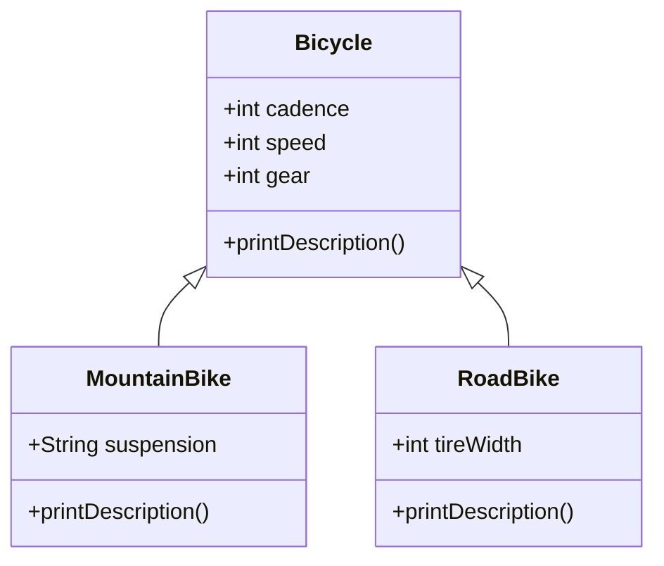

# OOP Principles in Java

## Overview

Object-Oriented Programming (OOP) is a programming paradigm centered around objects and classes. In Java, OOP is fundamental, enabling modular, reusable, and maintainable code. The four core principles are **Encapsulation**, **Abstraction**, **Inheritance**, and **Polymorphism**. These principles help model real-world entities, promote code reusability, and ensure data integrity. Java implements these through classes, interfaces, and inheritance mechanisms, as outlined in the official Java Tutorials.

## Detailed Explanation

### Encapsulation
Encapsulation bundles data (state) and methods (behavior) into a single unit called a class, hiding internal details from the outside world. Access to data is controlled via public methods, preventing unauthorized modifications. This principle enhances security and modularity.

- **Key Benefits**: Information hiding, modularity, and ease of maintenance.
- **Java Implementation**: Use private fields and public getter/setter methods.

### Abstraction
Abstraction focuses on exposing essential features while hiding complexities. It allows defining a blueprint for classes without specifying implementation details. In Java, interfaces and abstract classes achieve abstraction.

- **Key Benefits**: Simplifies complex systems, promotes loose coupling.
- **Java Implementation**: Interfaces declare methods without bodies; classes implement them.

### Inheritance
Inheritance allows a class (subclass) to inherit properties and behaviors from another class (superclass). It promotes code reuse and establishes hierarchical relationships. Java supports single inheritance for classes but multiple inheritance via interfaces.

- **Key Benefits**: Code reusability, extensibility, and logical organization.
- **Java Implementation**: Use the `extends` keyword for classes.

### Polymorphism
Polymorphism enables objects of different classes to be treated as instances of a common superclass, with behavior determined at runtime. It includes method overriding (runtime polymorphism) and method overloading (compile-time polymorphism).

- **Key Benefits**: Flexibility, extensibility, and dynamic behavior.
- **Java Implementation**: Achieved through inheritance and method overriding.

| Principle      | Definition | Java Keyword/Example |
|----------------|------------|----------------------|
| Encapsulation | Hiding data and exposing behavior | `private` fields, getters/setters |
| Abstraction   | Hiding complexity, showing essentials | `interface`, `abstract class` |
| Inheritance   | Deriving from superclass | `extends` |
| Polymorphism  | Many forms, runtime behavior | Method overriding |



## Real-world Examples & Use Cases

- **Encapsulation**: A bank account class hides balance details, exposing only deposit/withdraw methods to prevent invalid operations.
- **Abstraction**: A vehicle interface defines `start()` and `stop()` methods; car and bike classes implement specifics without revealing engine details.
- **Inheritance**: In a library system, a `Book` superclass is extended by `FictionBook` and `NonFictionBook` to add genre-specific attributes.
- **Polymorphism**: A payment system processes different payment types (credit card, PayPal) via a common `processPayment()` method, adapting behavior at runtime.

Use cases include GUI frameworks (e.g., Swing), where components inherit from base classes and override methods polymorphically.

## Code Examples

### Encapsulation Example
```java
public class BankAccount {
    private double balance;

    public BankAccount(double initialBalance) {
        this.balance = initialBalance;
    }

    public void deposit(double amount) {
        if (amount > 0) {
            balance += amount;
        }
    }

    public void withdraw(double amount) {
        if (amount > 0 && amount <= balance) {
            balance -= amount;
        }
    }

    public double getBalance() {
        return balance;
    }
}
```

### Abstraction Example
```java
interface Vehicle {
    void start();
    void stop();
}

public class Car implements Vehicle {
    @Override
    public void start() {
        System.out.println("Car engine started.");
    }

    @Override
    public void stop() {
        System.out.println("Car engine stopped.");
    }
}
```

### Inheritance Example
```java
public class Bicycle {
    protected int cadence;
    protected int speed;
    protected int gear;

    public Bicycle(int cadence, int speed, int gear) {
        this.cadence = cadence;
        this.speed = speed;
        this.gear = gear;
    }

    public void printDescription() {
        System.out.println("Bike is in gear " + gear + " with cadence " + cadence + " and speed " + speed);
    }
}

public class MountainBike extends Bicycle {
    private String suspension;

    public MountainBike(int cadence, int speed, int gear, String suspension) {
        super(cadence, speed, gear);
        this.suspension = suspension;
    }

    @Override
    public void printDescription() {
        super.printDescription();
        System.out.println("MountainBike has " + suspension + " suspension.");
    }
}
```

### Polymorphism Example
```java
public class TestBikes {
    public static void main(String[] args) {
        Bicycle bike1 = new Bicycle(20, 10, 1);
        Bicycle bike2 = new MountainBike(20, 10, 5, "Dual");
        Bicycle bike3 = new RoadBike(40, 20, 8, 23);

        bike1.printDescription();
        bike2.printDescription();
        bike3.printDescription();
    }
}

// RoadBike class (extends Bicycle)
public class RoadBike extends Bicycle {
    private int tireWidth;

    public RoadBike(int cadence, int speed, int gear, int tireWidth) {
        super(cadence, speed, gear);
        this.tireWidth = tireWidth;
    }

    @Override
    public void printDescription() {
        super.printDescription();
        System.out.println("RoadBike has " + tireWidth + " MM tires.");
    }
}
```

## References
- [Object-Oriented Programming Concepts - Oracle Java Tutorials](https://docs.oracle.com/javase/tutorial/java/concepts/)
- [What Is an Object? - Oracle](https://docs.oracle.com/javase/tutorial/java/concepts/object.html)
- [What Is Inheritance? - Oracle](https://docs.oracle.com/javase/tutorial/java/concepts/inheritance.html)
- [Polymorphism - Oracle](https://docs.oracle.com/javase/tutorial/java/IandI/polymorphism.html)
- [What Is an Interface? - Oracle](https://docs.oracle.com/javase/tutorial/java/concepts/interface.html)

## Github-README Links & Related Topics
- [Java Fundamentals](./java-fundamentals)
- [Design Patterns in Java](./design-patterns-in-java)
- [Java Classes and Objects](./java-classes-and-objects)
- [Java Interfaces](./java-interfaces)
- [Inheritance in Java](./inheritance-in-java)