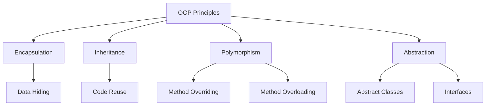
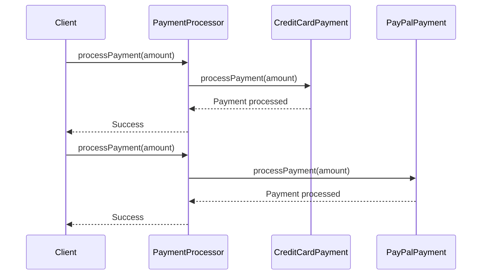

# OOP Principles in Java

## Overview

Object-Oriented Programming (OOP) is a programming paradigm centered around objects that encapsulate data and behavior. Java, being an object-oriented language, implements four core principles: **Encapsulation**, **Inheritance**, **Polymorphism**, and **Abstraction**. These principles enable developers to create modular, reusable, and maintainable code by modeling real-world entities and their interactions. Understanding these principles is crucial for Java interviews, as they form the foundation of Java's design and are frequently tested in coding assessments and discussions.

## Detailed Explanation

### Encapsulation

Encapsulation is the bundling of data (fields) and methods that operate on that data within a single unit, typically a class. It restricts direct access to an object's internal state, promoting data integrity and security. In Java, encapsulation is enforced through access modifiers: `private` (accessible only within the class), `protected` (accessible within the package and subclasses), `public` (accessible everywhere), and package-private (default, accessible within the package).

- **Key Benefits**: Prevents unauthorized data manipulation, enhances modularity, and simplifies debugging.
- **Implementation**: Declare fields as `private` and provide public getter/setter methods for controlled access.

### Inheritance

Inheritance allows a class (subclass or child class) to acquire properties and behaviors from another class (superclass or parent class), fostering code reuse and hierarchical relationships. Java supports single inheritance for classes using the `extends` keyword, but multiple inheritance through interfaces with `implements`.

- **Types**: 
  - Single Inheritance: One subclass extends one superclass.
  - Multilevel Inheritance: A subclass extends another subclass.
  - Hierarchical Inheritance: Multiple subclasses extend one superclass.
  - Multiple Inheritance: Achieved via interfaces.
- **Benefits**: Reduces redundancy, supports polymorphism, and enables "is-a" relationships (e.g., a Car is a Vehicle).

### Polymorphism

Polymorphism, meaning "many forms," allows objects to be treated as instances of their parent class or interface while exhibiting different behaviors. It enhances flexibility by enabling dynamic method dispatch.

- **Compile-time Polymorphism (Method Overloading)**: Multiple methods with the same name but different parameters in the same class.
- **Runtime Polymorphism (Method Overriding)**: A subclass provides a specific implementation of a method defined in its superclass or interface.
- **Benefits**: Improves code extensibility and supports the Open-Closed Principle.

### Abstraction

Abstraction involves exposing only essential features of an object while concealing implementation details, simplifying complex systems. It focuses on "what" an object does rather than "how."

- **Abstract Classes**: Declared with `abstract`, can contain abstract (unimplemented) and concrete methods; cannot be instantiated directly.
- **Interfaces**: Pure abstraction contracts defining methods that implementing classes must provide; support default and static methods since Java 8.
- **Benefits**: Promotes loose coupling, enhances maintainability, and facilitates API design.

| Principle      | Purpose                     | Java Keywords/Mechanisms    | Real-World Analogy         |
|----------------|-----------------------------|-----------------------------|----------------------------|
| Encapsulation | Data Protection             | `private`, getters/setters  | Bank Vault                 |
| Inheritance   | Code Reuse & Hierarchy      | `extends`, `implements`     | Family Tree                |
| Polymorphism  | Flexibility & Extensibility | Overloading, Overriding     | Remote Control             |
| Abstraction   | Simplification & Hiding     | `abstract`, `interface`     | Car Dashboard             |





## Real-world Examples & Use Cases

- **Encapsulation**: In e-commerce platforms like Amazon, customer data (e.g., credit card details) is encapsulated within `Customer` and `Order` classes, accessible only via secure methods to prevent breaches.
- **Inheritance**: Java's `ArrayList` extends `AbstractList`, inheriting common list behaviors while adding array-specific implementations.
- **Polymorphism**: In game development, a `Weapon` interface allows `Sword`, `Gun`, and `Bow` classes to implement `attack()` differently, enabling dynamic weapon switching.
- **Abstraction**: JDBC (Java Database Connectivity) abstracts database operations, allowing code to work with MySQL, PostgreSQL, or Oracle without changes to the application logic.

## Code Examples

### Encapsulation Example

```java
public class Person {
    private String name;
    private int age;

    public Person(String name, int age) {
        this.name = name;
        this.age = age;
    }

    public String getName() {
        return name;
    }

    public void setName(String name) {
        this.name = name;
    }

    public int getAge() {
        return age;
    }

    public void setAge(int age) {
        if (age > 0) {
            this.age = age;
        }
    }
}

// Usage
Person person = new Person("Alice", 30);
person.setAge(31);  // Controlled access
System.out.println(person.getName());  // Alice
```

### Inheritance Example

```java
public class Animal {
    protected String name;

    public Animal(String name) {
        this.name = name;
    }

    public void eat() {
        System.out.println(name + " is eating.");
    }
}

public class Dog extends Animal {
    public Dog(String name) {
        super(name);
    }

    public void bark() {
        System.out.println(name + " is barking.");
    }

    @Override
    public void eat() {
        System.out.println(name + " is eating dog food.");
    }
}

// Usage
Dog dog = new Dog("Buddy");
dog.eat();   // Buddy is eating dog food.
dog.bark();  // Buddy is barking.
```

### Polymorphism Example

```java
// Method Overloading (Compile-time)
public class MathUtils {
    public int add(int a, int b) {
        return a + b;
    }

    public double add(double a, double b) {
        return a + b;
    }

    public int add(int a, int b, int c) {
        return a + b + c;
    }
}

// Method Overriding (Runtime)
public abstract class Shape {
    public abstract double area();
}

public class Circle extends Shape {
    private double radius;

    public Circle(double radius) {
        this.radius = radius;
    }

    @Override
    public double area() {
        return Math.PI * radius * radius;
    }
}

public class Rectangle extends Shape {
    private double width, height;

    public Rectangle(double width, double height) {
        this.width = width;
        this.height = height;
    }

    @Override
    public double area() {
        return width * height;
    }
}

// Usage
Shape circle = new Circle(5);
Shape rectangle = new Rectangle(4, 6);
System.out.println(circle.area());     // 78.53981633974483
System.out.println(rectangle.area());  // 24.0
```

### Abstraction Example

```java
public interface Vehicle {
    void start();
    void stop();
    default void honk() {
        System.out.println("Honk!");
    }
}

public abstract class MotorVehicle implements Vehicle {
    protected String fuelType;

    public MotorVehicle(String fuelType) {
        this.fuelType = fuelType;
    }

    @Override
    public void start() {
        System.out.println("Starting motor with " + fuelType);
    }

    public abstract void accelerate();
}

public class Car extends MotorVehicle {
    public Car(String fuelType) {
        super(fuelType);
    }

    @Override
    public void stop() {
        System.out.println("Car stopped.");
    }

    @Override
    public void accelerate() {
        System.out.println("Car accelerating.");
    }
}

// Usage
Vehicle car = new Car("Petrol");
car.start();       // Starting motor with Petrol
car.honk();        // Honk!
car.stop();        // Car stopped.
```

## STAR Summary

For interview preparation, use the STAR method to explain OOP principles:

- **Situation**: Describe a scenario where OOP was applied (e.g., "In a banking application...").
- **Task**: Explain the problem (e.g., "I needed to model customer accounts securely").
- **Action**: Detail how you used OOP (e.g., "I encapsulated account data with private fields and public methods").
- **Result**: Highlight outcomes (e.g., "This prevented unauthorized access and improved maintainability").

## Journey / Sequence

1. **Learn Basics**: Understand classes, objects, and basic syntax.
2. **Master Encapsulation**: Practice data hiding with access modifiers.
3. **Explore Inheritance**: Build hierarchies and override methods.
4. **Apply Polymorphism**: Implement overloading and overriding.
5. **Achieve Abstraction**: Design with interfaces and abstract classes.
6. **Integrate All**: Combine principles in design patterns like Factory or Strategy.
7. **Interview Practice**: Solve problems using OOP and explain with STAR.

## Common Pitfalls & Edge Cases

- **Overusing Inheritance**: Leads to tight coupling; prefer composition over inheritance.
- **Breaking Encapsulation**: Exposing internal state via public fields; always use getters/setters.
- **Misusing Polymorphism**: Forgetting `@Override` can cause bugs; ensure method signatures match.
- **Abstract Class vs. Interface**: Use interfaces for contracts, abstract classes for shared state.
- **Multiple Inheritance Confusion**: Java doesn't support multiple class inheritance; use interfaces.
- **Edge Case**: Diamond Problem in interfaces (pre-Java 8); resolved by explicit implementation.

## Tools & Libraries

- **IDEs**: IntelliJ IDEA, Eclipse for OOP visualization and refactoring.
- **Libraries**: Lombok for reducing boilerplate in encapsulation (e.g., auto-generate getters/setters).
- **Build Tools**: Maven/Gradle for managing OOP-based projects.
- **Testing**: JUnit for unit testing OOP classes and inheritance hierarchies.

## References

- [Oracle Java Tutorials: Object-Oriented Programming Concepts](https://docs.oracle.com/javase/tutorial/java/concepts/)
- [Oracle: Object-Oriented Programming](https://www.oracle.com/java/technologies/oop.html)
- [GeeksforGeeks: OOPs Concepts in Java](https://www.geeksforgeeks.org/object-oriented-programming-oops-concept-in-java/)
- [Baeldung: Object-Oriented Programming in Java](https://www.baeldung.com/java-oop)
- [Effective Java by Joshua Bloch](https://www.amazon.com/Effective-Java-Joshua-Bloch/dp/0134685997)

## Github-README Links & Related Topics

- [Java Fundamentals](../java-fundamentals/)
- [Encapsulation in Java](../encapsulation-in-java/)
- [Inheritance in Java](../inheritance-in-java/)
- [Abstraction in Java](../abstraction-in-java/)
- [Java Design Patterns](../java-design-patterns/)
- [Polymorphism in Java](../polymorphism-in-java/)
- [Java OOP Principles Deep Dive](../java-oop-principles-deep-dive/)