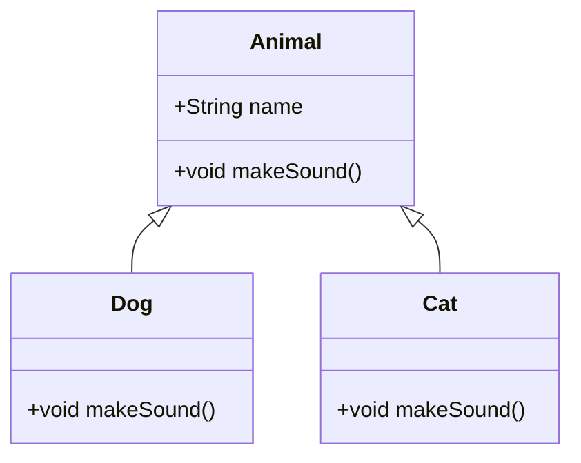

# OOP Principles in Java

## Overview

Object-Oriented Programming (OOP) is a programming paradigm centered around objects and classes. In Java, OOP is fundamental and revolves around four core principles: **Encapsulation**, **Abstraction**, **Inheritance**, and **Polymorphism**. These principles help in creating modular, reusable, and maintainable code by modeling real-world entities and their interactions.

This guide explores each principle with detailed explanations, real-world examples, code snippets, and diagrams to aid understanding for interviews and practical development.

## Detailed Explanation

### Encapsulation

Encapsulation is the bundling of data (fields) and methods (functions) that operate on the data into a single unit called a class. It restricts direct access to some of an object's components, which is a means of preventing accidental interference and misuse of the data.

- **Key Concepts**: Access modifiers (`private`, `protected`, `public`), getters/setters.
- **Benefits**: Data hiding, improved security, easier maintenance.

### Abstraction

Abstraction involves hiding complex implementation details and showing only the essential features of an object. In Java, this is achieved through abstract classes and interfaces.

- **Key Concepts**: Abstract classes, interfaces, method signatures without implementation.
- **Benefits**: Reduces complexity, increases reusability, allows for loose coupling.

### Inheritance

Inheritance allows a class (subclass) to inherit properties and behaviors from another class (superclass). It promotes code reusability and establishes a hierarchical relationship between classes.

- **Key Concepts**: `extends` keyword, method overriding, `super` keyword.
- **Benefits**: Code reuse, hierarchical classification, polymorphism support.

### Polymorphism

Polymorphism means "many forms" and allows objects to be treated as instances of their parent class rather than their actual class. In Java, it's achieved through method overloading and overriding.

- **Key Concepts**: Compile-time (overloading) and runtime (overriding) polymorphism, dynamic method dispatch.
- **Benefits**: Flexibility, extensibility, interface uniformity.

| Principle       | Purpose                          | Java Mechanism                  |
|-----------------|----------------------------------|---------------------------------|
| Encapsulation  | Data hiding and protection      | Access modifiers, getters/setters |
| Abstraction    | Hiding complexity               | Abstract classes, interfaces    |
| Inheritance    | Code reuse and hierarchy        | `extends`, `super`              |
| Polymorphism   | Multiple behaviors              | Overloading, overriding         |



*Figure 1: Inheritance and Polymorphism Example - Animal Hierarchy*

## Real-world Examples & Use Cases

- **Encapsulation**: A bank account class encapsulates balance and provides methods to deposit/withdraw, preventing direct manipulation.
- **Abstraction**: A vehicle interface abstracts common behaviors like `start()`, `stop()`, implemented differently by Car or Bike.
- **Inheritance**: Employee classes (Manager, Developer) inherit from Person, adding specific attributes.
- **Polymorphism**: Payment processing where different payment methods (CreditCard, PayPal) implement a common `process()` method.

In microservices, polymorphism allows handling different request types uniformly. Inheritance is used in frameworks like Spring for extending base classes.

## Code Examples

### Encapsulation Example

```java
public class BankAccount {
    private double balance;

    public BankAccount(double initialBalance) {
        this.balance = initialBalance;
    }

    public void deposit(double amount) {
        if (amount > 0) {
            balance += amount;
        }
    }

    public double getBalance() {
        return balance;
    }
}
```

### Abstraction Example

```java
abstract class Shape {
    abstract double area();
}

class Circle extends Shape {
    private double radius;

    public Circle(double radius) {
        this.radius = radius;
    }

    @Override
    double area() {
        return Math.PI * radius * radius;
    }
}
```

### Inheritance Example

```java
class Vehicle {
    protected String brand;

    public Vehicle(String brand) {
        this.brand = brand;
    }

    public void honk() {
        System.out.println("Honk!");
    }
}

class Car extends Vehicle {
    private int wheels = 4;

    public Car(String brand) {
        super(brand);
    }

    @Override
    public void honk() {
        System.out.println("Beep beep!");
    }
}
```

### Polymorphism Example

```java
interface Payment {
    void process(double amount);
}

class CreditCard implements Payment {
    @Override
    public void process(double amount) {
        System.out.println("Processing credit card payment: $" + amount);
    }
}

class PayPal implements Payment {
    @Override
    public void process(double amount) {
        System.out.println("Processing PayPal payment: $" + amount);
    }
}

// Usage
Payment payment = new CreditCard();
payment.process(100.0);  // Outputs: Processing credit card payment: $100.0
```

## Journey / Sequence

When designing OOP systems in Java, follow this sequence:

1. **Identify Entities**: Determine classes based on real-world objects.
2. **Apply Abstraction**: Define interfaces or abstract classes for common behaviors.
3. **Implement Encapsulation**: Hide data with private fields and public methods.
4. **Use Inheritance**: Extend classes to reuse code.
5. **Incorporate Polymorphism**: Override methods for specific behaviors.

This order ensures modular and extensible code.

## Common Pitfalls & Edge Cases

- **Overusing Inheritance**: Leads to tight coupling; prefer composition over inheritance.
- **Violating Encapsulation**: Exposing internal state directly.
- **Misusing Polymorphism**: Forgetting to override methods properly, causing unexpected behavior.
- **Diamond Problem**: Avoid multiple inheritance with classes; use interfaces.
- **Edge Case**: Abstract classes with no abstract methods; consider interfaces instead.

| Pitfall | Symptom | Solution |
|---------|---------|----------|
| Tight Coupling | Hard to change code | Use interfaces and dependency injection |
| God Object | One class doing everything | Split into smaller, focused classes |
| Inheritance Abuse | Deep hierarchies | Favor composition |

## Tools & Libraries

- **IDEs**: IntelliJ IDEA, Eclipse for OOP code navigation and refactoring.
- **Libraries**: Lombok for reducing boilerplate in encapsulation (getters/setters).
- **Frameworks**: Spring Framework leverages OOP for dependency injection and AOP.

## References

- [Oracle Java Tutorials: Object-Oriented Programming Concepts](https://docs.oracle.com/javase/tutorial/java/concepts/)
- [GeeksforGeeks: OOPs in Java](https://www.geeksforgeeks.org/object-oriented-programming-oops-concept-in-java/)
- [Baeldung: Object-Oriented Programming in Java](https://www.baeldung.com/java-oop)

## Github-README Links & Related Topics

- [Encapsulation in Java](../encapsulation-in-java/)
- [Inheritance in Java](../inheritance-in-java/)
- [Abstraction in Java](../abstraction-in-java/)
- [Polymorphism in Java](../polymorphism-in-java/)
- [Java Design Patterns](../java-design-patterns/)
- [Java OOP Fundamentals](../java-fundamentals/)