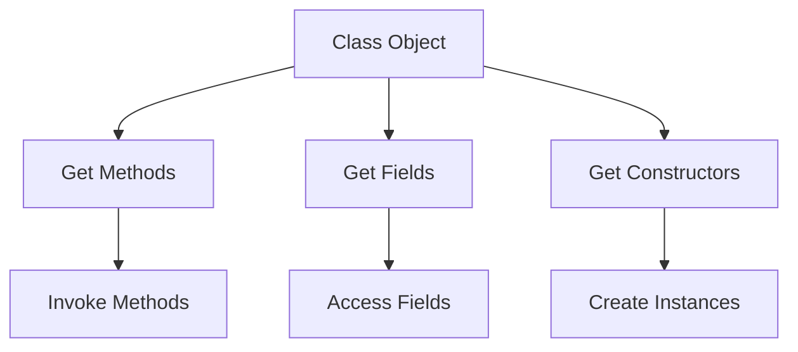

## Overview

Java Reflection enables runtime inspection and modification of classes, interfaces, fields, methods, and constructors. It allows dynamic code execution, such as instantiating objects, invoking methods, and accessing fields without compile-time knowledge. Essential for frameworks requiring extensibility, like dependency injection or serialization.

## Detailed Explanation

Reflection provides APIs in `java.lang.reflect` package to introspect and manipulate Java objects dynamically. The core class is `Class`, obtained via `.class`, `getClass()`, or `Class.forName()`. From `Class`, retrieve `Method`, `Field`, and `Constructor` objects for runtime operations.



Key components:
- **Class**: Represents classes and interfaces; entry point for reflection.
- **Method**: Allows invoking methods dynamically.
- **Field**: Enables getting/setting field values.
- **Constructor**: Permits creating objects via constructors.
- **Modifier**: Checks access modifiers (public, private, etc.).

Capacity and throughput targets:
- Performance: Reflective operations are slower due to dynamic resolution; cache `Class` objects for repeated use.
- Security: Requires `ReflectPermission` in secured environments.

Tradeoffs:
- **Flexibility vs Performance**: Enables dynamic behavior but incurs overhead.
- **Encapsulation**: Breaks private access, potentially leading to fragile code.

## Real-world Examples & Use Cases

- **Frameworks**: Spring uses reflection for autowiring beans and AOP.
- **ORM**: Hibernate inspects entity classes to map to database tables.
- **Testing**: JUnit and Mockito use reflection to access private members for testing.
- **Serialization**: Custom serializers dynamically handle object graphs.
- **Plugin Systems**: Load and instantiate classes at runtime without recompilation.

## Code Examples

**Obtaining Class Object:**

```java
// Via .class
Class<?> clazz1 = String.class;

// Via getClass()
String str = "example";
Class<?> clazz2 = str.getClass();

// Via Class.forName()
Class<?> clazz3 = Class.forName("java.lang.String");
```

**Accessing Fields:**

```java
import java.lang.reflect.Field;

public class Example {
    private String privateField = "hidden";

    public static void main(String[] args) throws Exception {
        Example obj = new Example();
        Field field = obj.getClass().getDeclaredField("privateField");
        field.setAccessible(true);
        System.out.println(field.get(obj)); // Output: hidden
        field.set(obj, "modified");
        System.out.println(field.get(obj)); // Output: modified
    }
}
```

**Invoking Methods:**

```java
import java.lang.reflect.Method;

public class Calculator {
    private int add(int a, int b) {
        return a + b;
    }

    public static void main(String[] args) throws Exception {
        Calculator calc = new Calculator();
        Method method = calc.getClass().getDeclaredMethod("add", int.class, int.class);
        method.setAccessible(true);
        int result = (int) method.invoke(calc, 5, 3);
        System.out.println(result); // Output: 8
    }
}
```

**Creating Instances:**

```java
import java.lang.reflect.Constructor;

public class Person {
    private String name;

    private Person(String name) {
        this.name = name;
    }

    public static void main(String[] args) throws Exception {
        Constructor<Person> constructor = Person.class.getDeclaredConstructor(String.class);
        constructor.setAccessible(true);
        Person person = constructor.newInstance("John");
        System.out.println(person.name); // Output: John
    }
}
```

**Inspecting Annotations:**

```java
import java.lang.annotation.Retention;
import java.lang.annotation.RetentionPolicy;
import java.lang.reflect.Method;

@Retention(RetentionPolicy.RUNTIME)
@interface MyAnnotation {
    String value();
}

public class AnnotatedClass {
    @MyAnnotation("test")
    public void method() {}

    public static void main(String[] args) throws Exception {
        Method method = AnnotatedClass.class.getMethod("method");
        MyAnnotation annotation = method.getAnnotation(MyAnnotation.class);
        System.out.println(annotation.value()); // Output: test
    }
}
```

## Common Pitfalls & Edge Cases

- **SecurityManager**: Reflective access may be restricted; handle `SecurityException`.
- **Performance**: Avoid in hot paths; use direct calls where possible.
- **Type Safety**: Reflection bypasses compile-time checks; runtime errors possible.
- **Accessibility**: `setAccessible(true)` required for private members; may fail in modules.
- **Primitive Types**: Use wrapper classes like `Integer.class` for primitives.

## Tools & Libraries

- **Java Reflection API**: Built-in `java.lang.reflect` package.
- **Libraries**: Apache Commons Lang for utilities; Spring ReflectionUtils for convenience.

## Github-README Links & Related Topics

- [Reflection and Annotations](java/reflection-and-annotations/README.md)
- [Java Language Basics](java/java-language-basics/README.md)

## References

- https://docs.oracle.com/javase/tutorial/reflect/
- https://www.baeldung.com/java-reflection
- https://docs.oracle.com/javase/8/docs/api/java/lang/reflect/package-summary.html