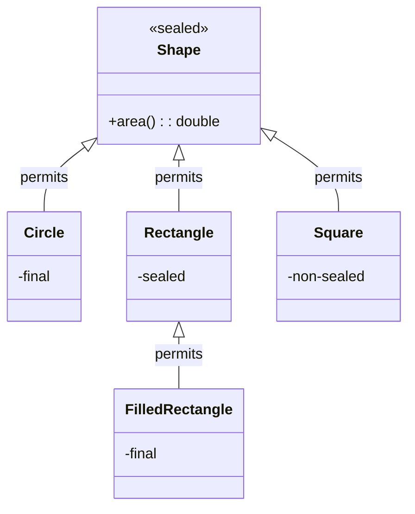

## Overview

Sealed classes and interfaces, introduced as a standard feature in Java 17 (previewed in Java 15 and 16), restrict which other classes or interfaces may extend or implement them. This feature enhances encapsulation by allowing developers to control inheritance hierarchies, supports exhaustive pattern matching in switch expressions, and provides a foundation for modeling algebraic data types. Sealed classes prevent unauthorized extension while maintaining accessibility for code reuse within the permitted hierarchy.

## Detailed Explanation

A class or interface is sealed by applying the `sealed` modifier to its declaration. After any `extends` and `implements` clauses, a `permits` clause specifies the classes that are permitted to extend or implement the sealed type. Permitted subclasses must directly extend the sealed class and be declared with exactly one of the following modifiers: `final`, `sealed`, or `non-sealed`.

### Key Constraints on Permitted Subclasses
- **Accessibility**: Permitted subclasses must be accessible by the sealed class at compile time and located in the same module (if named) or package (if unnamed).
- **Direct Extension**: Permitted subclasses must directly extend the sealed class.
- **Modifier Requirements**:
  - `final`: Prevents further extension.
  - `sealed`: Allows restricted further extension by its own permitted subclasses.
  - `non-sealed`: Reverts to open extension for unknown subclasses.
- **Location**: Permitted classes must be in the same package or module as the sealed class.

### Sealed Interfaces
Interfaces can also be sealed, restricting which classes implement them and which interfaces extend them via the `permits` clause.

### Integration with Records
Record classes are implicitly `final`, making them ideal for use as permitted subclasses in sealed hierarchies, enabling concise algebraic data types.

### Exhaustive Pattern Matching
Sealed classes enable the compiler to verify exhaustiveness in switch expressions, eliminating the need for `default` clauses when all permitted subclasses are covered.



| Modifier | Description | Extension Allowed? |
|----------|-------------|-------------------|
| `final` | Cannot be extended further | No |
| `sealed` | Can be extended by permitted subclasses | Restricted |
| `non-sealed` | Can be extended by any subclass | Yes |

## Real-world Examples & Use Cases

- **Geometric Shapes in Graphics Libraries**: Restrict `Shape` extensions to known types like `Circle`, `Rectangle`, and `Triangle`, ensuring library code can handle all possible shapes exhaustively.
- **Payment Methods**: Define a sealed `PaymentMethod` with permitted subclasses `CreditCard`, `DebitCard`, and `PayPal`, preventing arbitrary payment types from being added.
- **Mathematical Expressions**: Model expressions as a sealed interface `Expr` with permitted implementations `ConstantExpr`, `PlusExpr`, `TimesExpr`, and `NegExpr` for type-safe evaluation.
- **Celestial Bodies**: Represent astronomical entities with a sealed interface `Celestial` permitting `Planet`, `Star`, and `Comet`.
- **State Machines**: Model finite state machines where states are sealed classes, ensuring only valid transitions.
- **API Response Types**: Restrict response classes in REST APIs to prevent unexpected implementations.
- **JVM Descriptors**: As used in `java.lang.constant.ConstantDesc`, sealing hierarchies for JVM entity modeling.

## Code Examples

### Basic Sealed Class with Exhaustive Switch

```java
public sealed class Shape permits Circle, Rectangle, Square {
    public abstract double area();
}

public final class Circle extends Shape {
    private final double radius;
    public Circle(double radius) { this.radius = radius; }
    @Override public double area() { return Math.PI * radius * radius; }
}

public final class Rectangle extends Shape {
    private final double width, height;
    public Rectangle(double width, double height) { this.width = width; this.height = height; }
    @Override public double area() { return width * height; }
}

public non-sealed class Square extends Shape {
    private final double side;
    public Square(double side) { this.side = side; }
    @Override public double area() { return side * side; }
}

// Exhaustive switch (no default needed)
public double calculateArea(Shape shape) {
    return switch (shape) {
        case Circle c -> c.area();
        case Rectangle r -> r.area();
        case Square s -> s.area();
    };
}
```

### Sealed Interface with Records

```java
public sealed interface Expr permits ConstantExpr, PlusExpr, TimesExpr, NegExpr {
    int eval();
}

public record ConstantExpr(int i) implements Expr {
    @Override public int eval() { return i; }
}

public record PlusExpr(Expr a, Expr b) implements Expr {
    @Override public int eval() { return a.eval() + b.eval(); }
}

public record TimesExpr(Expr a, Expr b) implements Expr {
    @Override public int eval() { return a.eval() * b.eval(); }
}

public record NegExpr(Expr e) implements Expr {
    @Override public int eval() { return -e.eval(); }
}

// Usage
Expr expr = new TimesExpr(new PlusExpr(new ConstantExpr(6), new ConstantExpr(7)), new NegExpr(new ConstantExpr(8)));
System.out.println(expr.eval()); // Prints: -104
```

### Nested Sealed Hierarchy

```java
public sealed class Vehicle permits Car, Truck {
    public abstract String type();
}

public sealed class Car extends Vehicle permits Sedan, SUV {
    @Override public String type() { return "Car"; }
}

public final class Sedan extends Car {
    @Override public String type() { return "Sedan"; }
}

public final class SUV extends Car {
    @Override public String type() { return "SUV"; }
}

public non-sealed class Truck extends Vehicle {
    @Override public String type() { return "Truck"; }
}
```

### Sealed Class in Same File (Permits Inferred)

```java
public sealed class Root {
    // Permits clause omitted; inferred from classes in this file
}

final class A extends Root {}
final class B extends Root {}
sealed class C extends Root permits D {}
final class D extends C {}
```

## Common Pitfalls & Edge Cases

- **Compilation Order**: All permitted subclasses must be compiled together with the sealed class to avoid `IncompatibleClassChangeError` at runtime.
- **Accessibility Issues**: Permitted subclasses must be accessible; if in different packages, they must be in the same named module.
- **Anonymous and Local Classes**: Cannot be permitted subclasses; must have canonical names.
- **Modifier Conflicts**: Permitted subclasses must use exactly one of `final`, `sealed`, or `non-sealed`; omitting a modifier causes a compile error.
- **Refactoring Challenges**: Expanding the hierarchy requires updating the `permits` clause and recompiling all related classes.
- **Cast Restrictions**: Narrowing reference conversions are restricted based on sealed hierarchies; invalid casts (e.g., disjoint types) are compile-time errors.
- **Module Boundaries**: In named modules, permitted subclasses must be in the same module; cross-module hierarchies require careful module exports.
- **Inheritance Depth**: Sealed classes can have multiple levels, but each level must adhere to the modifier rules.

## Tools & Libraries

- **Jackson**: Supports JSON serialization/deserialization of sealed class hierarchies via `@JsonSubTypes` or custom deserializers.
- **Spring Framework**: Enables dependency injection and configuration with sealed classes in bean definitions.
- **MapStruct**: Provides mapping between sealed hierarchies and DTOs with type-safe conversions.
- **JUnit 5**: Facilitates testing of sealed class exhaustiveness in parameterized tests.
- **IDE Support**: IntelliJ IDEA and Eclipse provide refactoring assistance and exhaustiveness checks for sealed classes.

## References

- [Oracle Java Documentation: Sealed Classes and Interfaces](https://docs.oracle.com/en/java/javase/17/language/sealed-classes-and-interfaces.html)
- [JEP 409: Sealed Classes](https://openjdk.org/jeps/409)
- [Java Language Specification: Sealed Classes](https://docs.oracle.com/javase/specs/jls/se17/html/jls-8.html#jls-8.1.1.2)

## Github-README Links & Related Topics

- [OOP Principles in Java](../oop-principles-in-java/README.md)
- [Java Records](../java-records/README.md)
- [Java Pattern Matching](../java/java-pattern-matching/README.md)
- [Java Language Features](../java/java-language-features/README.md)