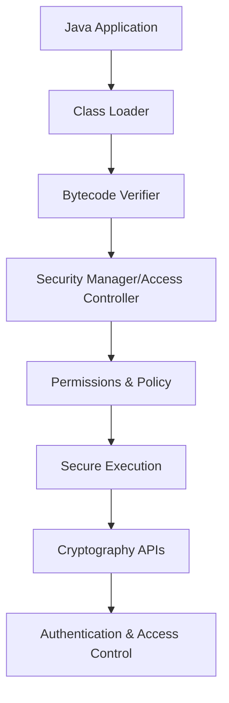

## Overview

Java Security Basics encompass the fundamental concepts, architectures, and practices for securing Java applications. This includes the Java Security Model, cryptography APIs, authentication, access control, and secure coding principles to prevent common vulnerabilities like those outlined in OWASP Top 10, such as injection attacks, broken access control, and cryptographic failures. Mastering these basics is essential for building robust, secure Java applications that protect against threats like data breaches, unauthorized access, and malicious code execution.

## Detailed Explanation

### Java Security Architecture

The Java platform provides a comprehensive security framework built on several core components:

- **Class Loaders**: Responsible for loading classes into the JVM while enforcing security policies. They isolate code from different sources (e.g., local filesystem vs. network) and prevent unauthorized class loading.
- **Bytecode Verifier**: Ensures that Java bytecode is valid and adheres to the Java Language Specification, preventing malicious code from exploiting JVM vulnerabilities.
- **Security Manager** (Deprecated in Java 17+): A legacy component that enforced access control policies. Replaced by more modular security mechanisms.
- **Access Controller**: Manages permissions and enforces security policies based on code source and signer. It uses a stack-based inspection to determine if operations are allowed.
- **Permissions and Policy Files**: Define what actions code can perform. Permissions are granted via policy files (e.g., `java.policy`), specifying access to resources like files, networks, and system properties.



### Cryptography in Java

Java provides robust cryptography support through the Java Cryptography Architecture (JCA) and Java Cryptography Extension (JCE):

- **Symmetric Encryption**: Uses the same key for encryption and decryption (e.g., AES).
- **Asymmetric Encryption**: Uses public/private key pairs (e.g., RSA for key exchange).
- **Hashing**: One-way functions for data integrity (e.g., SHA-256).
- **Digital Signatures**: Combines hashing with asymmetric encryption to verify authenticity (e.g., SHA256withRSA).
- **Message Authentication Codes (MACs)**: Ensures integrity and authenticity using shared secrets (e.g., HMAC-SHA256).
- **Key Encapsulation Mechanisms (KEM)**: Securely exchange symmetric keys using asymmetric cryptography (e.g., DHKEM).

| Algorithm Type | Examples | Use Case |
|----------------|----------|----------|
| Symmetric | AES, DES | Fast encryption for large data |
| Asymmetric | RSA, ECDSA | Key exchange, digital signatures |
| Hashing | SHA-256, SHA-512 | Data integrity checks |
| MAC | HMAC-SHA256 | Authenticated encryption |

### Authentication and Access Control

- **Authentication**: Verifying user identity, often using JAAS (Java Authentication and Authorization Service) with pluggable modules (e.g., LDAP, Kerberos).
- **Authorization**: Granting permissions based on roles or policies. Uses `java.security.Policy` and `AccessController`.
- **Secure Communication**: TLS/SSL via JSSE for encrypted network communication.

### Secure Coding Practices

To mitigate OWASP Top 10 risks in Java:

- **Injection Prevention**: Use PreparedStatement for SQL queries to avoid SQL injection. Validate and sanitize inputs.
- **Broken Access Control**: Implement proper authorization checks; avoid trusting client-side data.
- **Cryptographic Failures**: Use strong algorithms (e.g., AES-256, SHA-256); avoid deprecated ones like MD5.
- **Insecure Design**: Follow secure design patterns; use threat modeling.
- **Vulnerable Components**: Regularly update dependencies; use tools like OWASP Dependency-Check.
- **Identification/Authentication Failures**: Implement multi-factor authentication; avoid weak password storage.
- **Software/Data Integrity Failures**: Verify integrity of updates and data using signatures.
- **Security Logging/Monitoring**: Log security events; monitor for anomalies.
- **Server-Side Request Forgery (SSRF)**: Validate and restrict URLs in requests.

## Real-world Examples & Use Cases

- **Password Storage**: Hash passwords with PBKDF2 and salt to prevent rainbow table attacks. Used in user authentication systems.
- **Data Encryption**: Encrypt sensitive data (e.g., credit card info) using AES before storing in databases or transmitting over networks.
- **Digital Signatures**: Sign software updates or documents with RSA to ensure authenticity and integrity, common in banking apps.
- **Secure API Communication**: Use TLS for RESTful APIs to protect against man-in-the-middle attacks.
- **Access Control in Web Apps**: Implement role-based access control (RBAC) to restrict user actions based on permissions.
- **Key Exchange in Messaging Apps**: Use Diffie-Hellman for secure key agreement in encrypted messaging.

## Code Examples

### Password Hashing with PBKDF2

```java
import javax.crypto.SecretKeyFactory;
import javax.crypto.spec.PBEKeySpec;
import java.security.SecureRandom;
import java.security.spec.KeySpec;

public class PasswordHasher {
    public static byte[] hashPassword(String password, byte[] salt) throws Exception {
        KeySpec spec = new PBEKeySpec(password.toCharArray(), salt, 65536, 128);
        SecretKeyFactory factory = SecretKeyFactory.getInstance("PBKDF2WithHmacSHA256");
        return factory.generateSecret(spec).getEncoded();
    }

    public static byte[] generateSalt() {
        SecureRandom random = new SecureRandom();
        byte[] salt = new byte[16];
        random.nextBytes(salt);
        return salt;
    }
}
```

### AES Encryption/Decryption

```java
import javax.crypto.Cipher;
import javax.crypto.KeyGenerator;
import javax.crypto.SecretKey;
import javax.crypto.spec.SecretKeySpec;
import java.util.Base64;

public class AESEncryption {
    public static String encrypt(String data, String key) throws Exception {
        SecretKey secretKey = new SecretKeySpec(Base64.getDecoder().decode(key), "AES");
        Cipher cipher = Cipher.getInstance("AES");
        cipher.init(Cipher.ENCRYPT_MODE, secretKey);
        byte[] encrypted = cipher.doFinal(data.getBytes());
        return Base64.getEncoder().encodeToString(encrypted);
    }

    public static String decrypt(String encryptedData, String key) throws Exception {
        SecretKey secretKey = new SecretKeySpec(Base64.getDecoder().decode(key), "AES");
        Cipher cipher = Cipher.getInstance("AES");
        cipher.init(Cipher.DECRYPT_MODE, secretKey);
        byte[] decrypted = cipher.doFinal(Base64.getDecoder().decode(encryptedData));
        return new String(decrypted);
    }
}
```

### Digital Signature Generation and Verification

```java
import java.security.*;

public class DigitalSignature {
    public static byte[] signData(byte[] data, PrivateKey privateKey) throws Exception {
        Signature signature = Signature.getInstance("SHA256withRSA");
        signature.initSign(privateKey);
        signature.update(data);
        return signature.sign();
    }

    public static boolean verifySignature(byte[] data, byte[] sig, PublicKey publicKey) throws Exception {
        Signature signature = Signature.getInstance("SHA256withRSA");
        signature.initVerify(publicKey);
        signature.update(data);
        return signature.verify(sig);
    }
}
```

### Secure Random Number Generation

```java
import java.security.SecureRandom;

public class SecureRandomExample {
    public static void main(String[] args) {
        SecureRandom random = new SecureRandom();
        byte[] bytes = new byte[16];
        random.nextBytes(bytes);
        // Use bytes for cryptographic purposes
    }
}
```

## Common Pitfalls & Edge Cases

- **Weak Algorithms**: Avoid MD5/SHA-1 for hashing; use SHA-256+. For encryption, prefer AES over DES.
- **Key Management**: Never hardcode keys; use KeyStore for storage. Rotate keys regularly.
- **Timing Attacks**: Use constant-time comparisons for sensitive data (e.g., password verification) to prevent side-channel attacks.
- **Certificate Validation**: Always validate SSL/TLS certificates; disable hostname verification only in controlled environments.
- **Input Validation**: Fail-safe defaults; validate all inputs to prevent injection attacks.
- **Concurrency Issues**: SecureRandom is thread-safe, but custom implementations may not be.
- **Deprecated APIs**: Security Manager is deprecated; use modern access control mechanisms.

## Tools & Libraries

- **Built-in Java APIs**: `java.security`, `javax.crypto`, `javax.net.ssl` for core security.
- **Keytool and Jarsigner**: Command-line tools for managing keystores and signing JARs.
- **Bouncy Castle**: Third-party library for additional cryptographic algorithms.
- **OWASP Libraries**: ESAPI for secure coding utilities; Dependency-Check for vulnerability scanning.
- **Static Analysis Tools**: SpotBugs, FindSecBugs for detecting security issues in code.

## References

- [Oracle Java Security Overview](https://docs.oracle.com/en/java/javase/21/security/java-security-overview1.html)
- [Java Cryptography Architecture (JCA) Reference Guide](https://docs.oracle.com/en/java/javase/21/security/java-cryptography-architecture-jca-reference-guide.html)
- [OWASP Top Ten](https://owasp.org/www-project-top-ten/)
- [Secure Coding Guidelines for Java SE](https://www.oracle.com/java/technologies/javase/seccodeguide.html)
- [OWASP Java Security Cheat Sheet](https://cheatsheetseries.owasp.org/cheatsheets/Java_Security_Cheat_Sheet.html)

## Github-README Links & Related Topics

- [Security Best Practices in Java](security-best-practices-in-java/README.md)
- [Java Fundamentals](java-fundamentals/README.md)
- [API Authentication Methods](api-authentication-methods/README.md)
- [User Authentication](user-authentication/README.md)
- [Cryptography](cryptography/README.md)