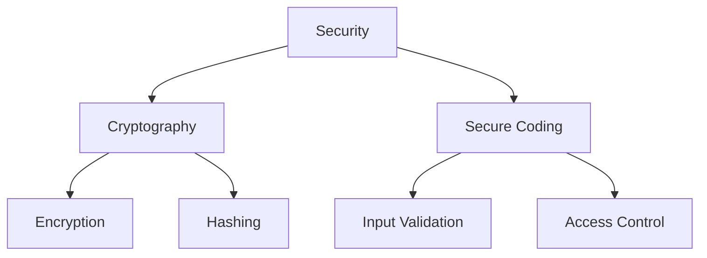

# Overview

Java security encompasses secure coding practices, cryptography, and protection against common vulnerabilities. Essential for building robust applications.

Canonical Interview Prompt: Implement secure password hashing and explain why it's important.

# Detailed Explanation

## Secure Coding Principles

- Input validation, output encoding, least privilege.
- Avoid common vulnerabilities: SQL injection, XSS, CSRF.

## Cryptography

- **Symmetric Encryption**: AES for data encryption.
- **Asymmetric Encryption**: RSA for key exchange.
- **Hashing**: SHA-256 for integrity, PBKDF2 for passwords.
- **Digital Signatures**: Verify authenticity.

## Java Security APIs

- **java.security**: Key management, certificates.
- **javax.crypto**: Encryption/decryption.
- **java.net.ssl**: SSL/TLS.



# Real-world Examples & Use Cases

- **Password Storage**: Hash passwords with salt.
- **Data Transmission**: Encrypt sensitive data over networks.
- **Authentication**: Use secure tokens.
- **Code Signing**: Verify software integrity.

# Code Examples

```java
// Password hashing with PBKDF2
import javax.crypto.SecretKeyFactory;
import javax.crypto.spec.PBEKeySpec;
import java.security.SecureRandom;
import java.security.spec.KeySpec;

public class PasswordHasher {
    public static byte[] hashPassword(String password, byte[] salt) throws Exception {
        KeySpec spec = new PBEKeySpec(password.toCharArray(), salt, 65536, 128);
        SecretKeyFactory factory = SecretKeyFactory.getInstance("PBKDF2WithHmacSHA1");
        return factory.generateSecret(spec).getEncoded();
    }

    public static byte[] generateSalt() {
        SecureRandom random = new SecureRandom();
        byte[] salt = new byte[16];
        random.nextBytes(salt);
        return salt;
    }
}
```

```java
// AES encryption
import javax.crypto.Cipher;
import javax.crypto.KeyGenerator;
import javax.crypto.SecretKey;
import javax.crypto.spec.SecretKeySpec;
import java.util.Base64;

public class AESEncryption {
    public static String encrypt(String data, String key) throws Exception {
        SecretKey secretKey = new SecretKeySpec(Base64.getDecoder().decode(key), "AES");
        Cipher cipher = Cipher.getInstance("AES");
        cipher.init(Cipher.ENCRYPT_MODE, secretKey);
        byte[] encrypted = cipher.doFinal(data.getBytes());
        return Base64.getEncoder().encodeToString(encrypted);
    }

    public static String decrypt(String encryptedData, String key) throws Exception {
        SecretKey secretKey = new SecretKeySpec(Base64.getDecoder().decode(key), "AES");
        Cipher cipher = Cipher.getInstance("AES");
        cipher.init(Cipher.DECRYPT_MODE, secretKey);
        byte[] decrypted = cipher.doFinal(Base64.getDecoder().decode(encryptedData));
        return new String(decrypted);
    }
}
```

# Common Pitfalls & Edge Cases

- **Weak Algorithms**: Avoid MD5, use SHA-256 or higher.
- **Key Management**: Store keys securely, rotate regularly.
- **Side-Channel Attacks**: Timing attacks on comparisons.
- **Certificate Validation**: Always validate SSL certificates.

# Tools & Libraries

- Java Cryptography Extension (JCE)
- Bouncy Castle for additional crypto
- OWASP for security guidelines

# References

- [Oracle Java Security](https://docs.oracle.com/javase/8/docs/technotes/guides/security/)
- [OWASP Java Security](https://owasp.org/www-pdf-archive/OWASP_Java_Security.pdf)
- [Baeldung Java Security](https://www.baeldung.com/java-security)

# Github-README Links & Related Topics

[Security Authz Authn Tokens](system-design/security-authz-authn-tokens/README.md), [Security in Distributed Systems](system-design/security-in-distributed-systems/README.md)