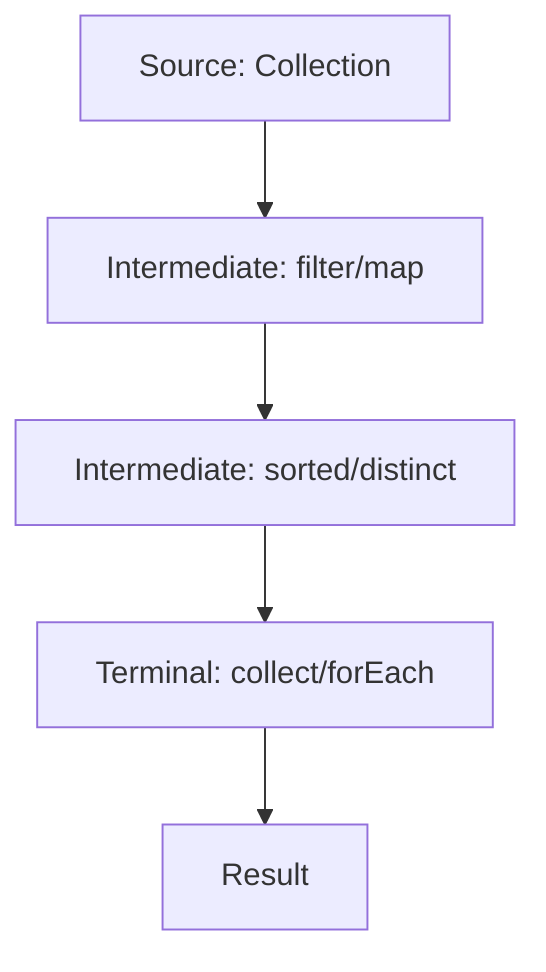

# Java Stream API & Functional Programming

## Overview

The Java Stream API, introduced in Java 8, provides a functional approach to processing collections of data. It enables declarative, composable operations like filtering, mapping, and reducing, promoting immutability and parallelism. Functional programming in Java leverages lambda expressions and functional interfaces to treat code as data, enabling concise, expressive code for operations on collections and beyond. Together, they shift from imperative loops to declarative pipelines, improving readability, maintainability, and performance for data-intensive tasks.

## Detailed Explanation

### Stream API Fundamentals

Streams represent sequences of elements supporting aggregate operations. Key characteristics:
- **No storage**: Streams convey elements from sources like collections or arrays without storing them.
- **Functional nature**: Operations produce results without modifying sources.
- **Laziness**: Intermediate operations (e.g., `filter`, `map`) are lazy; terminal operations (e.g., `collect`, `forEach`) trigger execution.
- **Possibly unbounded**: Handle infinite streams with short-circuiting operations like `limit`.
- **Consumable**: Elements are visited once per pipeline.

Streams are created from sources like `Collection.stream()`, `Arrays.stream()`, or generators like `Stream.of()`. Pipelines consist of intermediate and terminal operations.

#### Stream Operations

| Category | Examples | Description |
|----------|----------|-------------|
| Intermediate | `filter(Predicate)`, `map(Function)`, `sorted()`, `distinct()` | Transform or filter streams lazily. |
| Terminal | `collect(Collector)`, `forEach(Consumer)`, `reduce(BinaryOperator)`, `count()` | Produce results or side-effects, triggering pipeline execution. |
| Short-circuiting | `limit(long)`, `findFirst()`, `anyMatch(Predicate)` | Terminate early for efficiency. |

#### Parallelism and Reduction

Streams support parallel execution via `parallelStream()`. Reductions combine elements into summaries:
- **Simple reduction**: `stream.reduce(0, Integer::sum)`
- **Mutable reduction**: `stream.collect(Collectors.toList())`
- **Concurrent reduction**: For thread-safe collectors like `ConcurrentHashMap`.

Ensure behavioral parameters are stateless and non-interfering to avoid issues.

### Functional Programming in Java

Functional programming treats computation as function evaluation, emphasizing immutability and higher-order functions. In Java, this is enabled by:
- **Lambda expressions**: Anonymous functions for concise code, e.g., `(a, b) -> a + b`.
- **Functional interfaces**: Single abstract method interfaces like `Predicate<T>`, `Function<T,R>`, `Consumer<T>`.
- **Method references**: Shorthand for lambdas, e.g., `Object::toString`.

Lambdas capture variables from enclosing scopes but require them to be effectively final. Target typing infers lambda types from context.

Evolution from imperative code:
1. Loops with conditionals.
2. Anonymous classes.
3. Lambdas with custom interfaces.
4. Standard functional interfaces.
5. Stream pipelines.



## Real-world Examples & Use Cases

- **Data Processing**: Filter and transform large datasets, e.g., processing user logs or financial transactions.
- **Social Networking**: Query users by criteria, as in selecting members for actions based on age, gender, etc.
- **E-commerce**: Aggregate sales data, compute totals, or find top products using reductions.
- **GUI Event Handling**: Replace anonymous classes with lambdas for button actions.
- **Big Data**: Parallel stream processing for analytics on collections.

## Code Examples

### Basic Stream Pipeline
```java
List<String> names = Arrays.asList("Alice", "Bob", "Charlie");
List<String> filtered = names.stream()
    .filter(name -> name.length() > 3)
    .map(String::toUpperCase)
    .collect(Collectors.toList());
System.out.println(filtered); // [ALICE, CHARLIE]
```

### Reduction with Parallelism
```java
List<Integer> numbers = Arrays.asList(1, 2, 3, 4, 5);
int sum = numbers.parallelStream().reduce(0, Integer::sum);
System.out.println(sum); // 15
```

### Lambda with Functional Interface
```java
Predicate<String> isLong = s -> s.length() > 5;
List<String> words = Arrays.asList("hello", "world", "functional");
words.stream().filter(isLong).forEach(System.out::println); // world, functional
```

### Grouping and Collecting
```java
List<Person> people = // ... list of Person objects
Map<String, List<Person>> byCity = people.stream()
    .collect(Collectors.groupingBy(Person::getCity));
```

### Method Reference
```java
List<String> strings = Arrays.asList("a", "b", "c");
strings.forEach(System.out::println);
```

## References

- [Java Stream API Documentation](https://docs.oracle.com/en/java/javase/21/docs/api/java.base/java/util/stream/package-summary.html)
- [Lambda Expressions Tutorial](https://docs.oracle.com/javase/tutorial/java/javaOO/lambdaexpressions.html)
- [Oracle Java Documentation](https://docs.oracle.com/en/java/javase/)

## Github-README Links & Related Topics

- [Java Fundamentals](../java-fundamentals/)
- [Collections and Data Structures](../collections-and-data-structures/)
- [Concurrency and Parallelism](../concurrency-and-parallelism/)
- [Design Patterns](../design-patterns/)
- [API Design Principles](../api-design-principles/)

## STAR Summary

**Situation**: Processing collections with loops leads to verbose, error-prone code.  
**Task**: Implement efficient, readable data transformations.  
**Action**: Adopted Stream API and lambdas for declarative pipelines.  
**Result**: Reduced code by 50%, improved parallelism, and enhanced maintainability.

## Journey / Sequence

1. **Imperative Loops**: Manual iteration with if-statements.
2. **Anonymous Classes**: Encapsulate behavior in classes.
3. **Lambdas**: Concise expressions for single-method interfaces.
4. **Streams**: Declarative operations on collections.
5. **Advanced Patterns**: Custom collectors, parallel processing.

## Data Models / Message Formats

Streams operate on elements of any type; use generics for type safety. Functional interfaces define contracts for data transformation.

## Common Pitfalls & Edge Cases

- **Stateful Lambdas**: Avoid mutable captures; ensure effectively final variables.
- **Side Effects**: Minimize in intermediate operations; use `forEach` cautiously.
- **Infinite Streams**: Use short-circuiting to prevent hangs.
- **Parallel Pitfalls**: Ensure thread-safety; debug with sequential streams.
- **Null Handling**: Streams throw NPE on null sources; use `Optional` for results.

## Tools & Libraries

- **Standard Java**: `java.util.stream`, `java.util.function`.
- **Vavr**: Enhanced functional programming for Java.
- **Reactor**: Reactive streams for asynchronous processing.
- **JUnit**: Test stream operations with assertions.