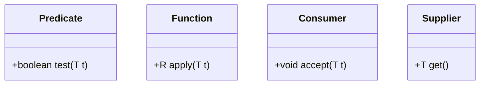
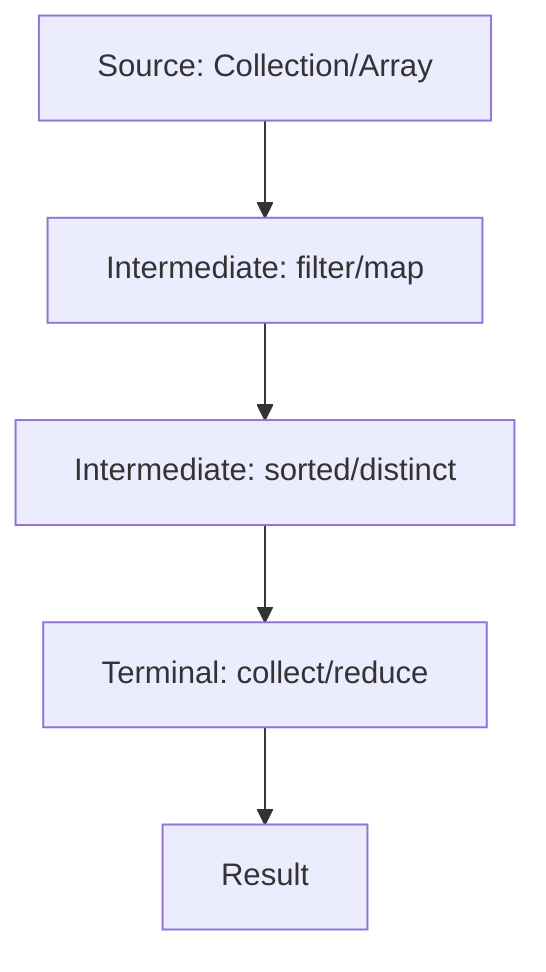

# Overview

The Java Stream API, introduced in Java 8, provides a functional approach to processing collections of data. Combined with functional programming concepts like lambda expressions and method references, it enables declarative, concise, and parallelizable operations on data sequences. Streams represent a sequence of elements supporting aggregate operations such as filter, map, and reduce, without modifying the underlying data source.

Functional programming in Java emphasizes immutability, higher-order functions, and composability, leveraging interfaces like `Predicate`, `Function`, and `Consumer` from `java.util.function`. This paradigm shift from imperative loops to declarative pipelines improves code readability, reduces boilerplate, and facilitates parallel execution.

# Detailed Explanation

## Stream API Fundamentals

A **stream** is a sequence of elements from a source (e.g., collections, arrays, or generators) that supports functional-style operations. Key characteristics:

- **No storage**: Streams do not store data; they convey elements through pipelines.
- **Functional nature**: Operations produce results without modifying the source.
- **Laziness**: Intermediate operations (e.g., `filter`, `map`) are lazy and only execute when a terminal operation (e.g., `collect`, `forEach`) is invoked.
- **Possibly unbounded**: Streams can handle infinite sequences with short-circuiting operations like `limit`.
- **Consumable**: Elements are visited once during the stream's lifecycle.

Streams are created via methods like `Collection.stream()`, `Arrays.stream()`, or `Stream.of()`. They support primitive specializations (`IntStream`, `LongStream`, `DoubleStream`) for performance.

### Functional Interfaces

Functional programming relies on **functional interfaces**—interfaces with a single abstract method (SAM). Common ones include:

- `Predicate<T>`: Tests a condition (e.g., `boolean test(T t)`).
- `Function<T, R>`: Transforms input to output (e.g., `R apply(T t)`).
- `Consumer<T>`: Performs an action (e.g., `void accept(T t)`).
- `Supplier<T>`: Provides a value (e.g., `T get()`).

These enable lambda expressions and method references for concise code.



### Lambda Expressions and Method References

**Lambda expressions** are anonymous functions for implementing functional interfaces:

```java
// Lambda: (parameters) -> expression
Predicate<Person> isAdult = person -> person.getAge() >= 18;

// Method reference: Class::method
Function<Person, String> getName = Person::getName;
```

They capture variables from enclosing scopes but require them to be effectively final.

## Stream Operations

Operations are categorized into:

- **Intermediate**: Return a new stream (e.g., `filter`, `map`, `sorted`).
- **Terminal**: Produce a result or side-effect (e.g., `collect`, `reduce`, `forEach`).

### Pipeline Flow



### Collectors

The `Collectors` class provides implementations for common reduction operations. Key collectors include:

| Collector | Description | Example |
|-----------|-------------|---------|
| `toList()` | Collects elements into a `List` | `stream.collect(Collectors.toList())` |
| `toSet()` | Collects elements into a `Set` | `stream.collect(Collectors.toSet())` |
| `toMap(keyMapper, valueMapper)` | Collects into a `Map` | `stream.collect(Collectors.toMap(Person::getId, Person::getName))` |
| `groupingBy(classifier)` | Groups elements by a classifier | `stream.collect(Collectors.groupingBy(Person::getCity))` |
| `partitioningBy(predicate)` | Partitions into two groups | `stream.collect(Collectors.partitioningBy(n -> n > 10))` |
| `joining(delimiter)` | Joins strings | `stream.collect(Collectors.joining(", "))` |
| `summingInt(mapper)` | Sums integers | `stream.collect(Collectors.summingInt(Integer::intValue))` |
| `averagingDouble(mapper)` | Averages doubles | `stream.collect(Collectors.averagingDouble(Double::doubleValue))` |

### Parallel Streams

Invoke `parallelStream()` for concurrent processing. Ensure operations are stateless and non-interfering.

```java
List<Integer> numbers = Arrays.asList(1, 2, 3, 4, 5);
int sum = numbers.parallelStream().mapToInt(Integer::intValue).sum();
```

## Functional Programming Principles

- **Immutability**: Avoid modifying state; use pure functions.
- **Higher-order functions**: Functions that take or return other functions.
- **Composition**: Chain operations declaratively.

# Real-world Examples & Use Cases

- **Data Filtering and Transformation**: Process user lists in web apps (e.g., filter active users, map to emails).
- **Big Data Processing**: Aggregate logs or sensor data in IoT systems.
- **Financial Calculations**: Compute totals, averages, or risk metrics on transaction streams.
- **Parallel Processing**: Leverage multi-core CPUs for performance in batch jobs or real-time analytics.
- **Event Handling**: React to streams of events in reactive systems.

Example: In an e-commerce platform, filter products by category, apply discounts, and compute total revenue.

# Best Practices

- **Immutability**: Treat streams as immutable; avoid modifying the source collection during processing.
- **Method References**: Prefer method references (e.g., `String::toUpperCase`) over lambda expressions for better readability when possible.
- **Stateless Operations**: Ensure intermediate operations are stateless to allow parallel execution.
- **Short-Circuiting**: Use operations like `limit`, `findFirst`, or `anyMatch` to terminate early and improve performance.
- **Avoid Side-Effects**: Intermediate operations should not have side-effects; reserve them for terminal operations.
- **Parallel Streams**: Use `parallelStream()` only for large datasets or CPU-intensive tasks; test for performance gains.

# Performance Considerations

- **Overhead**: Streams introduce some overhead due to object creation; for small collections, traditional loops may be faster.
- **Parallel Execution**: Parallel streams can leverage multi-core processors but incur thread management costs. Suitable for independent, computationally intensive operations.
- **Spliterator**: Custom spliterators can optimize parallel processing for specific data structures.
- **Primitive Streams**: Use `IntStream`, `LongStream`, `DoubleStream` for primitives to avoid boxing/unboxing overhead.
- **Lazy Evaluation**: Intermediate operations are lazy, allowing optimizations like fusion (combining operations).

# Common Pitfalls

- **Modifying Source**: Attempting to modify the source collection during stream processing leads to `ConcurrentModificationException`.
- **Infinite Streams**: Operations like `iterate` can create infinite streams; always use `limit` or short-circuiting terminals.
- **Stateful Lambdas**: Lambdas capturing mutable state can cause concurrency issues in parallel streams.
- **Null Handling**: Streams do not handle nulls gracefully; use `Optional` or filter nulls explicitly.
- **Exception Handling**: Checked exceptions in lambdas require wrapping in unchecked exceptions or using try-catch.

# Code Examples

## Basic Stream Operations

```java
import java.util.Arrays;
import java.util.List;
import java.util.stream.Collectors;

public class StreamExamples {
    public static void main(String[] args) {
        List<String> names = Arrays.asList("Alice", "Bob", "Charlie", "David");

        // Filter and collect
        List<String> filtered = names.stream()
            .filter(name -> name.startsWith("A"))
            .collect(Collectors.toList());
        System.out.println(filtered); // [Alice]

        // Map and reduce
        int totalLength = names.stream()
            .mapToInt(String::length)
            .sum();
        System.out.println(totalLength); // 21
    }
}
```

## Functional Interfaces with Lambdas

```java
import java.util.function.Predicate;
import java.util.function.Function;
import java.util.function.Consumer;

public class FunctionalExamples {
    public static void main(String[] args) {
        Predicate<String> isLong = s -> s.length() > 5;
        Function<String, Integer> toLength = String::length;
        Consumer<String> printer = System.out::println;

        String test = "Hello World";
        if (isLong.test(test)) {
            printer.accept("Length: " + toLength.apply(test)); // Length: 11
        }
    }
}
```

## Parallel Stream Example

```java
import java.util.Arrays;

public class ParallelExample {
    public static void main(String[] args) {
        int[] numbers = {1, 2, 3, 4, 5, 6, 7, 8, 9, 10};
        int sum = Arrays.stream(numbers)
            .parallel()
            .filter(n -> n % 2 == 0)
            .sum();
        System.out.println("Sum of evens: " + sum); // 30
    }
}
```

## Advanced Stream Operations

```java
import java.util.*;
import java.util.stream.Collectors;

class Person {
    String name;
    String city;
    int age;

    Person(String name, String city, int age) {
        this.name = name;
        this.city = city;
        this.age = age;
    }

    String getName() { return name; }
    String getCity() { return city; }
    int getAge() { return age; }
}

public class AdvancedExamples {
    public static void main(String[] args) {
        List<Person> people = Arrays.asList(
            new Person("Alice", "NYC", 25),
            new Person("Bob", "LA", 30),
            new Person("Charlie", "NYC", 35)
        );

        // Grouping by city
        Map<String, List<Person>> byCity = people.stream()
            .collect(Collectors.groupingBy(Person::getCity));
        System.out.println(byCity); // {NYC=[Alice, Charlie], LA=[Bob]}

        // Partitioning by age
        Map<Boolean, List<Person>> adults = people.stream()
            .collect(Collectors.partitioningBy(p -> p.getAge() >= 18));
        System.out.println(adults); // {false=[], true=[Alice, Bob, Charlie]}

        // Joining names
        String names = people.stream()
            .map(Person::getName)
            .collect(Collectors.joining(", "));
        System.out.println(names); // Alice, Bob, Charlie
    }
}
```

## Comparison: Imperative vs. Functional

| Aspect          | Imperative (Loop)                          | Functional (Stream)                          |
|-----------------|--------------------------------------------|----------------------------------------------|
| Readability     | Verbose, explicit steps                   | Declarative, concise                        |
| Mutability      | Modifies variables                        | Immutable operations                        |
| Parallelism     | Manual threading                          | Built-in with `parallelStream()`            |
| Example         | `for (int i : list) { if (i > 5) sum += i; }` | `list.stream().filter(i -> i > 5).sum()`    |

# References

- [Oracle Java Stream API Documentation](https://docs.oracle.com/javase/8/docs/api/java/util/stream/package-summary.html)
- [Oracle Lambda Expressions Tutorial](https://docs.oracle.com/javase/tutorial/java/javaOO/lambdaexpressions.html)
- [Oracle Aggregate Operations](https://docs.oracle.com/javase/tutorial/collections/streams/index.html)
- [Java Language Specification: Functional Interfaces](https://docs.oracle.com/javase/specs/jls/se8/html/jls-9.html)
- [Baeldung: Guide to Java 8 Streams](https://www.baeldung.com/java-8-streams)
- [Baeldung: Functional Interfaces in Java](https://www.baeldung.com/java-8-functional-interfaces)
- [Venkat Subramaniam: Functional Programming in Java](https://www.manning.com/books/functional-programming-in-java)

# Github-README Links & Related Topics

- [Java Lambda Expressions](../java-lambda-expressions/)
- [Java Functional Interfaces](../java-functional-interfaces/)
- [Java Streams Advanced](../java-streams-advanced/)
- [Java Parallel Streams](../java-parallel-streams/)
- [Java Collections](../java-collections/)
- [Java Concurrency](../java-multithreading-and-concurrency/)
