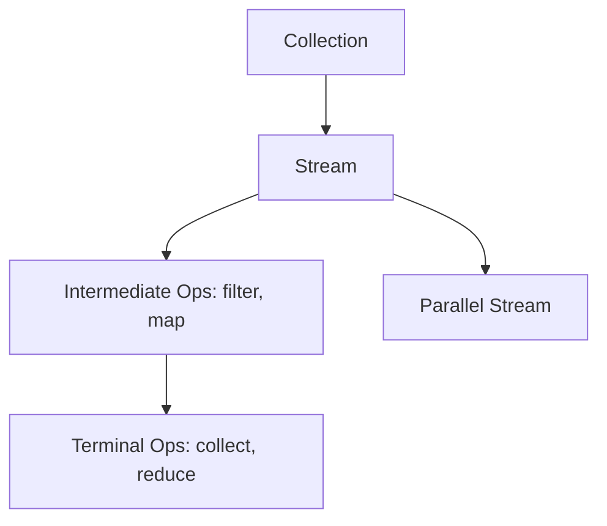

## Overview
The Java Stream API enables functional-style operations on collections, allowing for declarative data processing. Combined with lambdas and functional interfaces, it promotes immutable and parallel processing.

## Detailed Explanation
- **Streams:** Sequences of elements supporting aggregate operations.
- **Functional Interfaces:** Predicate, Function, Consumer, Supplier.
- **Operations:** Intermediate (filter, map) vs Terminal (collect, forEach).
- **Parallel Streams:** For concurrent processing using .parallelStream().

## Real-world Examples & Use Cases
- Filtering a list of users by age.
- Mapping objects to DTOs.
- Aggregating sales data.

## Code Examples
### Filtering and Mapping
```java
import java.util.List;
import java.util.stream.Collectors;

List<String> names = List.of("Alice", "Bob", "Charlie");
List<String> filtered = names.stream()
    .filter(name -> name.length() > 3)
    .map(String::toUpperCase)
    .collect(Collectors.toList());
System.out.println(filtered); // [ALICE, CHARLIE]
```

### Using Parallel Streams
```java
List<Integer> numbers = List.of(1, 2, 3, 4, 5);
int sum = numbers.parallelStream()
    .mapToInt(Integer::intValue)
    .sum();
System.out.println(sum); // 15
```

## Data Models / Message Formats


## Common Pitfalls & Edge Cases
- Streams are lazy; terminal operation triggers execution.
- Modifying source during stream processing causes exceptions.
- Parallel streams may not preserve order.

## Tools & Libraries
- Java 8+ Stream API.
- Vavr for functional programming extensions.

## Github-README Links & Related Topics
Related: [java/streams-functional-java](../java/streams-functional-java/), [java-lambda-expressions](../java-lambda-expressions/)

## References
- [Oracle Stream API Guide](https://docs.oracle.com/javase/8/docs/api/java/util/stream/package-summary.html)
- "Functional Programming in Java" by Venkat Subramaniam
- https://github.com/eugenp/tutorials/tree/master/core-java-modules/core-java-streams