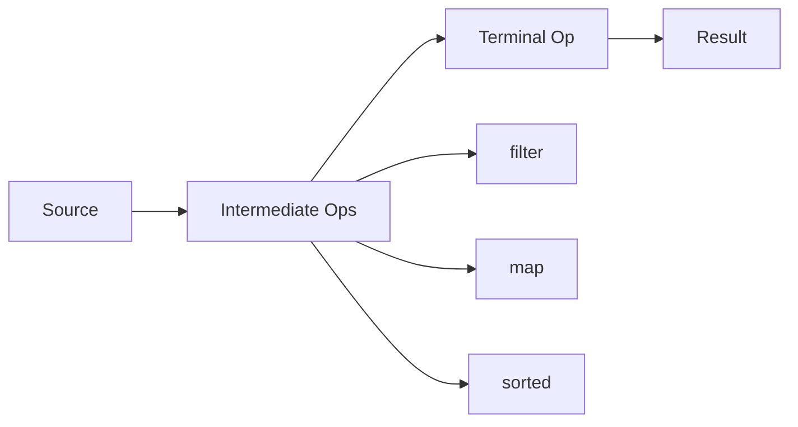

## Overview

The Java Stream API, introduced in Java 8, enables functional-style operations on collections. It supports operations like filter, map, reduce, and collect, promoting immutability and parallelism. Functional programming concepts like lambdas, method references, and higher-order functions are integral to using streams effectively.

## Detailed Explanation

### Key Concepts
- **Streams**: Sequences of elements supporting sequential and parallel operations.
- **Intermediate Operations**: filter, map, sorted – return a stream.
- **Terminal Operations**: collect, forEach, reduce – produce a result.
- **Lambdas**: Anonymous functions, e.g., `x -> x * 2`.
- **Method References**: Shorthand for lambdas, e.g., `String::toUpperCase`.

### Stream Pipeline


## Real-world Examples & Use Cases

- **Filtering Data**: Extracting active users from a list.
- **Mapping Transformations**: Converting objects to DTOs.
- **Aggregation**: Calculating totals or averages.
- **Parallel Processing**: Handling large datasets efficiently.

## Code Examples

### Basic Stream Operations
```java
import java.util.Arrays;
import java.util.List;
import java.util.stream.Collectors;

public class StreamExample {
    public static void main(String[] args) {
        List<String> names = Arrays.asList("Alice", "Bob", "Charlie");
        List<String> upperNames = names.stream()
            .map(String::toUpperCase)
            .filter(name -> name.startsWith("A"))
            .collect(Collectors.toList());
        System.out.println(upperNames); // [ALICE]
    }
}
```

### Parallel Stream
```java
import java.util.Arrays;

public class ParallelStreamExample {
    public static void main(String[] args) {
        int[] numbers = {1, 2, 3, 4, 5};
        int sum = Arrays.stream(numbers)
            .parallel()
            .sum();
        System.out.println(sum); // 15
    }
}
```

## References

- [Oracle Stream API Guide](https://docs.oracle.com/javase/8/docs/api/java/util/stream/package-summary.html)
- [Baeldung Functional Programming](https://www.baeldung.com/java-functional-programming)

## Github-README Links & Related Topics

- [Collections & Data Structures](../collections-and-data-structures/)
- [Java Lambda Expressions](../java-lambda-expressions/)
- [Java Optional Class](../java-optional-class/)
