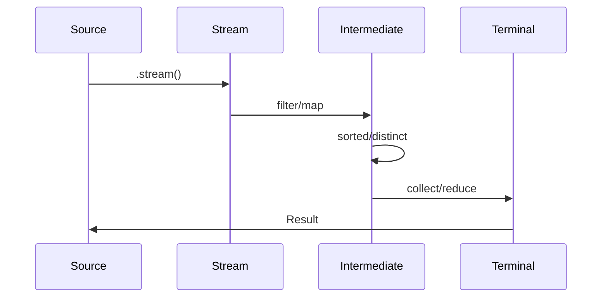
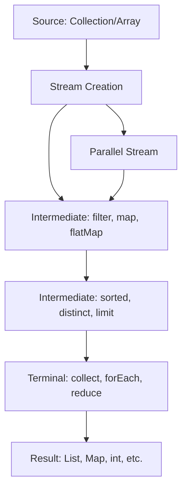

## Overview
The Java Stream API, introduced in Java 8, enables functional-style operations on collections and arrays, allowing for declarative, composable, and parallel data processing. It integrates seamlessly with lambda expressions and functional interfaces to promote immutable operations, reducing side effects and improving code readability and maintainability.

## Detailed Explanation
Streams represent a sequence of elements from a source (collections, arrays, I/O channels) that support aggregate operations. Key concepts include:

- **Stream Creation:** From collections via `.stream()` or `.parallelStream()`, arrays via `Arrays.stream()`, or generators like `Stream.of()`.
- **Functional Interfaces:** Core interfaces like `Predicate<T>` (boolean test), `Function<T,R>` (transformation), `Consumer<T>` (side-effect), `Supplier<T>` (value generation).
- **Method References:** Shorthand for lambdas, e.g., `String::toUpperCase` instead of `s -> s.toUpperCase()`.
- **Operations Types:**
  - **Intermediate:** Lazy operations returning a new stream (filter, map, flatMap, sorted, distinct).
  - **Terminal:** Eager operations producing a result or side-effect (collect, forEach, reduce, count, anyMatch).
- **Parallel Streams:** Leverage multi-core processors for performance, but may not preserve order; use `.parallelStream()`.
- **Collectors:** Utilities for accumulating stream elements into collections, maps, or other structures (e.g., `Collectors.toList()`, `groupingBy()`).

### Stream Pipeline
A stream pipeline consists of a source, zero or more intermediate operations, and a terminal operation. Pipelines are lazy until the terminal operation executes.

## Real-world Examples & Use Cases
- **Data Filtering and Transformation:** In e-commerce, filter products by category and map to display DTOs.
- **Aggregation:** Calculate total sales from a list of transactions.
- **Parallel Processing:** Process large datasets for analytics, like computing statistics on user logs.
- **Grouping and Partitioning:** Group employees by department or partition users into active/inactive.
- **Infinite Streams:** Generate sequences for simulations or pagination.

## Code Examples
### Basic Filtering and Mapping
```java
import java.util.List;
import java.util.stream.Collectors;

List<String> names = List.of("Alice", "Bob", "Charlie", "David");
List<String> longNames = names.stream()
    .filter(name -> name.length() > 3)
    .map(String::toUpperCase)
    .collect(Collectors.toList());
System.out.println(longNames); // [ALICE, CHARLIE, DAVID]
```

### Reduction and Aggregation
```java
import java.util.List;

List<Integer> numbers = List.of(1, 2, 3, 4, 5);
int sum = numbers.stream()
    .reduce(0, Integer::sum);
System.out.println(sum); // 15

double average = numbers.stream()
    .mapToInt(Integer::intValue)
    .average()
    .orElse(0.0);
System.out.println(average); // 3.0
```

### Grouping and Collecting
```java
import java.util.List;
import java.util.Map;
import java.util.stream.Collectors;

class Employee {
    String name, department;
    double salary;
    Employee(String name, String dept, double sal) {
        this.name = name; this.department = dept; this.salary = sal;
    }
}

List<Employee> employees = List.of(
    new Employee("Alice", "Engineering", 100000),
    new Employee("Bob", "HR", 80000),
    new Employee("Charlie", "Engineering", 120000)
);

Map<String, Double> avgSalaryByDept = employees.stream()
    .collect(Collectors.groupingBy(e -> e.department,
             Collectors.averagingDouble(e -> e.salary)));
System.out.println(avgSalaryByDept); // {Engineering=110000.0, HR=80000.0}
```

### Parallel Stream for Performance
```java
import java.util.List;

List<Integer> largeList = // assume large list
int sum = largeList.parallelStream()
    .mapToInt(Integer::intValue)
    .sum();
System.out.println(sum);
```

### FlatMap for Nested Structures
```java
import java.util.List;
import java.util.stream.Collectors;

List<List<String>> nested = List.of(
    List.of("a", "b"),
    List.of("c", "d")
);
List<String> flat = nested.stream()
    .flatMap(List::stream)
    .collect(Collectors.toList());
System.out.println(flat); // [a, b, c, d]
```

## Journey / Sequence


## Data Models / Message Formats
### Stream Operations Flow


### JSON Example for Collected Data
```json
{
  "groupedEmployees": {
    "Engineering": [
      {"name": "Alice", "salary": 100000},
      {"name": "Charlie", "salary": 120000}
    ],
    "HR": [
      {"name": "Bob", "salary": 80000}
    ]
  }
}
```

## Common Pitfalls & Edge Cases
- **Stateful Operations:** Avoid stateful lambdas; streams assume statelessness.
- **Infinite Streams:** Operations like `iterate()` can cause infinite loops if not limited.
- **Null Handling:** Streams throw NPE on null sources; use `Optional` for safe operations.
- **Parallel Stream Order:** Does not guarantee order; use `forEachOrdered()` if needed.
- **Performance:** Parallel streams have overhead; benchmark for large datasets.
- **Edge Cases:** Empty streams, single-element streams, streams with duplicates.

## Tools & Libraries
- Java 8+ Stream API (java.util.stream).
- Vavr: Functional programming library with enhanced streams.
- Reactor: Reactive streams for asynchronous processing.
- Apache Commons Lang: Utilities complementing streams.

## Github-README Links & Related Topics
- [java-lambda-expressions](../java-lambda-expressions/)
- [java-streams-advanced](../java-streams-advanced/)
- [multithreading-and-concurrency-in-java](../multithreading-and-concurrency-in-java/)

## References
- Oracle Java Stream API: https://docs.oracle.com/javase/8/docs/api/java/util/stream/package-summary.html
- "Functional Programming in Java" by Venkat Subramaniam: https://www.manning.com/books/functional-programming-in-java
- Baeldung Streams Guide: https://www.baeldung.com/java-8-streams
- GitHub: https://github.com/eugenp/tutorials/tree/master/core-java-modules/core-java-streams
- GeeksforGeeks Streams: https://www.geeksforgeeks.org/stream-in-java/