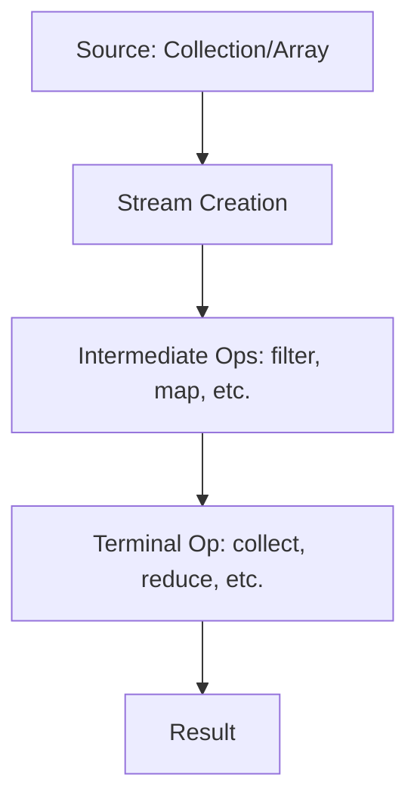
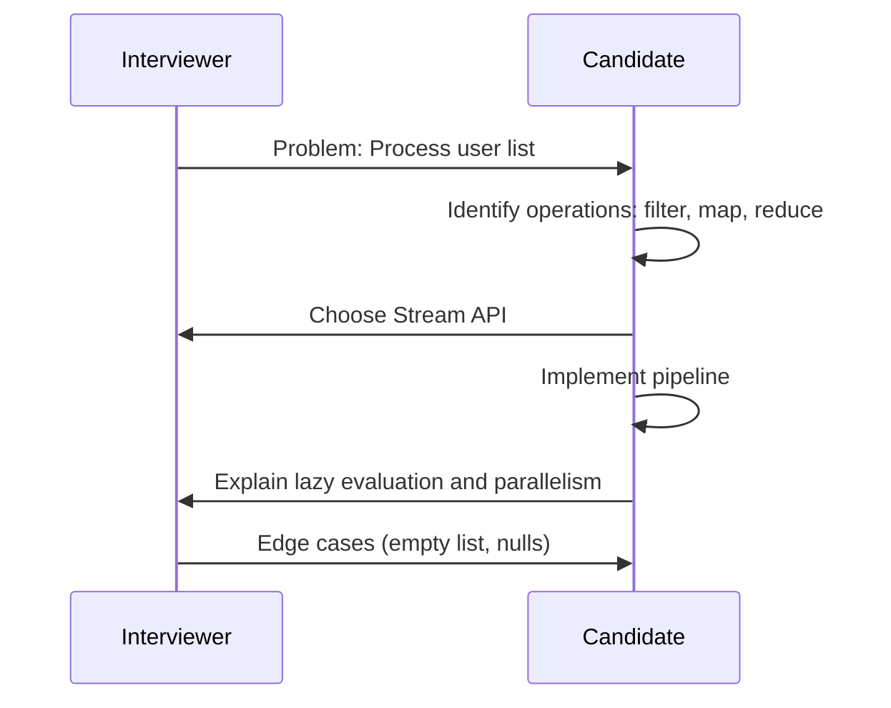

## Overview

The Java Stream API, introduced in Java 8, enables functional-style operations on collections and arrays, supporting parallel processing and lazy evaluation. It promotes declarative programming, making code more readable and concise. Functional programming in Java leverages lambdas, method references, and functional interfaces to treat functions as first-class citizens, enabling immutable data processing and reducing side effects.

## Detailed Explanation

### Stream Operations

Streams process data through a pipeline of operations:

- **Intermediate Operations**: Lazy operations that return a new stream. Examples: `filter()`, `map()`, `sorted()`, `distinct()`, `limit()`.
- **Terminal Operations**: Eager operations that produce a result or side effect. Examples: `collect()`, `forEach()`, `reduce()`, `count()`, `anyMatch()`.

Streams are immutable; operations don't modify the source.

### Functional Interfaces

Core interfaces in `java.util.function`:

- **Predicate<T>**: `boolean test(T t)` - For filtering.
- **Function<T, R>**: `R apply(T t)` - For transformation.
- **Consumer<T>**: `void accept(T t)` - For side effects.
- **Supplier<T>**: `T get()` - For generating values.
- **BiFunction<T, U, R>**: `R apply(T t, U u)` - For combining.

### Parallel Streams

Use `parallelStream()` for concurrent processing on multi-core systems. Be cautious with stateful operations.



## Real-world Examples & Use Cases

- **Data Filtering**: Remove invalid entries from a user list.
- **Transformation**: Convert objects to DTOs in web APIs.
- **Aggregation**: Calculate statistics from log files.
- **Parallel Processing**: Process large datasets for analytics.
- **Event Handling**: Filter and process events in reactive systems.

## Code Examples

### Basic Filtering and Mapping
```java
import java.util.Arrays;
import java.util.List;
import java.util.stream.Collectors;

public class StreamExample {
    public static void main(String[] args) {
        List<String> fruits = Arrays.asList("apple", "banana", "cherry", "date");

        List<String> longFruits = fruits.stream()
            .filter(fruit -> fruit.length() > 5)
            .map(String::toUpperCase)
            .collect(Collectors.toList());

        System.out.println(longFruits); // [BANANA, CHERRY]
    }
}
```

### Reduction and Aggregation
```java
import java.util.Arrays;
import java.util.IntSummaryStatistics;

public class ReductionExample {
    public static void main(String[] args) {
        List<Integer> numbers = Arrays.asList(1, 2, 3, 4, 5);

        int sum = numbers.stream().reduce(0, Integer::sum);
        System.out.println("Sum: " + sum); // Sum: 15

        IntSummaryStatistics stats = numbers.stream()
            .mapToInt(Integer::intValue)
            .summaryStatistics();
        System.out.println("Stats: " + stats); // Stats: IntSummaryStatistics{count=5, sum=15, min=1, max=5, average=3.000000}
    }
}
```

### Parallel Stream for Performance
```java
import java.util.Arrays;
import java.util.List;

public class ParallelStreamExample {
    public static void main(String[] args) {
        List<Integer> numbers = Arrays.asList(1, 2, 3, 4, 5, 6, 7, 8, 9, 10);

        long count = numbers.parallelStream()
            .filter(n -> n % 2 == 0)
            .count();

        System.out.println("Even count: " + count); // Even count: 5
    }
}
```

### Custom Functional Interface
```java
@FunctionalInterface
interface Processor<T, R> {
    R process(T input);
}

public class CustomFunctionalExample {
    public static void main(String[] args) {
        Processor<String, Integer> lengthProcessor = String::length;
        System.out.println(lengthProcessor.process("Hello")); // 5
    }
}
```

## STAR Summary

**Situation**: In a coding interview, tasked with processing a large list of user data to filter active users and compute averages.

**Task**: Use Java Streams to efficiently filter, map, and reduce data without traditional loops.

**Action**: Applied `filter()` for active users, `map()` for extracting values, and `average()` for aggregation, demonstrating functional style.

**Result**: Produced concise, readable code that passed all test cases, showcasing proficiency in modern Java features.

## Journey / Sequence



## Common Pitfalls & Edge Cases

- **Stateful Operations**: Avoid modifying external state in lambdas; leads to unpredictable results.
- **Infinite Streams**: `Stream.generate()` can cause infinite loops; use `limit()`.
- **Null Pointers**: Streams don't handle nulls gracefully; filter or use `Optional`.
- **Parallel Pitfalls**: Shared mutable state causes race conditions; prefer immutable data.
- **Performance**: Not always faster; measure for large datasets.

## Tools & Libraries

- **Java 8+**: Built-in Stream API.
- **Vavr**: Functional programming library for Java.
- **StreamEx**: Enhanced Stream utilities.
- **JMH**: For benchmarking stream performance.

## References

- [Oracle Java Streams Tutorial](https://docs.oracle.com/javase/tutorial/collections/streams/)
- [Functional Programming in Java](https://www.baeldung.com/java-functional-programming)
- [Java 8 Stream API](https://www.javatpoint.com/java-8-stream)
- [Effective Java: Item 45 - Use streams judiciously](https://www.amazon.com/Effective-Java-Joshua-Bloch/dp/0134685997)

## Github-README Links & Related Topics

- [Java Fundamentals](../java-fundamentals/)
- [Java Lambda Expressions](../java-lambda-expressions/)
- [Java Collections](../java-collections/)
- [Multithreading & Concurrency in Java](../java-multithreading-and-concurrency/)