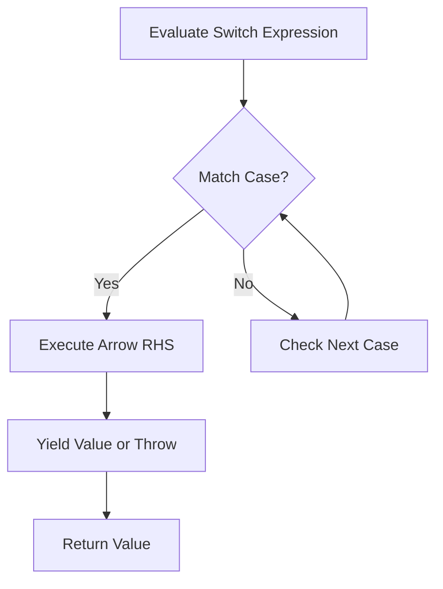

## Overview

Switch expressions, introduced as a preview feature in Java 12 and 13, and finalized in Java 14 (JEP 361), extend the traditional `switch` statement to support expressions that evaluate to a value. They eliminate fall-through behavior by default, support multiple case labels, and use arrow syntax (`->`) for concise branching. Switch expressions improve code readability, reduce boilerplate, and prepare the language for pattern matching enhancements.

## Detailed Explanation

Switch expressions allow `switch` to return values, making it suitable for assignments, method returns, and functional programming contexts. Key features include:

- **Arrow Syntax**: `case L -> expression` prevents fall-through and executes only the right-hand side.
- **Multiple Labels**: `case A, B -> expression` handles multiple constants in one case.
- **Yield Statement**: For blocks, `yield value` returns a value from the expression.
- **Exhaustiveness**: Expressions must cover all possible values (e.g., via `default` or for enums).
- **Type Inference**: Poly expressions that infer types from context.

Unlike statements, expressions must produce a value or throw an exception, with no implicit fall-through.

### Comparison: Statement vs Expression

| Aspect              | Switch Statement                  | Switch Expression                  |
|---------------------|-----------------------------------|------------------------------------|
| Purpose            | Side effects                     | Compute values                     |
| Fall-through       | Default (requires `break`)       | None (arrow syntax)                |
| Labels             | `case L:` or `case L ->`         | `case L ->` preferred              |
| Completion         | Any (e.g., `break`, `return`)    | Must yield value or throw          |
| Exhaustiveness     | Not required                     | Required for expressions           |

### Flow Diagram



## Real-world Examples & Use Cases

- **Enum Processing**: Mapping enums to values, e.g., day of week to string or number.
- **State Machines**: Transition logic in parsers or game states.
- **Configuration Parsing**: Converting strings to types or settings.
- **Functional Programming**: Replacing if-else chains in data transformations.
- **Error Handling**: Returning results or exceptions based on input validation.

## Code Examples

### Basic Switch Expression

```java
enum Day { MONDAY, TUESDAY, WEDNESDAY, THURSDAY, FRIDAY, SATURDAY, SUNDAY }

Day day = Day.WEDNESDAY;
String type = switch (day) {
    case MONDAY, TUESDAY, WEDNESDAY, THURSDAY, FRIDAY -> "Weekday";
    case SATURDAY, SUNDAY -> "Weekend";
};
System.out.println(type); // Output: Weekday
```

### Using Yield in Blocks

```java
int numLetters = switch (day) {
    case MONDAY, FRIDAY, SUNDAY -> {
        System.out.println("Processing " + day);
        yield 6;
    }
    case TUESDAY -> 7;
    case THURSDAY, SATURDAY -> 8;
    case WEDNESDAY -> 9;
};
```

### Traditional Statement vs Expression

```java
// Traditional Statement
String result;
switch (day) {
    case MONDAY:
        result = "Start of work week";
        break;
    case FRIDAY:
        result = "TGIF";
        break;
    default:
        result = "Regular day";
        break;
}

// Expression
String result = switch (day) {
    case MONDAY -> "Start of work week";
    case FRIDAY -> "TGIF";
    default -> "Regular day";
};
```

### With Pattern Matching (Preview in Later Versions)

```java
// Requires Java 17+ with pattern matching
Object obj = "Hello";
String description = switch (obj) {
    case String s -> "String: " + s;
    case Integer i -> "Integer: " + i;
    default -> "Unknown";
};
```

### Exhaustiveness with Enums

For enums, the compiler ensures all cases are covered; otherwise, add `default`.

```java
// Exhaustive for enum
String dayName = switch (day) {
    case MONDAY -> "Mon";
    case TUESDAY -> "Tue";
    // ... other cases
    case SUNDAY -> "Sun";
}; // No default needed if all enum values covered
```

## Common Pitfalls & Edge Cases

- **Non-Exhaustive Cases**: Expressions require covering all values; enums auto-insert `default` if incomplete.
- **Yield in Blocks**: Arrow cases with blocks must use `yield`; simple expressions do not.
- **Null Handling**: Switch throws `NullPointerException` on null; use guards or checks.
- **Type Mismatch**: Arms must be compatible types; compiler infers common supertype.
- **Scoping**: Variables in arrow blocks are scoped locally, avoiding leaks.
- **Mixing Styles**: Avoid mixing `case L:` and `case L ->` in the same switch for clarity.

## Tools & Libraries

- **IDE Support**: Modern IDEs like IntelliJ IDEA, Eclipse, and VS Code provide syntax highlighting, refactoring, and error detection for switch expressions.
- **Build Tools**: Maven and Gradle compile Java 14+ code; ensure `--enable-preview` for preview features if applicable.
- **Testing**: Use JUnit for unit tests; expressions simplify assertions on returned values.

## References

- [Oracle Java Documentation: Switch Expressions](https://docs.oracle.com/en/java/javase/21/language/switch-expressions-and-statements.html)
- [JEP 361: Switch Expressions](https://openjdk.org/jeps/361)
- [Oracle Java Tutorials: The switch Statement](https://docs.oracle.com/javase/tutorial/java/nutsandbolts/switch.html)

## Github-README Links & Related Topics

- [Java Fundamentals](../java-fundamentals/README.md)
- [Java Sealed Classes](../java-sealed-classes/README.md)
- [Control Flow Statements](../java/java-language-basics/README.md)