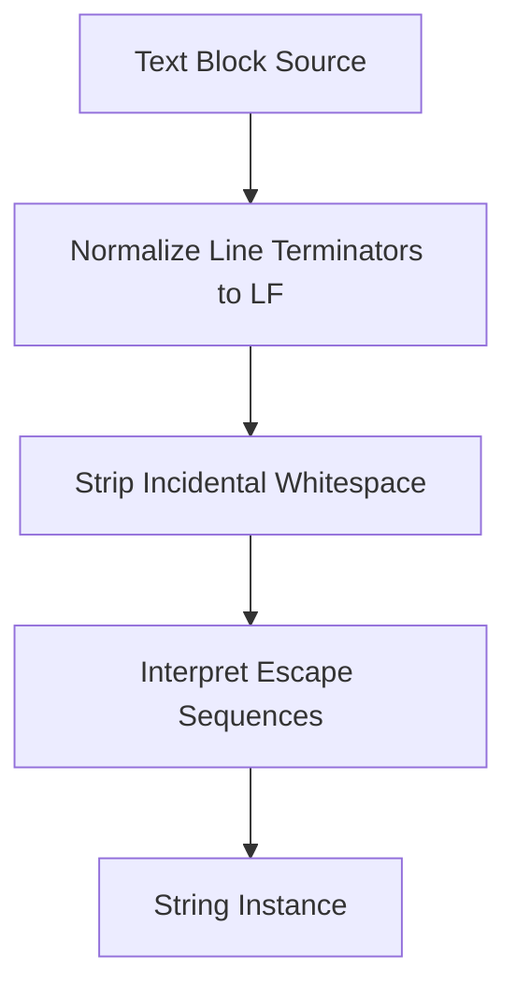

## Overview

Java Text Blocks, introduced as a preview feature in Java 13 and finalized in Java 15 via JEP 378, enable the definition of multi-line string literals without requiring escape sequences for newlines or quotes. This feature enhances code readability for strings spanning multiple lines, such as embedded code snippets, data formats, or templates, by automatically managing indentation and line normalization.

## Detailed Explanation

A text block is delimited by triple double quotes (`"""`) and allows content to span multiple lines. The compiler processes text blocks in three steps: normalizing line terminators to LF, stripping incidental whitespace based on the closing delimiter's position, and interpreting escape sequences. Text blocks support all standard string literal escapes plus two new ones: `\<line-terminator>` to suppress newlines and `\s` for explicit spaces.

Key characteristics:
- **Syntax**: Starts with `"""` followed by a newline, ends with `"""`.
- **Whitespace Handling**: Removes common leading whitespace from non-blank lines; trailing whitespace is stripped.
- **Escape Sequences**: Processed last, allowing `\n`, `\"`, etc., without interference from earlier steps.
- **Type**: Compiles to `String`, indistinguishable from string literals at runtime.

The re-indentation algorithm ensures that indentation aligns with the closing delimiter, preserving essential whitespace while removing incidental formatting.



## Real-world Examples & Use Cases

Text blocks are ideal for scenarios involving multi-line content that would otherwise require concatenation or extensive escaping:

- **Embedded Code Snippets**: Storing JavaScript, SQL, or other languages inline without escape clutter.
- **Data Formats**: Defining JSON, XML, YAML, or HTML templates directly in code.
- **Configuration Strings**: Representing properties files or configuration data.
- **Documentation and Messages**: Formatting multi-line error messages or help text.
- **Testing**: Creating expected output strings for assertions.

## Code Examples

### Basic Text Block

```java
String greeting = """
    Hello,
    World!
    """;
System.out.println(greeting); // Output: Hello,\nWorld!\n
```

### JSON Data

```java
String json = """
    {
        "name": "John Doe",
        "age": 30,
        "city": "New York"
    }
    """;
```

### SQL Query

```java
String query = """
    SELECT id, name, email
    FROM users
    WHERE active = true
    ORDER BY name
    """;
```

### HTML Template

```java
String html = """
    <html>
        <head>
            <title>My Page</title>
        </head>
        <body>
            <h1>Hello, World!</h1>
        </body>
    </html>
    """;
```

### String Interpolation with formatted()

```java
String name = "Alice";
int age = 25;
String message = """
    Hello, %s!
    You are %d years old.
    """.formatted(name, age);
```

### Escaping Quotes and Newlines

```java
String text = """
    This line has a quote: \"""
    And this continues on the next line.
    """;
```

### Suppressing Newlines with \<line-terminator>

```java
String longLine = """
    This is a very long line that \
    continues without a newline.
    """;
```

### Preserving Spaces with \s

```java
String padded = """
    Item 1\s\s\s
    Item 2\s\s\s
    """;
```

### Concatenation with Literals

```java
String combined = "Prefix: " + """
    Multi-line
    content
    """ + " Suffix.";
```

## Common Pitfalls & Edge Cases

- **Indentation Misalignment**: If the closing `"""` is not aligned with content, it may alter whitespace stripping. Always position it to reflect intended indentation.
- **Trailing Whitespace**: Lines with trailing spaces after content may retain them if they exceed common prefix removal.
- **Empty Lines**: Leading/trailing blank lines are stripped, but internal ones are preserved.
- **Escape Sequence Timing**: Escapes like `\n` are processed after whitespace stripping, so they don't affect indentation.
- **Delimiter Mimicking**: Sequences of three or more quotes in content must be escaped if they could be mistaken for the closing delimiter.
- **Platform Line Endings**: Source code line endings are normalized, ensuring consistent output across systems.
- **Performance**: Text blocks are constant expressions, so they're as efficient as string literals.

## Tools & Libraries

- **IDE Support**: Modern IDEs like IntelliJ IDEA, Eclipse, and VS Code provide syntax highlighting and auto-indentation for text blocks.
- **Libraries**: Frameworks like Spring Boot or testing libraries (e.g., JUnit) can leverage text blocks for configuration or assertions. No specific libraries are required, but `String` methods like `stripIndent()` and `formatted()` complement usage.

| Feature | String Literal | Text Block |
|---------|----------------|------------|
| Multi-line | Requires `\n` | Native support |
| Quotes | Must escape `\"` | No escaping needed |
| Indentation | Manual management | Automatic stripping |
| Newlines | Escaped | Preserved |
| Escape Processing | Immediate | After whitespace handling |

## References

- [Oracle Java Documentation: Text Blocks](https://docs.oracle.com/en/java/javase/21/language/text-blocks.html)
- [JEP 378: Text Blocks](https://openjdk.org/jeps/378)
- [Programmer's Guide to Text Blocks](https://docs.oracle.com/en/java/javase/21/text-blocks/index.html)

## Github-README Links & Related Topics

- [Java Fundamentals](../java-fundamentals/README.md)
- [Java Strings and Text Processing](../java/java-language-basics/README.md)
- [Java Annotations](../java-annotations/README.md)
- [Java Generics](../java-generics/README.md)