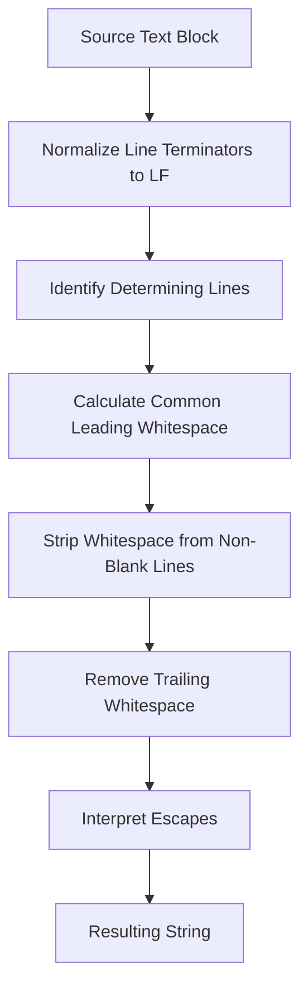

## Overview

Java Text Blocks, introduced as a preview feature in Java 13 (JEP 355), refined in Java 14 (JEP 368), and finalized in Java 15 (JEP 378), provide a way to define multi-line string literals without the need for escape sequences for newlines or quotes. This feature improves code readability and maintainability for strings that span multiple lines, such as embedded code in other languages, data formats like JSON or XML, or formatted text. Text blocks automatically handle indentation and line normalization, making them ideal for scenarios where traditional string concatenation would be cumbersome.

## Detailed Explanation

A text block is a new kind of string literal in Java, delimited by three double quotes (`"""`). It allows developers to express strings across multiple lines of source code while avoiding the visual clutter of escape sequences. The content of a text block is processed in three compile-time steps:

1. **Line Terminator Normalization**: All line terminators (CR, LF, CRLF) are normalized to LF (`\u000A`) to ensure platform-independent behavior.
2. **Incidental Whitespace Removal**: Leading whitespace that matches the indentation of the source code is stripped, preserving only essential whitespace relative to the closing delimiter.
3. **Escape Sequence Interpretation**: Standard escape sequences (e.g., `\n`, `\"`) are processed, along with two new ones: `\<line-terminator>` for line continuation and `\s` for explicit spaces.

Text blocks compile to `String` instances, indistinguishable from string literals at runtime, and are subject to string interning for efficiency.

### Syntax and Structure

- **Opening Delimiter**: `"""` followed by optional whitespace and a mandatory line terminator.
- **Content**: Any characters, including newlines and quotes, until the closing delimiter.
- **Closing Delimiter**: `"""` on its own line, influencing whitespace stripping.

### Whitespace Handling Algorithm

The algorithm identifies "determining lines" (non-blank lines and the closing delimiter line if blank) and removes the minimum leading whitespace from them. This ensures that indentation aligns with the intended structure.



### Escape Sequences

Text blocks support all escape sequences from string literals, plus:

- `\<line-terminator>`: Suppresses the newline.
- `\s`: Inserts a space character.

| Escape | Description | Unicode |
|--------|-------------|---------|
| `\b` | Backspace | `\u0008` |
| `\s` | Space | `\u0020` |
| `\t` | Tab | `\u0009` |
| `\n` | Linefeed | `\u000A` |
| `\f` | Form feed | `\u000C` |
| `\r` | Carriage return | `\u000D` |
| `\<line-terminator>` | Line continuation | (none) |
| `\"` | Double quote | `\u0022` |
| `\'` | Single quote | `\u0027` |
| `\\` | Backslash | `\u005C` |
| `\0` to `\377` | Octal escapes | `\u0000` to `\u00FF` |

## Real-world Examples & Use Cases

Text blocks excel in scenarios requiring multi-line strings:

- **Embedded Languages**: Including SQL, JavaScript, or Python code without escaping.
- **Data Formats**: Defining JSON, XML, HTML, or YAML directly.
- **Templates**: Creating email bodies, configuration files, or documentation.
- **Testing**: Specifying expected multi-line outputs.
- **Logging and Messages**: Formatting detailed error messages or help text.

For instance, in web development, text blocks simplify embedding HTML or SQL queries, reducing errors from manual escaping.

## Code Examples

### Basic Multi-Line String

```java
String poem = """
    Roses are red,
    Violets are blue,
    Sugar is sweet,
    And so are you.
    """;
System.out.println(poem);
```

### JSON Object

```java
String userJson = """
    {
        "name": "Jane Doe",
        "age": 28,
        "email": "jane@example.com"
    }
    """;
```

### SQL Query

```java
String selectQuery = """
    SELECT employee_id, first_name, last_name
    FROM employees
    WHERE department = 'Engineering'
    ORDER BY last_name ASC
    """;
```

### HTML Snippet

```java
String pageHtml = """
    <!DOCTYPE html>
    <html lang="en">
    <head>
        <meta charset="UTF-8">
        <title>Welcome</title>
    </head>
    <body>
        <h1>Hello, World!</h1>
        <p>This is a sample page.</p>
    </body>
    </html>
    """;
```

### String Interpolation

```java
String name = "Alice";
String greeting = """
    Dear %s,

    Welcome to our platform!

    Best regards,
    The Team
    """.formatted(name);
```

### Escaping Special Characters

```java
String quote = """
    She said, "Hello!"
    And then she left.
    """;

String escapedQuote = """
    He replied, \\"Goodbye!\\"
    With a smile.
    """;
```

### Line Continuation

```java
String longSentence = """
    This is a very long sentence that \
    spans multiple lines in the source \
    but appears as one line in the output.
    """;
```

### Preserving Spaces

```java
String table = """
    Item 1\s\s\s\sPrice
    Item 2\s\s\s\sPrice
    """;
```

### Concatenation

```java
String header = "Header\n";
String body = """
    Line 1
    Line 2
    """;
String footer = "\nFooter";
String document = header + body + footer;
```

## Common Pitfalls & Edge Cases

- **Indentation Errors**: Misaligned closing delimiters can lead to unexpected whitespace. Always align `"""` with the intended left margin.
- **Trailing Whitespace**: Extra spaces at line ends may be preserved if not part of the common prefix.
- **Empty Text Blocks**: `""""""` is valid but represents an empty string with a newline; use `""` for truly empty.
- **Quote Sequences**: Three or more consecutive quotes in content must be escaped to avoid delimiter confusion.
- **Escape Timing**: `\n` and `\t` are processed after whitespace stripping, so they don't interfere with indentation.
- **Platform Differences**: Source line endings are normalized, but ensure consistent behavior in version control.
- **Performance**: Text blocks are constants, so no runtime overhead compared to literals.

## References

- [JEP 378: Text Blocks (OpenJDK)](https://openjdk.org/jeps/378)
- [Oracle Java SE 21 Documentation: Text Blocks](https://docs.oracle.com/en/java/javase/21/language/text-blocks.html)
- [Java Language Specification, Chapter 3.10.6: Text Blocks](https://docs.oracle.com/javase/specs/jls/se21/html/jls-3.html#jls-3.10.6)
- [Programmer's Guide to Text Blocks](https://docs.oracle.com/en/java/javase/21/text-blocks/index.html)

## Github-README Links & Related Topics

- [Java Fundamentals](../java-fundamentals/README.md)
- [Java Strings and Text Processing](../java/java-language-basics/README.md)
- [Java Annotations](../java-annotations/README.md)
- [Java Generics](../java-generics/README.md)
- [Java Stream API](../java-stream-api-and-functional-programming/README.md)