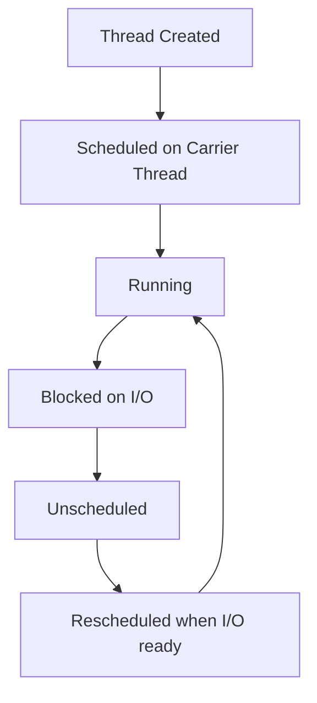

# Java Virtual Threads

## Overview

Virtual threads are lightweight threads introduced in Java 21 as part of Project Loom. They allow for efficient concurrency by decoupling threads from OS threads, enabling millions of concurrent tasks without exhausting system resources.

## Detailed Explanation

Virtual threads are user-mode threads managed by the JVM. Unlike platform threads that map 1:1 to OS threads, virtual threads can be multiplexed onto a smaller pool of carrier threads. This reduces overhead and improves scalability for I/O-bound applications.

Key features:
- Lightweight: Low memory footprint (~1KB vs ~1MB for platform threads)
- Scalable: Handle millions of concurrent connections
- API compatible: Use same Thread API
- Automatic scheduling: JVM handles context switching

### Thread Lifecycle



## Real-world Examples & Use Cases

- Web servers handling thousands of concurrent HTTP requests
- Database connection pooling with high concurrency
- Microservices processing multiple async tasks
- Chat applications managing user sessions

## Code Examples

### Creating Virtual Threads

```java
// Using Thread.ofVirtual()
Thread virtualThread = Thread.ofVirtual().start(() -> {
    System.out.println("Hello from virtual thread!");
});

// Using Executors
ExecutorService executor = Executors.newVirtualThreadPerTaskExecutor();
executor.submit(() -> {
    // Task code
});
```

### Blocking Operations

```java
public static void main(String[] args) throws InterruptedException {
    Thread virtual = Thread.ofVirtual().start(() -> {
        try {
            Thread.sleep(1000); // Blocking operation
            System.out.println("Woke up!");
        } catch (InterruptedException e) {
            Thread.currentThread().interrupt();
        }
    });
    virtual.join();
}
```

## References

- [Oracle Virtual Threads Guide](https://docs.oracle.com/en/java/javase/21/core/virtual-threads.html)
- [Project Loom JEP 444](https://openjdk.org/jeps/444)

## Github-README Links & Related Topics

- [Multithreading & Concurrency in Java](../multithreading-and-concurrency-in-java/README.md)
- [Java Reactive Streams](../java-reactive-streams/README.md)
- [Concurrency & Parallelism](../concurrency-parallelism/README.md)