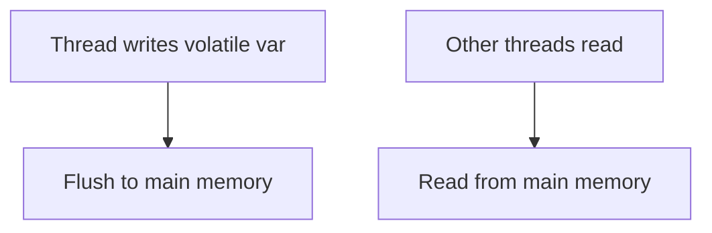

# Java Volatile Keyword

## Overview

The `volatile` keyword in Java ensures visibility and ordering of variable changes across threads, preventing caching issues in multi-threaded environments.

## Detailed Explanation

Volatile variables are not cached in thread-local memory; reads and writes go directly to main memory. It guarantees visibility but not atomicity for compound operations.

Use for flags, single variables where atomicity isn't needed.



## Real-world Examples & Use Cases

- Stop flags for threads.
- Status indicators.
- Simple counters (but prefer Atomic for safety).

## Code Examples

```java
public class VolatileExample {
    private volatile boolean running = true;

    public void stop() {
        running = false;
    }

    public void run() {
        while (running) {
            // do work
        }
    }
}
```

## Common Pitfalls & Edge Cases

- Volatile doesn't make ++ atomic; use AtomicInteger.
- Ordering guarantees are limited.

## References

- [Oracle JavaDoc: Volatile](https://docs.oracle.com/javase/specs/jls/se8/html/jls-8.html#jls-8.3.1.4)
- [Java Concurrency in Practice - Chapter 3](https://www.amazon.com/Java-Concurrency-Practice-Brian-Goetz/dp/0321349601)

## Github-README Links & Related Topics

- [java-atomic-variables](java-atomic-variables/README.md)
- [Multithreading & Concurrency in Java](../multithreading-and-concurrency-in-java/README.md)