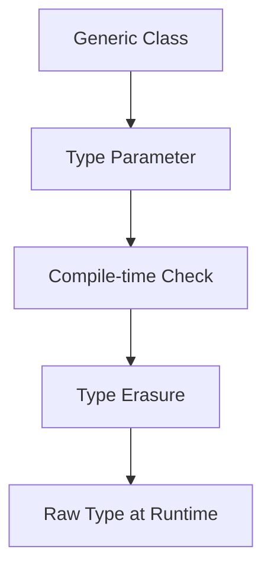

# Overview

Advanced Java concepts include generics for type safety, type erasure for compatibility, and other language features like enums, varargs, and annotations. Essential for writing robust, type-safe code.

Canonical Interview Prompt: Explain type erasure and its implications in Java generics.

# Detailed Explanation

## High-Level Design

Generics allow parameterized types, ensuring compile-time type checking. Type erasure removes generic information at runtime for backward compatibility.



## Key Components

- **Generics**: Classes, interfaces, methods with type parameters.
- **Wildcards**: ? extends/super for flexible bounds.
- **Type Erasure**: Generic types become raw types at runtime.
- **Enums**: Type-safe constants.
- **Varargs**: Variable-length argument lists.

## Capacity and Throughput Targets

- Generics: No runtime overhead due to erasure.

## Tradeoffs

- **Type Safety vs Compatibility**: Erasure maintains JVM compatibility but loses type info.
- **Complexity**: Wildcards can be confusing.

# Real-world Examples & Use Cases

- **Collections**: List<String> prevents ClassCastException.
- **Frameworks**: Spring uses generics extensively.
- **APIs**: Type-safe method signatures.

# Code Examples

**Generic Class:**

```java
public class Box<T> {
    private T item;
    public void set(T item) { this.item = item; }
    public T get() { return item; }
}
```

**Wildcard:**

```java
public void printList(List<? extends Number> list) {
    for (Number n : list) System.out.println(n);
}
```

**Type Erasure Example:**

```java
Box<String> box = new Box<>();
// At runtime, it's Box (raw type)
```

# Common Pitfalls & Edge Cases

- **Erasure Limitations**: Cannot instantiate generic arrays.
- **Overloading**: Erasure can cause conflicts.
- **Raw Types**: Avoid using raw types.

# Tools & Libraries

- Java Language Specification

# Github-README Links & Related Topics

[java-language-basics](../java-language-basics/README.md), [reflection-and-annotations](../reflection-and-annotations/README.md)

# References

- https://docs.oracle.com/javase/tutorial/java/generics/
- https://www.baeldung.com/java-generics
- https://docs.oracle.com/javase/specs/jls/se8/html/jls-4.html