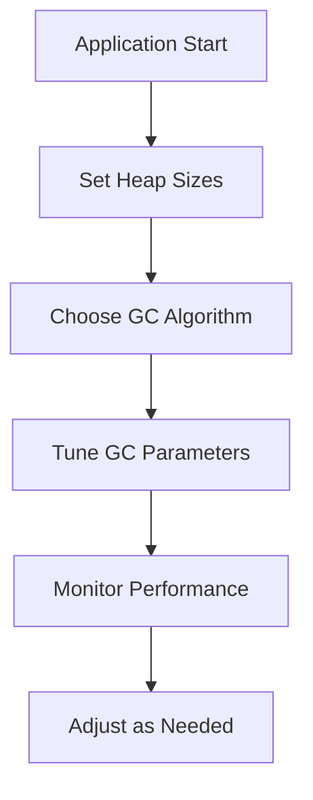

## Overview
JVM performance tuning involves configuring heap sizes, selecting garbage collectors, and setting JVM parameters to optimize application performance, especially for low-latency and high-throughput systems.

## Detailed Explanation
- **Heap Sizing**: Set initial (-Xms) and maximum (-Xmx) heap sizes to avoid resizing overhead.
- **Garbage Collection Tuning**: Choose appropriate GC (e.g., G1 for balanced, ZGC for low pause), tune pause times with -XX:MaxGCPauseMillis.
- **JVM Flags**: Use flags like -XX:+UseG1GC, -XX:G1HeapRegionSize for region-based GC.
- **Monitoring**: Use tools like jstat, jmap for heap analysis.



## Real-world Examples & Use Cases
- **Financial Trading Platforms**: Tune JVM for sub-millisecond GC pauses to handle high-frequency trades.
- **E-commerce Sites**: Optimize heap for large user sessions and caching layers.
- **Big Data Processing**: Configure JVM for Spark jobs to minimize GC overhead.

## Code Examples
**Setting JVM Options in Java:**
```java
// In code, but typically in startup script
public class App {
    public static void main(String[] args) {
        // Application logic
    }
}
```

**Startup Script:**
```bash
java -Xms4g -Xmx8g -XX:+UseG1GC -XX:MaxGCPauseMillis=200 -jar app.jar
```

**Monitoring with jstat:**
```bash
jstat -gcutil <pid> 1000
```

## References
- https://docs.oracle.com/javase/8/docs/technotes/guides/vm/gctuning/
- https://www.oracle.com/java/technologies/javase/vmoptions-jsp.html

## Github-README Links & Related Topics
- [Garbage Collection Algorithms](../garbage-collection-algorithms/README.md)
- [JVM Internals & Class Loading](../jvm-internals-and-classloading/README.md)