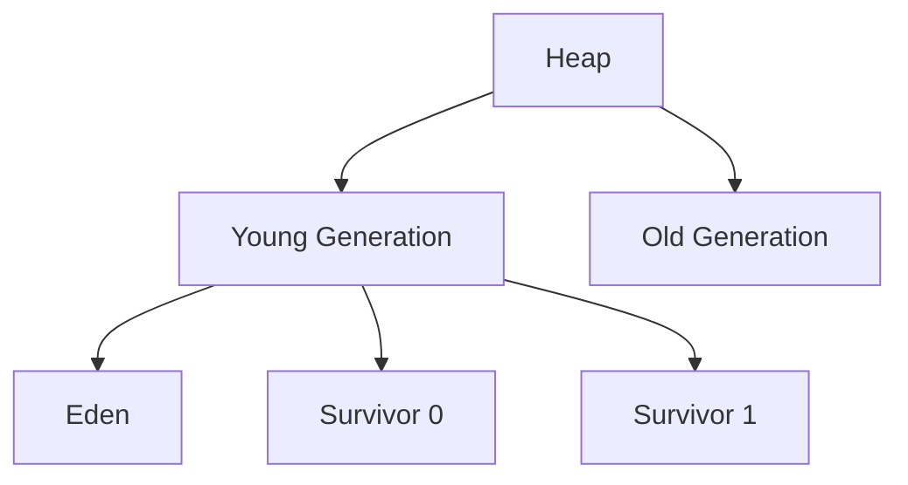

# JVM Performance Tuning

## Overview

JVM Performance Tuning focuses on optimizing Java Virtual Machine (JVM) heap sizing and Garbage Collector (GC) configuration to achieve low-latency performance. This involves balancing memory allocation, minimizing GC pause times, and ensuring efficient memory reclamation for applications requiring sub-millisecond response times, such as financial trading systems, real-time analytics, and high-throughput services.

Key areas include:
- **Heap Sizing**: Configuring initial (-Xms), maximum (-Xmx), and young generation (-Xmn) heap sizes to match application memory needs and reduce GC frequency.
- **GC Tuning for Low Latency**: Selecting and tuning GC algorithms like G1, ZGC, or Shenandoah to keep pause times under 10ms while maintaining throughput.

## Detailed Explanation

### Heap Sizing

The JVM heap is divided into young generation (eden, survivor spaces) and old generation. Proper sizing prevents frequent GCs and out-of-memory errors.

- **Initial Heap Size (-Xms)**: Sets the starting heap size. Setting it equal to -Xmx avoids heap resizing overhead.
- **Maximum Heap Size (-Xmx)**: Limits heap growth. For low-latency apps, set to 70-80% of available RAM to leave room for native memory.
- **Young Generation Size (-Xmn)**: Typically 1/3 to 1/2 of total heap. Larger young gen reduces minor GCs but increases full GC time.
- **Survivor Ratio (-XX:SurvivorRatio)**: Ratio of eden to survivor space (default 8). Tune for object tenure.



### GC Tuning for Low Latency

Low-latency GCs minimize pause times by performing most work concurrently with application threads.

- **G1 GC**: Default since JDK 9. Balances throughput and latency. Tune -XX:MaxGCPauseMillis for target pause time (e.g., 200ms).
- **ZGC**: Concurrent, region-based, compacting. Pauses <10ms for heaps up to 16TB. Enable with -XX:+UseZGC.
- **Shenandoah**: Similar to ZGC, focuses on concurrent evacuation.

| GC | Pause Time | Throughput | Heap Size Support | JDK Availability |
|----|------------|------------|-------------------|------------------|
| G1 | <200ms (configurable) | High | Up to 64GB+ | JDK 7+ |
| ZGC | <10ms | 85-95% of G1 | Up to 16TB | JDK 11+ (production in 15+) |
| Shenandoah | <10ms | Similar to ZGC | Large | JDK 12+ (experimental) |

Tuning parameters:
- -XX:MaxGCPauseMillis: Target max pause.
- -XX:G1HeapRegionSize: Region size for G1 (1-32MB).
- -XX:ConcGCThreads: Concurrent GC threads.

## Real-world Examples & Use Cases

- **High-Frequency Trading**: Use ZGC with -Xmx16g -XX:+UseZGC for <1ms pauses on large heaps.
- **Real-Time Analytics**: G1 with -XX:MaxGCPauseMillis=50 for predictable pauses in data processing pipelines.
- **Microservices**: Tune heap to 1-4GB with G1 for low-latency API responses.

## Code Examples

### Basic Heap Sizing
```bash
java -Xms4g -Xmx8g -Xmn2g -XX:SurvivorRatio=8 -jar app.jar
```

### G1 GC Tuning for Low Latency
```bash
java -Xms4g -Xmx8g -XX:+UseG1GC -XX:MaxGCPauseMillis=200 -XX:G1HeapRegionSize=16m -jar app.jar
```

### ZGC for Ultra-Low Latency
```bash
java -Xms4g -Xmx16g -XX:+UseZGC -XX:ZAllocationSpikeTolerance=5 -jar app.jar
```

### Monitoring GC
```bash
java -XX:+PrintGC -XX:+PrintGCDetails -XX:+PrintGCTimeStamps -jar app.jar
```

## Common Pitfalls & Edge Cases

- **Heap Too Small**: Frequent GCs increase CPU usage and latency.
- **Heap Too Large**: Increases full GC time; risk of long pauses.
- **Incorrect GC Selection**: G1 for general use; ZGC for very large heaps/low pauses.
- **NUMA Systems**: Use -XX:+UseNUMA for better performance on multi-socket machines.
- **Compressed Oops**: Ensure heap <32GB for compressed pointers; disable with -XX:-UseCompressedOops for larger heaps.

## Tools & Libraries

- **JVM Tools**: jstat, jmap, jstack for monitoring.
- **Profilers**: VisualVM, JProfiler for heap analysis.
- **Libraries**: Use off-heap storage (e.g., Chronicle Bytes) to reduce heap pressure.

## References

- [Oracle JVM GC Tuning Guide](https://docs.oracle.com/javase/8/docs/technotes/guides/vm/gctuning/)
- [JVM Options Reference](https://docs.oracle.com/javase/8/docs/technotes/tools/unix/java.html)
- [JEP 333: ZGC (Experimental)](https://openjdk.java.net/jeps/333)
- [JEP 377: ZGC (Production)](https://openjdk.java.net/jeps/377)
- [JEP 376: ZGC Concurrent Thread-Stack Processing](https://openjdk.java.net/jeps/376)

## Github-README Links & Related Topics

- [GC Tuning](../gc-tuning/)
- [JVM Internals](../jvm-internals-and-classloading/)
- [Memory Models](../memory-models/)