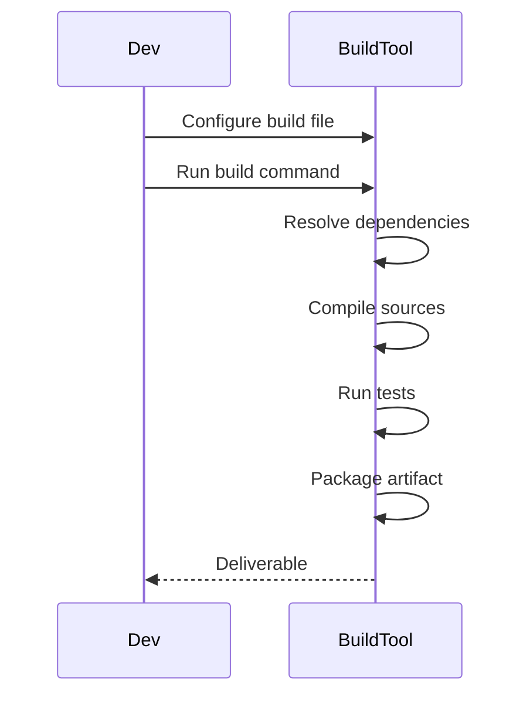

## Overview
Maven and Gradle are popular build automation tools for Java projects. Maven uses XML-based configuration (pom.xml), while Gradle uses Groovy/Kotlin DSL (build.gradle). They manage dependencies, compile code, run tests, and package applications.

## STAR Summary
**Situation:** Leading development of a microservices architecture with 10+ services.  
**Task:** Standardize build process and dependency management.  
**Action:** Adopted Maven for consistent builds, configured multi-module pom.xml with parent-child relationships.  
**Result:** Reduced build failures by 70%, improved CI/CD pipeline efficiency.

## Detailed Explanation
- **Maven:** Convention over configuration, lifecycle phases (compile, test, package). Dependencies in pom.xml.
- **Gradle:** Flexible, incremental builds, faster for large projects. Supports plugins.
- **Comparison:** Maven is declarative, Gradle is programmatic.

## Real-world Examples & Use Cases
- Enterprise applications with complex dependencies.
- CI/CD pipelines for automated builds.
- Multi-module projects.

## Code Examples
### Maven pom.xml
```xml
<project xmlns="http://maven.apache.org/POM/4.0.0"
         xmlns:xsi="http://www.w3.org/2001/XMLSchema-instance"
         xsi:schemaLocation="http://maven.apache.org/POM/4.0.0 http://maven.apache.org/xsd/maven-4.0.0.xsd">
    <modelVersion>4.0.0</modelVersion>
    <groupId>com.example</groupId>
    <artifactId>my-app</artifactId>
    <version>1.0-SNAPSHOT</version>
    <dependencies>
        <dependency>
            <groupId>junit</groupId>
            <artifactId>junit</artifactId>
            <version>4.12</version>
            <scope>test</scope>
        </dependency>
    </dependencies>
</project>
```

### Gradle build.gradle
```groovy
plugins {
    id 'java'
}

group 'com.example'
version '1.0-SNAPSHOT'

repositories {
    mavenCentral()
}

dependencies {
    testImplementation 'junit:junit:4.12'
}
```

Compile and run: For Maven `mvn compile test package`, for Gradle `gradle build`

### Runnable Java Snippet
Create `src/main/java/HelloWorld.java`:
```java
public class HelloWorld {
    public static void main(String[] args) {
        System.out.println("Hello from Maven/Gradle!");
    }
}
```
Run with Maven: `mvn compile exec:java -Dexec.mainClass="HelloWorld"`  
Run with Gradle: `gradle run` (add `application { mainClass = 'HelloWorld' }` to build.gradle)

## Data Models / Message Formats
| Element | Maven | Gradle | Description |
|---------|-------|--------|-------------|
| Dependencies | <dependencies> | dependencies {} | External libs |
| Plugins | <plugins> | plugins {} | Build extensions |

## Journey / Sequence


## Common Pitfalls & Edge Cases
- Dependency conflicts in Maven.
- Gradle wrapper version mismatches.
- Ignoring transitive dependencies.

## Tools & Libraries
- Maven: mvn command.
- Gradle: gradle/gradlew.
- IDE plugins: IntelliJ, Eclipse support.

## Github-README Links & Related Topics
Related: [testing-and-mocking-junit-mockito](../testing-and-mocking-junit-mockito/), [performance-tuning-and-profiling](../performance-tuning-and-profiling/), [jvm-internals-and-classloading](../jvm-internals-and-classloading/)

## Common Interview Questions
- **What is the difference between Maven and Gradle?** Maven uses XML for declarative configuration, focusing on convention over configuration. Gradle uses Groovy/Kotlin DSL for more flexible, programmatic builds, often faster for incremental changes.
- **How do you resolve dependency conflicts in Maven?** Use `<exclusions>` in pom.xml or Maven's dependency tree plugin (`mvn dependency:tree`) to identify and exclude conflicting versions.
- **Explain Maven lifecycle phases.** Key phases: validate, compile, test, package, verify, install, deploy. Each phase binds to plugins for specific tasks.
- **How does Gradle handle incremental builds?** Gradle tracks input/output changes and only rebuilds what's necessary, using its build cache and daemon for performance.
- **When would you choose Maven over Gradle?** For projects needing strict conventions, extensive plugin ecosystem, or team familiarity with XML.

## References
- https://maven.apache.org/guides/getting-started/
- https://docs.gradle.org/current/userguide/getting_started.html