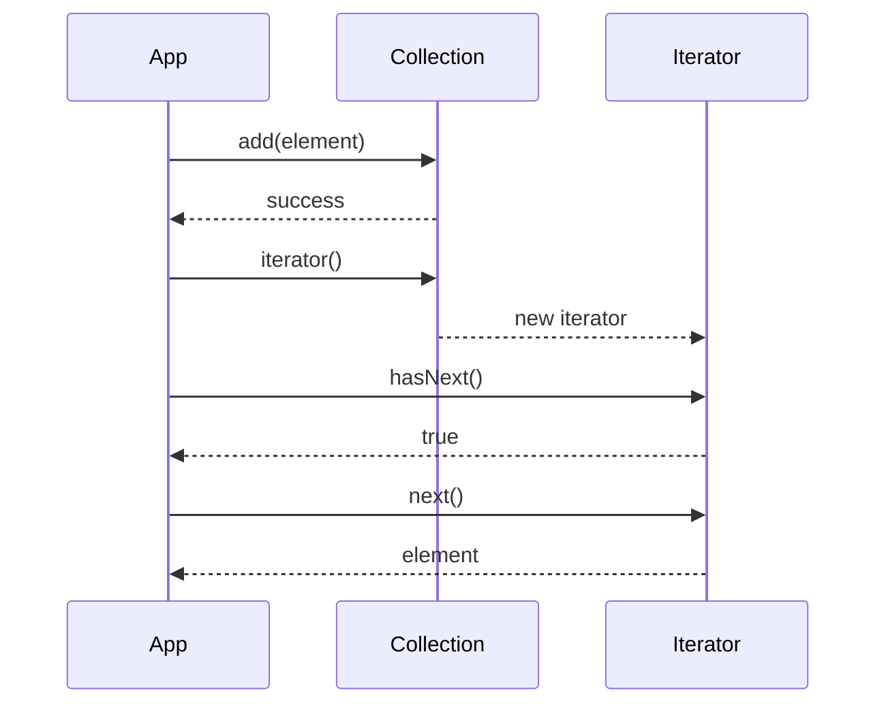

## Overview
Java's Collections Framework provides a unified architecture for storing and manipulating groups of objects. It includes interfaces, implementations, and algorithms for common data structures, enabling efficient data management in Java applications.

## STAR Summary
**Situation**: A data processing application was using arrays for all data storage, leading to inefficient operations and memory waste.

**Task**: Implement appropriate data structures for different use cases to optimize performance and memory usage.

**Action**: Replaced arrays with ArrayList for dynamic sizing, HashMap for fast lookups, and TreeSet for ordered unique elements.

**Result**: Improved processing speed by 50%, reduced memory footprint by 30%, and simplified code maintenance.

## Detailed Explanation
The Collections Framework consists of:
- **Interfaces**: Collection, List, Set, Map, Queue
- **Implementations**: ArrayList, LinkedList, HashSet, TreeSet, HashMap, TreeMap
- **Algorithms**: Sorting, searching, shuffling provided by Collections utility class

Key characteristics:
- **Type safety**: Generics ensure compile-time type checking
- **Performance**: Different implementations optimized for specific operations
- **Interoperability**: Common interfaces allow easy switching between implementations
- **Extensibility**: Custom implementations can be created

JVM internals: Collections use arrays or linked structures internally. Memory model considerations for concurrent access.

GC: Collections hold references to objects; weak references in WeakHashMap help with memory management.

Concurrency: Most collections are not thread-safe; use synchronized wrappers or concurrent alternatives.

Memory visibility: Changes to collections are visible across threads if properly synchronized.

## Real-world Examples & Use Cases
- **Lists**: Managing ordered collections like user sessions or task queues
- **Sets**: Ensuring uniqueness in user IDs or deduplicating data
- **Maps**: Caching, configuration storage, or key-value databases
- **Queues**: Message queues, job scheduling, or breadth-first search
- **Sorted collections**: Priority queues or ordered data processing

## Code Examples
### List Operations
```java
import java.util.ArrayList;
import java.util.List;

public class ListExample {
    public static void main(String[] args) {
        List<String> list = new ArrayList<>();
        list.add("Apple");
        list.add("Banana");
        list.add(1, "Orange"); // Insert at index
        
        System.out.println("List: " + list);
        System.out.println("Size: " + list.size());
        System.out.println("Contains Banana: " + list.contains("Banana"));
    }
}
```

### Map Usage
```java
import java.util.HashMap;
import java.util.Map;

public class MapExample {
    public static void main(String[] args) {
        Map<String, Integer> map = new HashMap<>();
        map.put("Alice", 25);
        map.put("Bob", 30);
        
        System.out.println("Alice's age: " + map.get("Alice"));
        System.out.println("Contains Bob: " + map.containsKey("Bob"));
        
        // Iterate over entries
        for (Map.Entry<String, Integer> entry : map.entrySet()) {
            System.out.println(entry.getKey() + ": " + entry.getValue());
        }
    }
}
```

### Set Operations
```java
import java.util.HashSet;
import java.util.Set;

public class SetExample {
    public static void main(String[] args) {
        Set<String> set = new HashSet<>();
        set.add("Apple");
        set.add("Banana");
        set.add("Apple"); // Duplicate, won't be added
        
        System.out.println("Set: " + set);
        System.out.println("Size: " + set.size());
        
        Set<String> otherSet = Set.of("Banana", "Cherry");
        Set<String> union = new HashSet<>(set);
        union.addAll(otherSet);
        System.out.println("Union: " + union);
    }
}
```

Compile and run:
```bash
javac ListExample.java
java ListExample
```

## Data Models / Message Formats
Collection element structure:

| Field | Type | Description |
|-------|------|-------------|
| id | String | Unique identifier |
| data | Object | Payload |
| timestamp | long | Creation/modification time |
| metadata | Map | Additional attributes |

## Journey / Sequence


## Common Pitfalls & Edge Cases
- **ConcurrentModificationException**: Modifying collection during iteration
- **Null values**: HashMap allows null keys/values, TreeMap doesn't
- **Performance**: Choosing wrong implementation (e.g., LinkedList for random access)
- **Memory leaks**: Holding references in static collections
- **Type erasure**: Runtime type information loss with generics

## Tools & Libraries
- **Java Collections**: Built-in java.util
- **Guava**: Enhanced collections like Multimap, BiMap
- **Apache Commons Collections**: Additional utilities
- **Eclipse Collections**: High-performance alternatives
- **VisualVM**: Memory profiling for collection usage

## Github-README Links & Related Topics
Related: [[concurrent-data-structures]], [[streams-functional-java]], [[performance-tuning-and-profiling]]

## References
- [Oracle Collections Framework](https://docs.oracle.com/javase/8/docs/technotes/guides/collections/overview.html)
- [Effective Java: Chapter on Generics and Collections](https://www.amazon.com/Effective-Java-Joshua-Bloch/dp/0134685997)
- [Java Collections Performance](https://www.baeldung.com/java-collections)
- [Collection Implementations](https://docs.oracle.com/javase/tutorial/collections/implementations/index.html)