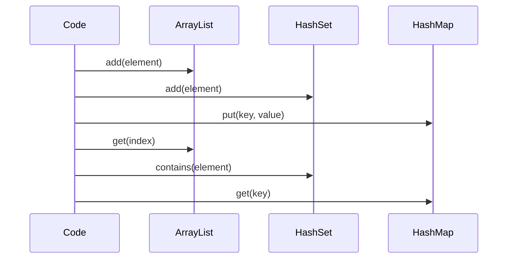

## Overview
Java Collections Framework provides interfaces and implementations for storing and manipulating groups of objects. It includes List, Set, Map, Queue, and their concrete classes like ArrayList, HashSet, HashMap.

## STAR Summary
**Situation:** Needed efficient data storage for a user session cache with fast lookups.  
**Task:** Choose appropriate collection for key-value pairs with O(1) access.  
**Action:** Used HashMap for storage, ensuring null handling and iteration order where needed.  
**Result:** Achieved sub-millisecond lookups for millions of entries.

## Detailed Explanation
Core interfaces: Collection (List, Set, Queue), Map. Implementations vary in performance: ArrayList for indexed access, LinkedList for insertions, HashMap for fast lookups. Generics ensure type safety.

Complexity: HashMap O(1) average for get/put, TreeMap O(log n) for ordered operations.

## Common Interview Questions
- What is the difference between ArrayList and LinkedList?
- How does HashMap handle collisions?
- When would you use TreeMap over HashMap?
- Explain the fail-fast behavior of iterators in collections.
- How do you make a collection thread-safe?

## Real-world Examples & Use Cases
- **Lists:** Shopping carts (ArrayList).
- **Sets:** Unique user IDs (HashSet).
- **Maps:** Configuration properties (HashMap).
- **Queues:** Task scheduling (PriorityQueue).

## Code Examples
```java
import java.util.*;

public class CollectionsExample {
    public static void main(String[] args) {
        List<String> list = new ArrayList<>();
        list.add("Apple");
        list.add("Banana");
        
        Set<String> set = new HashSet<>(list);
        
        Map<String, Integer> map = new HashMap<>();
        map.put("Apple", 1);
        map.put("Banana", 2);
        
        System.out.println(list);
        System.out.println(set);
        System.out.println(map);
    }
}
```

Compile and run:
```bash
javac CollectionsExample.java && java CollectionsExample
```

## Data Models / Message Formats
| Interface | Implementations | Complexity |
|-----------|----------------|------------|
| List | ArrayList, LinkedList | O(1) access, O(n) insert |
| Set | HashSet, TreeSet | O(1) contains, O(log n) ordered |
| Map | HashMap, TreeMap | O(1) get, O(log n) ordered |

## Journey / Sequence


## Common Pitfalls & Edge Cases
- **Concurrent modification:** Use iterators carefully.
- **Null values:** HashMap allows null keys/values, TreeMap does not.
- **Capacity:** ArrayList resizes; pre-size for performance.

## Tools & Libraries
- **Java Collections:** Built-in.
- **Apache Commons Collections:** Extended utilities.
- **Eclipse Collections:** High-performance alternatives.

## Github-README Links & Related Topics
- [[concurrent-data-structures]]
- [[algorithms-and-data-structures]]
- [[streams-functional-java]]

## References
- https://docs.oracle.com/javase/8/docs/technotes/guides/collections/overview.html
- https://www.baeldung.com/java-collections