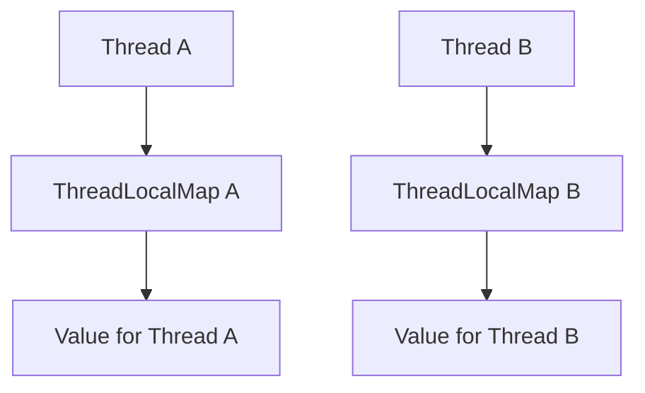

# Java ThreadLocal

## Overview

Java ThreadLocal allows each thread to have its own copy of a variable, providing thread isolation without synchronization.

## Detailed Explanation

ThreadLocal creates a separate instance of a variable for each thread. Methods: `get()`, `set()`, `remove()`. Useful for storing per-thread context like user sessions or transaction IDs.

Internally, it uses a ThreadLocalMap per thread.



## Real-world Examples & Use Cases

- Storing user context in web applications.
- Database connections in connection pools.
- Logging context per thread.

## Code Examples

```java
public class ThreadLocalExample {
    private static final ThreadLocal<Integer> threadId = ThreadLocal.withInitial(() -> 0);

    public static void setId(int id) {
        threadId.set(id);
    }

    public static int getId() {
        return threadId.get();
    }

    public static void remove() {
        threadId.remove();
    }
}
```

## Common Pitfalls & Edge Cases

- Memory leaks: Call `remove()` to clean up.
- Not suitable for sharing data between threads.

## References

- [Oracle JavaDoc: ThreadLocal](https://docs.oracle.com/javase/8/docs/api/java/lang/ThreadLocal.html)
- [Java Concurrency in Practice - Chapter 3](https://www.amazon.com/Java-Concurrency-Practice-Brian-Goetz/dp/0321349601)

## Github-README Links & Related Topics

- [java-volatile-keyword](java-volatile-keyword/README.md)
- [Multithreading & Concurrency in Java](../multithreading-and-concurrency-in-java/README.md)