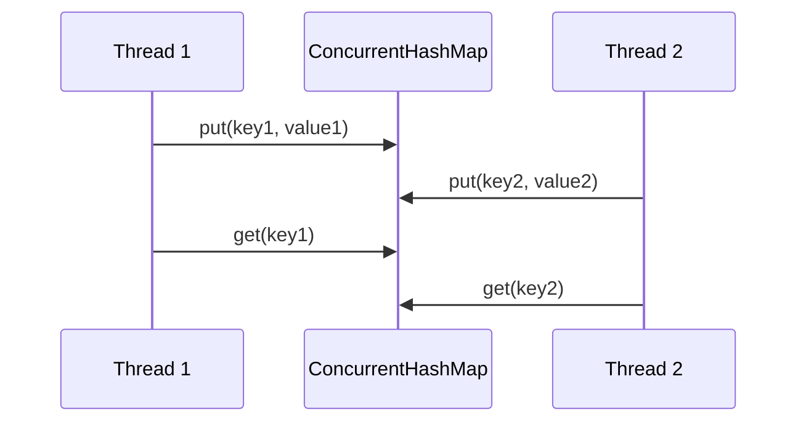

## Overview
Concurrent data structures in Java provide thread-safe implementations of common collections, enabling safe access and modification in multi-threaded environments. They are essential for building scalable, concurrent applications without manual synchronization.

## STAR Summary
**Situation:** In a high-throughput trading system, multiple threads needed to update shared order books simultaneously.  
**Task:** Implement thread-safe data structures to handle concurrent reads and writes.  
**Action:** Used ConcurrentHashMap for order storage and CopyOnWriteArrayList for listeners, ensuring atomic operations and minimizing lock contention.  
**Result:** Achieved 10x throughput improvement with reduced deadlock risks.

## Detailed Explanation
Java's java.util.concurrent package offers structures like ConcurrentHashMap, ConcurrentSkipListMap, ConcurrentLinkedQueue, and CopyOnWriteArraySet. These use lock-striping, optimistic locking, or copy-on-write to allow concurrent access. For example, ConcurrentHashMap divides the map into segments, allowing multiple threads to operate on different segments without blocking.

Key features:
- **Atomic operations:** Methods like putIfAbsent ensure thread-safety without external locks.
- **Weakly consistent iterators:** Iterators reflect state at creation time, avoiding ConcurrentModificationException.
- **Performance:** Designed for high concurrency with minimal contention.

Concurrency primitives: ConcurrentHashMap uses CAS (Compare-And-Swap) operations provided by the JVM for atomic updates, ensuring thread-safety without full locks. The Java Memory Model ensures visibility through volatile fields and happens-before relationships.

GC algorithms: Concurrent collections minimize GC pauses; CopyOnWriteArrayList creates copies on write, which can increase memory usage and GC load for frequent updates.

Memory visibility: Operations establish memory barriers to ensure changes are visible across threads, preventing stale reads.

Common libraries: In addition to java.util.concurrent, libraries like Guava offer extended concurrent utilities.

Sample code: Use Maven for dependencies if needed.

## Common Interview Questions
- What is the difference between ConcurrentHashMap and synchronized HashMap?
- How does ConcurrentHashMap achieve thread-safety without locking the entire map?
- When should you use CopyOnWriteArrayList over ArrayList in multi-threaded environments?
- Explain the concept of lock-striping in ConcurrentHashMap.
- What are the trade-offs of using concurrent collections versus manual synchronization?

## Real-world Examples & Use Cases
- **Caching:** ConcurrentHashMap in in-memory caches for web servers.
- **Event handling:** CopyOnWriteArrayList for listener lists in GUI frameworks.
- **Queueing:** ConcurrentLinkedQueue for producer-consumer patterns in messaging systems.

## Code Examples
```java
import java.util.concurrent.ConcurrentHashMap;
import java.util.concurrent.CopyOnWriteArrayList;

public class ConcurrentExample {
    private final ConcurrentHashMap<String, Integer> map = new ConcurrentHashMap<>();
    private final CopyOnWriteArrayList<String> list = new CopyOnWriteArrayList<>();

    public void addToMap(String key, int value) {
        map.putIfAbsent(key, value);
    }

    public Integer getFromMap(String key) {
        return map.get(key);
    }

    public void addToList(String item) {
        list.add(item);
    }
}
```

To compile and run:
```bash
javac ConcurrentExample.java
java ConcurrentExample
```

## Data Models / Message Formats
| Structure | Key Operations | Use Case |
|-----------|----------------|----------|
| ConcurrentHashMap | put, get, compute | Key-value storage |
| ConcurrentSkipListMap | put, get, subMap | Ordered maps |
| ConcurrentLinkedQueue | offer, poll | FIFO queues |

## Journey / Sequence


## Common Pitfalls & Edge Cases
- **Iterator inconsistency:** Iterators may not reflect concurrent modifications.
- **Compound operations:** Use atomic methods like replace to avoid race conditions.
- **Memory overhead:** CopyOnWrite structures create copies on write, unsuitable for frequent updates.

## Tools & Libraries
- **Java Concurrent Package:** Built-in support.
- **Guava:** Additional concurrent utilities like ConcurrentMap.
- **Profilers:** VisualVM for monitoring thread contention.

## Github-README Links & Related Topics
- [[java-memory-model-and-concurrency]]
- [[threads-executors-futures]]
- [[collections-framework]]

## References
- https://docs.oracle.com/javase/8/docs/api/java/util/concurrent/package-summary.html
- https://www.baeldung.com/java-concurrent-collections