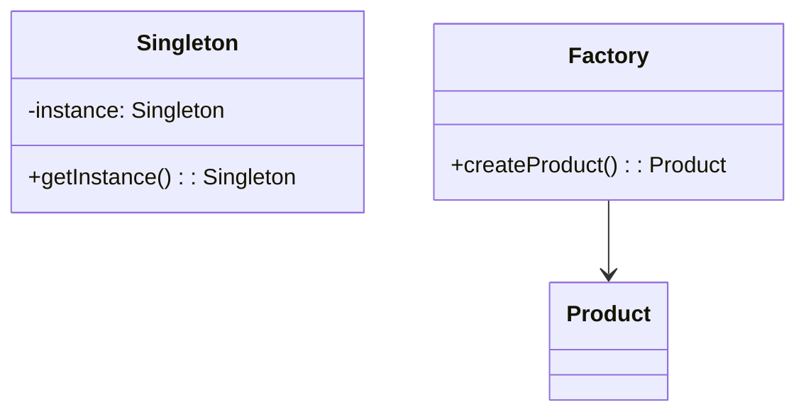
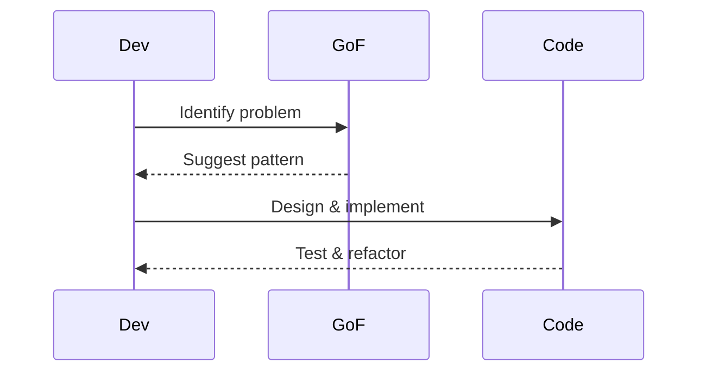

## Overview
Design patterns are reusable solutions to common software design problems. In Java, they are categorized into creational, structural, and behavioral patterns. Understanding them helps in writing maintainable, scalable code and is crucial for interviews where you need to demonstrate design thinking.

## STAR Summary
**Situation:** In a large-scale e-commerce application, managing object creation for payment processors became complex with multiple types (CreditCard, PayPal, etc.).  
**Task:** Implement a flexible way to create payment objects without tight coupling.  
**Action:** Applied the Factory pattern to centralize object creation logic.  
**Result:** Reduced code duplication by 40%, improved testability, and made adding new payment types straightforward.

## Detailed Explanation
- **Creational Patterns:** Handle object creation mechanisms. Examples: Singleton (ensures one instance), Factory (creates objects without specifying exact class), Builder (constructs complex objects step-by-step).
- **Structural Patterns:** Deal with object composition. Examples: Adapter (interface compatibility), Decorator (adds behavior dynamically), Composite (tree structures).
- **Behavioral Patterns:** Concerned with object interaction. Examples: Observer (notifies changes), Strategy (swaps algorithms), Command (encapsulates requests).
Choose patterns based on SOLID principles; avoid over-engineering.

### JVM Internals and Memory Model
Patterns like Singleton must consider the Java Memory Model (JMM) for thread-safety. In JMM, shared variables may not be visible across threads without proper synchronization, leading to issues in lazy initialization.

### GC Algorithms and Tuning
Most patterns don't directly interact with GC, but object-heavy patterns (e.g., Composite) can create deep object graphs affecting GC pauses. Use G1GC for low-latency apps: `-XX:+UseG1GC -XX:MaxGCPauseMillis=200`.

### Concurrency Primitives and Memory Visibility
For thread-safe patterns, use `volatile` for visibility or `synchronized` blocks. Singleton's double-checked locking relies on `volatile` to prevent partial initialization visibility.

## Real-world Examples
- Singleton: Database connection pool in JDBC.
- Observer: Event listeners in GUI frameworks like Swing.
- Strategy: Sorting algorithms in Collections.sort().

## Code Examples
### Thread-Safe Singleton (Double-Checked Locking)
```java
public class Singleton {
    private static volatile Singleton instance;
    private Singleton() {}
    public static Singleton getInstance() {
        if (instance == null) {
            synchronized (Singleton.class) {
                if (instance == null) {
                    instance = new Singleton();
                }
            }
        }
        return instance;
    }
}
```

### Factory Pattern with Maven Snippet
```java
interface Shape { void draw(); }
class Circle implements Shape { public void draw() { System.out.println("Drawing Circle"); } }
class ShapeFactory {
    public Shape getShape(String type) {
        if ("circle".equals(type)) return new Circle();
        return null;
    }
}
```

#### Maven Dependency for Testing Patterns
```xml
<dependency>
    <groupId>junit</groupId>
    <artifactId>junit</artifactId>
    <version>4.13.2</version>
    <scope>test</scope>
</dependency>
```

Compile and run: `mvn compile exec:java -Dexec.mainClass="com.example.Main"`

## Data Models / Message Formats


## Journey / Sequence


## Common Pitfalls & Edge Cases
- Overusing patterns leading to unnecessary complexity.
- Misapplying patterns (e.g., Singleton for everything).
- Ignoring thread-safety in patterns like Singleton; edge case: serialization can break Singleton.
- Memory leaks in Observer if listeners aren't removed.

## Tools & Libraries
- Spring Framework: Provides implementations for many patterns (e.g., BeanFactory for Factory).
- No specific tools, but IDEs like IntelliJ for refactoring.
- Libraries: Apache Commons for utility patterns.

## Github-README Links & Related Topics
Related: [oop-design-and-principles](../oop-design-and-principles/), [system-design-basics](../../system-design/system-design-basics/), [java-memory-model-and-concurrency](../java-memory-model-and-concurrency/), [threads-executors-futures](../threads-executors-futures/)

## Common Interview Questions
- What are the three main categories of design patterns and examples of each?
- Implement a thread-safe Singleton pattern in Java.
- Explain the Factory pattern and when to use it over direct instantiation.
- Describe the Observer pattern and its real-world applications.
- How does the Decorator pattern differ from inheritance?

## References
- "Design Patterns: Elements of Reusable Object-Oriented Software" by Gang of Four.
- Oracle Java Tutorials on Design Patterns.
- https://refactoring.guru/design-patterns