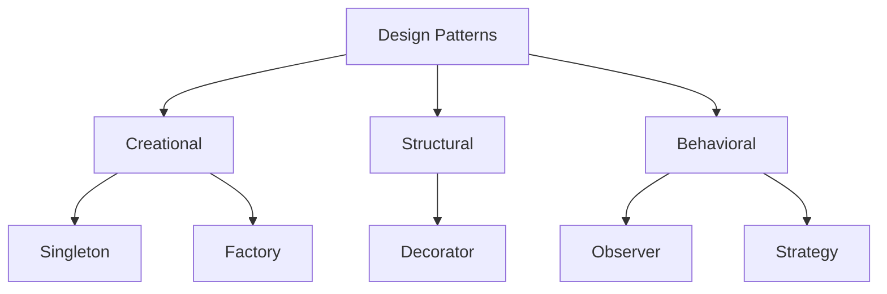

# Java Design Patterns

## Overview

Design patterns in Java are reusable solutions to common software design problems. They provide templates for solving issues in object-oriented design, promoting code reusability, maintainability, and scalability. Originating from the Gang of Four (GoF) book, patterns are categorized into Creational, Structural, and Behavioral. In Java interviews, understanding these patterns demonstrates knowledge of SOLID principles and effective coding practices.

## Detailed Explanation

### Categories of Design Patterns

- **Creational Patterns**: Handle object creation mechanisms, increasing flexibility and reuse.
- **Structural Patterns**: Concern class and object composition, forming larger structures.
- **Behavioral Patterns**: Deal with object interaction and responsibility distribution.

### Key Patterns

| Pattern | Category | Purpose | Example |
|---------|----------|---------|---------|
| Singleton | Creational | Ensure single instance | Logger |
| Factory | Creational | Create objects without specifying class | UI components |
| Observer | Behavioral | Notify dependents of changes | Event handling |
| Decorator | Structural | Add responsibilities dynamically | I/O streams |
| Strategy | Behavioral | Encapsulate algorithms | Sorting strategies |

### SOLID Principles Integration

- **Single Responsibility**: Patterns like Strategy help achieve this.
- **Open/Closed**: Decorator allows extension without modification.
- **Liskov Substitution**: Ensures subtypes are substitutable.
- **Interface Segregation**: Patterns promote clean interfaces.
- **Dependency Inversion**: Factory and Dependency Injection aid this.



## Real-world Examples & Use Cases

- **Singleton**: Database connection pool in JDBC, ensuring one shared instance.
- **Factory**: Java's `Calendar.getInstance()` for locale-specific calendars.
- **Observer**: Swing GUI components reacting to user events.
- **Decorator**: Java I/O classes like `BufferedReader` wrapping `FileReader`.
- **Strategy**: Collections.sort() using different comparators.

## Code Examples

### Singleton Pattern
```java
public class Singleton {
    private static Singleton instance;
    private Singleton() {}
    public static Singleton getInstance() {
        if (instance == null) {
            instance = new Singleton();
        }
        return instance;
    }
}
```

### Factory Pattern
```java
interface Shape {
    void draw();
}
class Circle implements Shape {
    public void draw() { System.out.println("Drawing Circle"); }
}
class ShapeFactory {
    public Shape getShape(String shapeType) {
        if ("CIRCLE".equals(shapeType)) return new Circle();
        return null;
    }
}
```

### Observer Pattern
```java
import java.util.ArrayList;
import java.util.List;

interface Observer {
    void update(String message);
}
class ConcreteObserver implements Observer {
    public void update(String message) {
        System.out.println("Received: " + message);
    }
}
class Subject {
    private List<Observer> observers = new ArrayList<>();
    public void attach(Observer o) { observers.add(o); }
    public void notifyObservers(String message) {
        for (Observer o : observers) o.update(message);
    }
}
```

## References

- [Design Patterns: Elements of Reusable Object-Oriented Software](https://www.amazon.com/Design-Patterns-Elements-Reusable-Object-Oriented/dp/0201633612) - Gang of Four
- [Java Design Patterns](https://www.oracle.com/technetwork/java/designpatterns-142738.html) - Oracle
- [Refactoring Guru - Design Patterns](https://refactoring.guru/design-patterns)

## Github-README Links & Related Topics

- [OOP Principles in Java](../oop-principles-in-java/README.md)
- [Java Fundamentals](../java-fundamentals/README.md)
- [Design Patterns](../design-patterns/README.md)

## STAR Summary

**Situation**: Building a scalable application required reusable components.

**Task**: Implement design patterns to avoid code duplication.

**Action**: Applied Singleton for shared resources, Factory for object creation.

**Result**: Improved maintainability and reduced bugs.

## Journey / Sequence

1. Identify recurring problems.
2. Choose appropriate pattern.
3. Implement with Java best practices.
4. Test and refactor.

## Common Pitfalls & Edge Cases

- Overusing patterns leading to complexity.
- Thread-safety in Singleton.
- Breaking encapsulation in Observer.

## Tools & Libraries

- IDEs like IntelliJ for pattern detection.
- Libraries: Spring Framework implements many patterns.