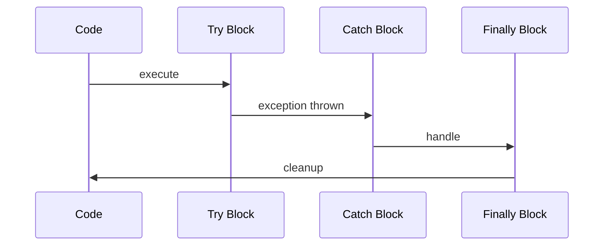

## Overview
Exception handling in Java manages runtime errors gracefully. Checked exceptions require handling, unchecked (RuntimeException) do not. Effective handling prevents crashes and improves robustness.

## STAR Summary
**Situation:** A service crashed due to unhandled IO exceptions during file operations.  
**Task:** Implement robust error handling to log and recover.  
**Action:** Used try-with-resources, custom exceptions, and logging.  
**Result:** 99.9% uptime with detailed error logs for debugging.

## Detailed Explanation
Hierarchy: Throwable > Exception (checked/unchecked) > RuntimeException. Errors are JVM issues. Use try-catch-finally, or try-with-resources for AutoCloseable.

Best practices: Catch specific exceptions, avoid catching Exception, log appropriately.

JVM internals: Exceptions unwind the stack using exception tables in bytecode, checked at compile time for checked exceptions.

GC: Proper handling prevents resource leaks, reducing GC pressure from unreleased objects.

Memory visibility: Exception state is thread-local, no cross-thread visibility issues.

Common libraries: SLF4J for logging exceptions.

## Common Interview Questions
- What is the difference between checked and unchecked exceptions?
- When should you use try-with-resources?
- How do you create custom exceptions in Java?
- Explain the finally block and when it executes.
- What are the best practices for exception handling in Java?

## Real-world Examples & Use Cases
- **File I/O:** Handling FileNotFoundException.
- **Network:** SocketTimeoutException in clients.
- **Business logic:** Custom exceptions for validation failures.

## Code Examples
```java
import java.io.*;

public class ExceptionExample {
    public static void main(String[] args) {
        try (BufferedReader br = new BufferedReader(new FileReader("file.txt"))) {
            String line = br.readLine();
            System.out.println(line);
        } catch (FileNotFoundException e) {
            System.err.println("File not found: " + e.getMessage());
        } catch (IOException e) {
            System.err.println("IO error: " + e.getMessage());
        }
    }
}

class CustomException extends Exception {
    public CustomException(String message) {
        super(message);
    }
}
```

Compile and run:
```bash
javac ExceptionExample.java && java ExceptionExample
```

## Data Models / Message Formats
| Type | Checked? | Example |
|------|----------|---------|
| IOException | Yes | File operations |
| RuntimeException | No | NullPointerException |
| Error | No | OutOfMemoryError |

## Journey / Sequence


## Common Pitfalls & Edge Cases
- **Swallowing exceptions:** Don't catch without handling.
- **Resource leaks:** Always close resources.
- **Exception chaining:** Use initCause for context.

## Tools & Libraries
- **Java Lang:** Built-in.
- **SLF4J/Logback:** For logging exceptions.
- **JUnit:** For testing exception scenarios.

## Github-README Links & Related Topics
- [[java-language-basics]]
- [[performance-tuning-and-profiling]]
- [[testing-and-mocking-junit-mockito]]

## References
- https://docs.oracle.com/javase/tutorial/essential/exceptions/
- https://www.baeldung.com/java-exceptions