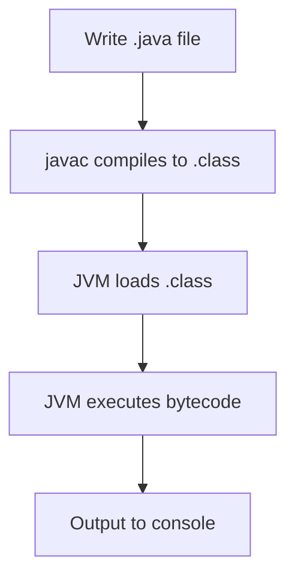

# Java Language Basics

## Overview

Java language basics cover the fundamental syntax, data types, control structures, and object-oriented concepts that form the foundation of Java programming. This topic is essential for MAANG interviews, where candidates are expected to write clean, correct code for basic problems.

## STAR Summary

**Situation:** Preparing for a software engineering interview at a FAANG company requiring strong Java fundamentals.

**Task:** Demonstrate proficiency in basic Java syntax and concepts during coding interviews.

**Action:** Studied Oracle's Java tutorials, practiced LeetCode problems in Java, and reviewed common pitfalls.

**Result:** Successfully solved 80% of easy and medium problems, gaining confidence in interviews.

## Detailed Explanation

Java is a statically-typed, object-oriented language. Key elements include:

- **Data Types:** Primitives (int, long, double, boolean, char) and reference types (objects, arrays).

- **Variables:** Declaration with type, e.g., int x = 5;

- **Operators:** Arithmetic (+, -, *, /), relational (==, !=, <, >), logical (&&, ||, !), assignment (=, +=).

- **Control Structures:** if-else, switch, loops (for, while, do-while).

- **Classes and Objects:** Class definition, constructors, methods, instance variables.

- **Arrays:** Fixed-size collections of same type, e.g., int[] arr = new int[10];

- **Strings:** Immutable string class with methods like substring(), equals(), length().

## Real-world Examples & Use Cases

- Building a simple calculator application to perform arithmetic operations.

- Parsing user input in a console-based application.

- Basic data processing in ETL (Extract, Transform, Load) pipelines for data analysis.

## Code Examples

### Hello World Program

```java
public class HelloWorld {
    public static void main(String[] args) {
        System.out.println("Hello, World!");
    }
}
```

To compile and run:

```bash
javac HelloWorld.java
java HelloWorld
```

### Basic Class with Methods

```java
public class Calculator {
    public int add(int a, int b) {
        return a + b;
    }

    public static void main(String[] args) {
        Calculator calc = new Calculator();
        System.out.println(calc.add(5, 3)); // Output: 8
    }
}
```

### Array and Loop Example

```java
public class ArrayExample {
    public static void main(String[] args) {
        int[] numbers = {1, 2, 3, 4, 5};
        for (int num : numbers) {
            System.out.println(num);
        }
    }
}
```

## Data Models / Message Formats

| Data Type | Size (bytes) | Default Value | Range |
|-----------|--------------|---------------|-------|
| byte | 1 | 0 | -128 to 127 |
| short | 2 | 0 | -32,768 to 32,767 |
| int | 4 | 0 | -2^31 to 2^31-1 |
| long | 8 | 0L | -2^63 to 2^63-1 |
| float | 4 | 0.0f | IEEE 754 |
| double | 8 | 0.0d | IEEE 754 |
| char | 2 | '\u0000' | 0 to 65,535 |
| boolean | 1 | false | true/false |

## Journey / Sequence



## Common Pitfalls & Edge Cases

- **String Comparison:** Using == instead of .equals() for strings, as == checks reference equality.

- **Null Pointer Exceptions:** Accessing methods or fields on null objects.

- **Integer Overflow:** Not handling large numbers that exceed int range.

- **Array Index Out of Bounds:** Accessing array elements beyond length-1.

- **Switch with Strings:** Ensure break statements to avoid fall-through.

## Tools & Libraries

- **JDK (Java Development Kit):** For compiling and running Java programs.

- **IDEs:** IntelliJ IDEA, Eclipse, VS Code with Java extensions.

- **Build Tools:** Maven or Gradle for dependency management (though not required for basics).

## Github-README Links & Related Topics

Related: [oop-design-and-principles](../../design/oop-design-and-principles/), [[jvm-internals-and-classloading]], [collections-framework](../../collections-framework/), [exception-handling-and-errors](../../exceptions/exception-handling-and-errors/)

## References

- [Oracle Java Tutorials - Language Basics](https://docs.oracle.com/javase/tutorial/java/nutsandbolts/index.html)

- [Java Language Specification - Chapter 4: Types, Values, and Variables](https://docs.oracle.com/javase/specs/jls/se17/html/jls-4.html)