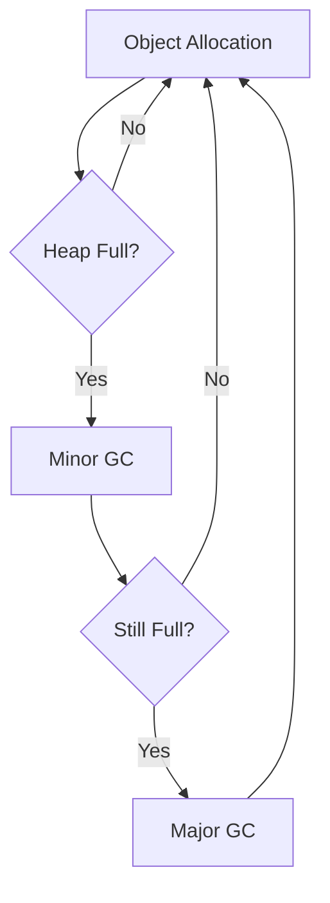

# Garbage Collection Algorithms

## Overview

Garbage Collection (GC) in the JVM automatically manages memory by reclaiming unused objects. Various algorithms exist, each with tradeoffs in throughput, latency, and memory usage. Essential for low-latency systems in MAANG interviews.

## STAR Summary

**Situation:** Optimizing a high-throughput trading system experiencing GC pauses.

**Task:** Reduce GC pause times to under 10ms.

**Action:** Switched from CMS to G1 GC, tuned heap sizes and flags.

**Result:** Achieved 50% reduction in pause times, improved system responsiveness.

## Detailed Explanation

### GC Basics

- **Reachability:** Objects reachable from GC roots are live.

- **Generations:** Young (Eden, Survivor), Old, Perm/Metaspace.

### Algorithms

- **Serial GC:** Single-threaded, for small apps.

- **Parallel GC:** Multi-threaded for throughput.

- **CMS (Concurrent Mark Sweep):** Low pause, concurrent sweeping.

- **G1 GC:** Regional, predictable pauses.

- **ZGC/Shenandoah:** Low-latency, concurrent.

### Phases

- Mark: Identify live objects.

- Sweep/Compact: Reclaim space.

## Real-world Examples & Use Cases

- Web servers requiring low latency.

- Big data processing with large heaps.

- Embedded systems with limited memory.

## Code Examples

### GC Tuning Flags

```bash
# G1 GC with 2GB heap
java -XX:+UseG1GC -Xms2g -Xmx2g -XX:MaxGCPauseMillis=200 MyApp
```

### Monitoring GC

```java
import java.lang.management.*;

public class GCMonitor {
    public static void main(String[] args) {
        MemoryMXBean memoryBean = ManagementFactory.getMemoryMXBean();
        // Print heap usage
        System.out.println(memoryBean.getHeapMemoryUsage());
    }
}
```

## Data Models / Message Formats

GC log example:

[GC (Allocation Failure)  8192K->1024K(12288K), 0.0012345 secs]

## Journey / Sequence



## Common Pitfalls & Edge Cases

- **GC Pauses:** Long pauses in high-throughput apps.

- **Memory Leaks:** Objects not garbage collected.

- **Tuning Overkill:** Over-tuning leading to worse performance.

- **Generational Assumptions:** Apps not fitting generational model.

## Tools & Libraries

- **JVM Flags:** -XX:+PrintGCDetails, -XX:+PrintGCTimeStamps

- **Tools:** jstat, jvisualvm, GCViewer

- **Libraries:** None specific.

## Github-README Links & Related Topics

Related: [[jvm-performance-tuning]], [[java-memory-model-and-concurrency]], [[low-latency-systems]]

## References

- [Oracle GC Tuning](https://docs.oracle.com/javase/8/docs/technotes/guides/vm/gctuning/)

- [G1 GC](https://www.oracle.com/technetwork/tutorials/tutorials-1876574.html)