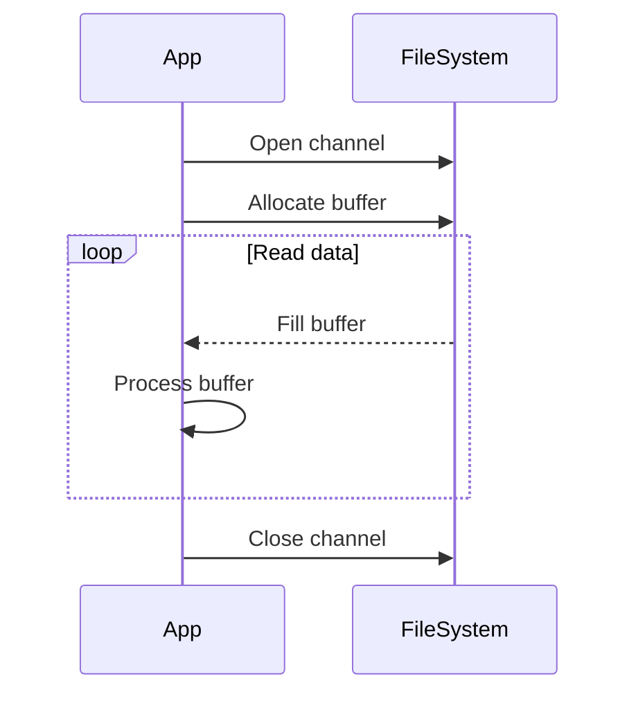

## Overview
Java I/O (Input/Output) and NIO (New I/O) are fundamental for handling data streams, files, and network communications. Traditional IO is blocking and stream-oriented, while NIO is non-blocking, buffer-oriented, and supports multiplexing for scalable applications.

## STAR Summary
**Situation:** Developing a file upload service handling 1000 concurrent uploads.  
**Task:** Optimize I/O to reduce response times.  
**Action:** Migrated from java.io streams to java.nio channels with ByteBuffers and selectors for non-blocking operations.  
**Result:** Achieved 5x throughput improvement, reducing average upload time from 10s to 2s.

## Detailed Explanation
- **IO Streams:** Byte streams (InputStream/OutputStream) and character streams (Reader/Writer) for sequential data access. Blocking operations.
- **NIO Channels and Buffers:** Channels represent connections to entities capable of I/O. Buffers are containers for data. Non-blocking with selectors for multiplexing.
- **Key Differences:** IO is blocking, NIO is non-blocking; IO uses streams, NIO uses channels and buffers.

## Real-world Examples & Use Cases
- File copying utilities.
- Network servers handling multiple clients (e.g., chat servers).
- High-performance data processing pipelines.

## Code Examples
### Reading a file with IO
```java
import java.io.*;

public class FileReadIO {
    public static void main(String[] args) {
        try (BufferedReader br = new BufferedReader(new FileReader("file.txt"))) {
            String line;
            while ((line = br.readLine()) != null) {
                System.out.println(line);
            }
        } catch (IOException e) {
            e.printStackTrace();
        }
    }
}
```

### Reading a file with NIO
```java
import java.nio.file.*;
import java.io.IOException;

public class FileReadNIO {
    public static void main(String[] args) {
        Path path = Paths.get("file.txt");
        try {
            byte[] data = Files.readAllBytes(path);
            System.out.println(new String(data));
        } catch (IOException e) {
            e.printStackTrace();
        }
    }
}
```

Compile and run: `javac FileReadNIO.java && java FileReadNIO`

## Data Models / Message Formats
| Field | Type | Description |
|-------|------|-------------|
| Path | java.nio.file.Path | Represents file path |
| Buffer | java.nio.ByteBuffer | Data container |
| Channel | java.nio.channels.Channel | I/O connection |

## Journey / Sequence


## Common Pitfalls & Edge Cases
- Forgetting to flip() buffer after writing.
- Not handling encoding properly in character streams.
- Resource leaks if not using try-with-resources.

## Common Interview Questions
- **What is the difference between Java IO and NIO?**  
  IO is blocking, stream-oriented, and suitable for simple operations. NIO is non-blocking, buffer-oriented, and designed for scalable, high-performance applications with multiplexing.

- **Explain blocking vs non-blocking I/O.**  
  Blocking I/O waits for the operation to complete before proceeding. Non-blocking I/O allows the thread to continue execution while I/O operations are pending.

- **What are Channels, Buffers, and Selectors in NIO?**  
  Channels are connections to I/O sources. Buffers are data containers. Selectors enable monitoring multiple channels for readiness events.

- **How does NIO improve performance for network applications?**  
  By allowing a single thread to handle multiple connections using selectors, reducing thread overhead and enabling non-blocking operations.

- **Provide an example of copying a file using NIO.**  
  Use FileChannel.transferTo() or read/write with ByteBuffers for efficient copying.

## Tools & Libraries
- java.io: For basic stream I/O.
- java.nio: For advanced channel-based I/O.
- Apache Commons IO: Utilities for file operations.

## Github-README Links & Related Topics
Related: [jvm-internals-and-classloading](../jvm-internals-and-classloading/), [threads-executors-futures](../threads-executors-futures/), [networking-tcp-ip-http2-tls](../../networking/networking-tcp-ip-http2-tls/)

## References
- https://docs.oracle.com/javase/tutorial/essential/io/
- https://docs.oracle.com/javase/tutorial/essential/io/file.html
- https://docs.oracle.com/javase/tutorial/essential/io/nio.html