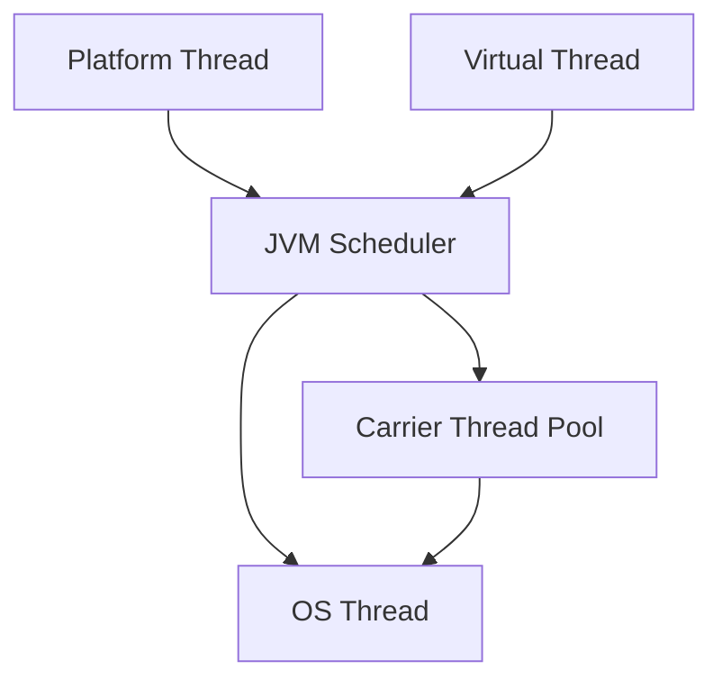

# Java 21 Features

## Overview

Java 21 is a Long-Term Support (LTS) release of the Java platform, introducing significant enhancements to the language, JVM, and libraries. Key features include virtual threads for improved concurrency, record patterns for better data handling, and enhanced pattern matching capabilities. This release builds on the preview features from previous versions, stabilizing them for production use.

## Detailed Explanation

Java 21 brings several major features that enhance developer productivity and application performance:

### Virtual Threads (Project Loom)
Virtual threads provide a lightweight concurrency model that simplifies writing, maintaining, and debugging high-throughput concurrent applications. Unlike traditional platform threads, virtual threads are managed by the JVM and can be created in large numbers without exhausting system resources.

### Record Patterns and Pattern Matching
Record patterns allow for more expressive and concise code when working with records. Combined with pattern matching in switch expressions, this enables powerful data-oriented programming techniques.

### Sequenced Collections
New interfaces and implementations for collections that maintain a specific order, providing better APIs for ordered data structures.

### Key Encapsulation Mechanism API
Support for key encapsulation mechanisms, enhancing cryptographic capabilities for secure communications.

### Other Enhancements
- Improved garbage collection with Generational ZGC
- Foreign Function & Memory API (Third Preview)
- Vector API (Sixth Incubator)
- Scoped Values (Second Preview)



## Real-world Examples & Use Cases

### Virtual Threads in Web Servers
Virtual threads are ideal for handling large numbers of concurrent connections in web servers, allowing for more efficient resource utilization compared to traditional thread pools.

### Pattern Matching in Data Processing
Record patterns simplify data validation and transformation in ETL pipelines, making code more readable and less error-prone.

### Sequenced Collections in Financial Applications
Ordered collections ensure predictable iteration order in financial calculations and reporting systems.

## Code Examples

### Virtual Threads
```java
import java.util.concurrent.Executors;

public class VirtualThreadExample {
    public static void main(String[] args) {
        try (var executor = Executors.newVirtualThreadPerTaskExecutor()) {
            for (int i = 0; i < 10; i++) {
                executor.submit(() -> {
                    System.out.println("Running on virtual thread: " + Thread.currentThread());
                });
            }
        }
    }
}
```

### Record Patterns
```java
public class PatternMatchingExample {
    record Point(int x, int y) {}
    
    public static void process(Object obj) {
        switch (obj) {
            case Point(var x, var y) when x > 0 && y > 0 -> 
                System.out.println("Point in first quadrant");
            case Point(var x, var y) -> 
                System.out.println("Point at (" + x + ", " + y + ")");
            default -> System.out.println("Not a point");
        }
    }
}
```

### Sequenced Collections
```java
import java.util.SequencedCollection;
import java.util.ArrayList;

public class SequencedCollectionExample {
    public static void main(String[] args) {
        SequencedCollection<String> list = new ArrayList<>();
        list.addFirst("First");
        list.addLast("Last");
        System.out.println(list.getFirst()); // "First"
        System.out.println(list.getLast());  // "Last"
    }
}
```

## References

- [OpenJDK JDK 21 Project](https://openjdk.org/projects/jdk/21/)
- [Oracle Java 21 Documentation](https://docs.oracle.com/en/java/javase/21/)
- [JEP 444: Virtual Threads](https://openjdk.org/jeps/444)
- [JEP 440: Record Patterns](https://openjdk.org/jeps/440)

## Github-README Links & Related Topics

- [Java Fundamentals](../java-fundamentals/)
- [Multithreading & Concurrency in Java](../java-multithreading-and-concurrency/)
- [Java Records](../java-records/)
- [JVM Internals & Class Loading](../jvm-internals-class-loading/)