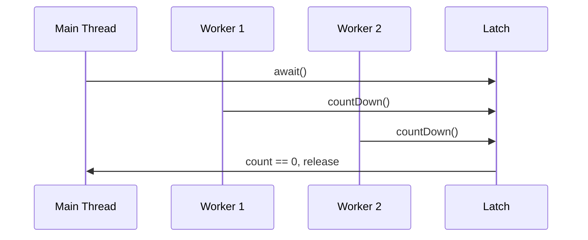

# Overview

A synchronization aid that allows one or more threads to wait until a set of operations being performed in other threads completes. A `CountDownLatch` is initialized with a given *count*. The `await` methods block until the current count reaches zero due to invocations of the `countDown()` method, after which all waiting threads are released and any subsequent invocations of `await` return immediately. This is a one-shot phenomenon -- the count cannot be reset.

# Detailed Explanation

Useful for dividing a problem into N parts, each part counts down when done, and the main thread awaits.

A latch initialized to N can be used to make one thread wait until N threads have completed some action.

## Constructors

- `CountDownLatch(int count)`: Initializes with the given count.

## Key Methods

- `void await()`: Waits until count is zero.
- `boolean await(long timeout, TimeUnit unit)`: With timeout.
- `void countDown()`: Decrements the count.
- `long getCount()`: Returns current count.

# Real-world Examples & Use Cases

- Starting multiple services: Wait for all services to initialize.
- Parallel processing: Wait for all worker threads to finish.
- Testing: Coordinating test threads.

# Code Examples

```java
import java.util.concurrent.CountDownLatch;

class Driver {
    void main() throws InterruptedException {
        CountDownLatch startSignal = new CountDownLatch(1);
        CountDownLatch doneSignal = new CountDownLatch(N);

        for (int i = 0; i < N; ++i)
            new Thread(new Worker(startSignal, doneSignal)).start();

        doSomethingElse();
        startSignal.countDown(); // let all threads proceed
        doSomethingElse();
        doneSignal.await(); // wait for all to finish
    }
}

class Worker implements Runnable {
    private final CountDownLatch startSignal;
    private final CountDownLatch doneSignal;
    Worker(CountDownLatch startSignal, CountDownLatch doneSignal) {
        this.startSignal = startSignal;
        this.doneSignal = doneSignal;
    }
    public void run() {
        try {
            startSignal.await();
            doWork();
            doneSignal.countDown();
        } catch (InterruptedException ex) {}
    }
}
```

Simple example:

```java
CountDownLatch latch = new CountDownLatch(3);
for (int i = 0; i < 3; i++) {
    new Thread(() -> {
        // do work
        latch.countDown();
    }).start();
}
latch.await(); // wait for all
```

# References

- [Oracle Java Docs: CountDownLatch](https://docs.oracle.com/javase/8/docs/api/java/util/concurrent/CountDownLatch.html)

# Github-README Links & Related Topics

- [Java CyclicBarrier](java-cyclicbarrier/)
- [Java Semaphore](java-semaphore/)
- [Multithreading & Concurrency in Java](multithreading-and-concurrency-in-java/)

# Common Pitfalls & Edge Cases

- One-shot: Cannot reset the count.
- Count cannot go negative: countDown when zero does nothing.
- Timeout: Use await with timeout.

# Tools & Libraries

- Java Standard Library: java.util.concurrent.CountDownLatch

