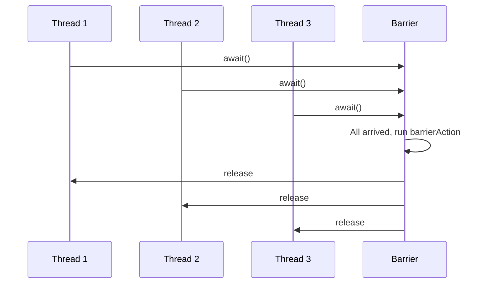

# Overview

A synchronization aid that allows a set of threads to all wait for each other to reach a common barrier point. CyclicBarriers are useful in programs involving a fixed sized party of threads that must occasionally wait for each other. The barrier is called *cyclic* because it can be re-used after the waiting threads are released.

# Detailed Explanation

A `CyclicBarrier` supports an optional `Runnable` command that is run once per barrier point, after the last thread in the party arrives, but before any threads are released. This *barrier action* is useful for updating shared-state before any of the parties continue.

The barrier uses an all-or-none breakage model for failed synchronization attempts: If a thread leaves a barrier point prematurely because of interruption, failure, or timeout, all other threads waiting at that barrier point will also leave abnormally via `BrokenBarrierException`.

## Constructors

- `CyclicBarrier(int parties)`: Creates a barrier for the given number of threads.
- `CyclicBarrier(int parties, Runnable barrierAction)`: Creates a barrier with a barrier action.

## Key Methods

- `int await()`: Waits until all parties have invoked await.
- `int await(long timeout, TimeUnit unit)`: Waits with timeout.
- `boolean isBroken()`: Checks if broken.
- `void reset()`: Resets the barrier.
- `int getParties()`: Returns the number of parties.
- `int getNumberWaiting()`: Returns waiting threads.

# Real-world Examples & Use Cases

- Parallel computation: Dividing a task into subtasks, each thread processes a part, then waits at barrier for all to finish before merging.
- Multi-phase algorithms: Like genetic algorithms where phases need synchronization.
- Testing: Simulating concurrent scenarios.

# Code Examples

```java
import java.util.concurrent.CyclicBarrier;

class Solver {
    final int N;
    final float[][] data;
    final CyclicBarrier barrier;

    class Worker implements Runnable {
        int myRow;
        Worker(int row) { myRow = row; }
        public void run() {
            while (!done()) {
                processRow(myRow);
                try {
                    barrier.await();
                } catch (InterruptedException ex) {
                    return;
                } catch (BrokenBarrierException ex) {
                    return;
                }
            }
        }
    }

    public Solver(float[][] matrix) {
        data = matrix;
        N = matrix.length;
        Runnable barrierAction = () -> mergeRows();
        barrier = new CyclicBarrier(N, barrierAction);
        for (int i = 0; i < N; i++) {
            new Thread(new Worker(i)).start();
        }
    }
}
```

Another example: Simple barrier without action.

```java
CyclicBarrier barrier = new CyclicBarrier(3);
for (int i = 0; i < 3; i++) {
    new Thread(() -> {
        try {
            System.out.println("Before barrier");
            barrier.await();
            System.out.println("After barrier");
        } catch (Exception e) {}
    }).start();
}
```

# References

- [Oracle Java Docs: CyclicBarrier](https://docs.oracle.com/javase/8/docs/api/java/util/concurrent/CyclicBarrier.html)

# Github-README Links & Related Topics

- [Java CountDownLatch](java-countdownlatch/)
- [Java Semaphore](java-semaphore/)
- [Multithreading & Concurrency in Java](multithreading-and-concurrency-in-java/)

# Common Pitfalls & Edge Cases

- Broken barrier: If one thread is interrupted, all waiting threads get BrokenBarrierException.
- Reset: Can reset, but complicated if threads are waiting.
- Timeout: Use await with timeout to avoid indefinite wait.

# Tools & Libraries

- Java Standard Library: java.util.concurrent.CyclicBarrier

