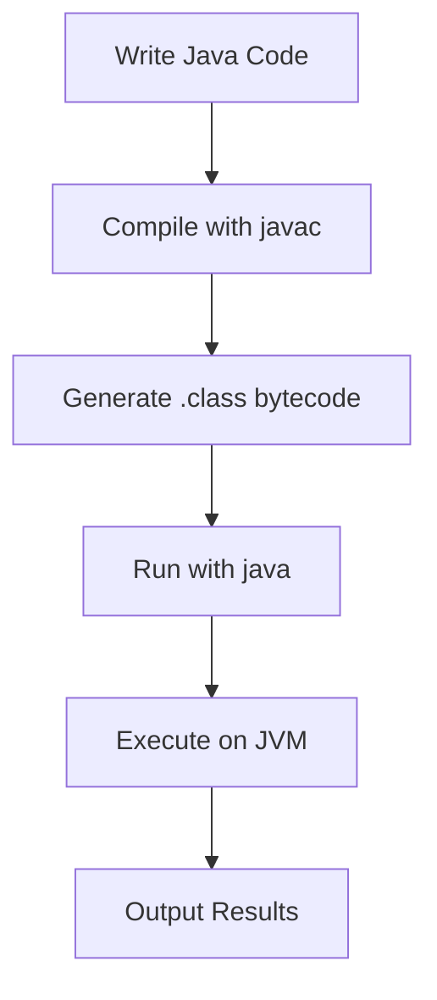

# Overview

Java Fundamentals cover the core building blocks of the Java programming language, including syntax, data types, operators, control structures, and basic object-oriented concepts. These form the foundation for writing Java applications, from simple console programs to complex enterprise systems. Java is a statically-typed, object-oriented language that emphasizes portability through the "write once, run anywhere" principle via the Java Virtual Machine (JVM).

# STAR Summary

**SITUATION:** Developers need a solid grasp of Java's basic constructs to build applications, but the language's syntax and concepts can be overwhelming for beginners.

**TASK:** Learn the essential elements of Java programming, including variables, data types, operators, and control flow, to enable writing functional code.

**ACTION:** Study Java's syntax rules, primitive and reference types, arithmetic and logical operators, conditional statements, loops, and method definitions through examples and practice.

**RESULT:** Ability to write, compile, and run basic Java programs, laying the groundwork for advanced topics like OOP, collections, and concurrency.

# Detailed Explanation

Java programs are structured around classes and methods. Every Java application starts with a `main` method in a class. The language uses curly braces `{}` for blocks, semicolons `;` to end statements, and is case-sensitive.

Key components:

- **Variables and Data Types:** Variables store data and must be declared with a type. Primitive types include `int`, `double`, `boolean`, `char`. Reference types include objects and arrays.

- **Operators:** Arithmetic (`+`, `-`, `*`, `/`, `%`), relational (`==`, `!=`, `<`, `>`), logical (`&&`, `||`, `!`), and assignment (`=`, `+=`).

- **Control Structures:** `if-else` for conditions, `switch` for multi-way branches, `for`, `while`, `do-while` for loops.

- **Methods:** Functions defined in classes, with parameters and return types. Overloading allows multiple methods with the same name but different signatures.

- **Arrays:** Fixed-size collections of elements of the same type.

- **Strings:** Immutable objects for text manipulation, with methods like `length()`, `substring()`, `equals()`.

Java enforces strong typing, meaning variables must be declared before use, and type conversions are explicit (casting).

# Real-world Examples & Use Cases

- **Console Applications:** Writing a calculator that takes user input, performs operations, and displays results using `Scanner` for input and `System.out` for output.

- **Data Processing:** Reading a file of numbers, calculating averages, and writing results to another file, demonstrating file I/O basics.

- **Simple Games:** Implementing a number guessing game with loops and conditionals to handle user guesses and provide feedback.

In enterprise software, fundamentals are used in utility classes for string processing, date handling, and basic computations before integrating with frameworks like Spring.

# Message Formats / Data Models

N/A (not applicable for Java fundamentals, as this is language syntax rather than messaging protocols).

# Journey of a Trade

N/A (trading-specific; for Java, consider a "Journey of a Program Execution" diagram).



This flowchart shows the basic compilation and execution process in Java.

# Common Pitfalls & Edge Cases

- **Type Mismatches:** Assigning incompatible types without casting leads to compile errors; e.g., `int x = 3.14;` fails.

- **Null Pointer Exceptions:** Accessing methods on null references; always check with `if (obj != null)`.

- **Integer Overflow:** `int` values wrap around silently; use `long` for large numbers or check bounds.

- **String Comparison:** Use `equals()` instead of `==` for content comparison, as `==` checks reference equality.

- **Array Index Out of Bounds:** Accessing array elements beyond length causes runtime exceptions; validate indices.

- **Uninitialized Variables:** Local variables must be initialized before use; fields have default values.

# Tools & Libraries

- **JDK (Java Development Kit):** Includes compiler (`javac`), runtime (`java`), and tools like `javadoc`.

- **IDEs:** Eclipse, IntelliJ IDEA, VS Code with Java extensions for code completion and debugging.

- **Build Tools:** Maven or Gradle for project management, though fundamentals focus on command-line compilation.

Sample code snippet:

```java
public class HelloWorld {
    public static void main(String[] args) {
        // Variables and data types
        int age = 25;
        double height = 5.9;
        String name = "Alice";
        
        // Operators and control structures
        if (age > 18) {
            System.out.println(name + " is an adult.");
        } else {
            System.out.println(name + " is a minor.");
        }
        
        // Loop
        for (int i = 0; i < 5; i++) {
            System.out.println("Count: " + i);
        }
    }
}
```

This example demonstrates variables, conditionals, and loops.

# Github-README Links & Related Topics

[[OOP Principles in Java]]
[[JVM Internals & Class Loading]]
[[Garbage Collection Algorithms]]
[[Multithreading & Concurrency in Java]]
[[Java Data Types]]

# References

- [Oracle Java Tutorials: Language Basics](https://docs.oracle.com/javase/tutorial/java/nutsandbolts/index.html)
- [Java Language Specification](https://docs.oracle.com/javase/specs/jls/se21/html/index.html)
- [GeeksforGeeks: Java Fundamentals](https://www.geeksforgeeks.org/java/)